# Create our first application
In this exercise you will create your very first Functions app, Hello World

## Step 1: Create a Virtual Cloud Network
1. From the OCI Services menu, click **Virtual Cloud Networks** under **Networking**. Select the compartment assigned to you from the drop down menu on the left side of the screen(you may need to scroll down to see the dropdown) and Click **Start VCN Wizard**.
    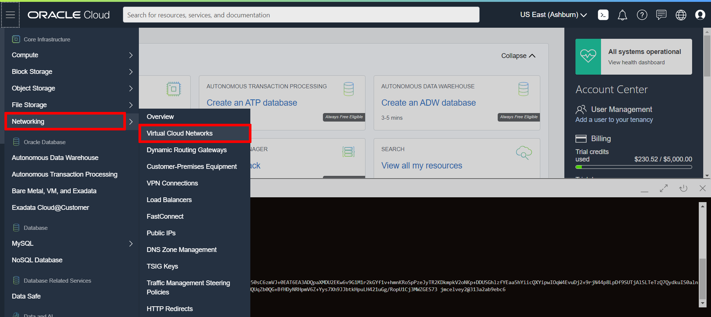  
    <span style="color: red">NOTE: Ensure the correct Compartment is selected under COMPARTMENT list</span>
2. Choose **VCN with Internet Connectivity** and click **Start VCN Wizard**.
    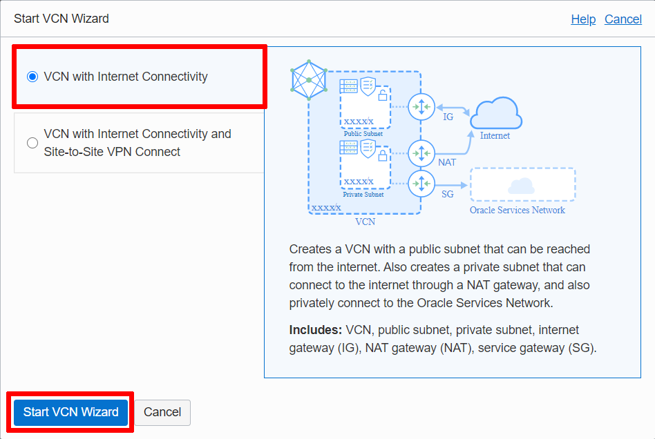  
3. Fill out the dialog box:
    - **VCN Name**: Provide a name
    - **Compartment**: Ensure your compartment is selected
    - **VCN CIDR Block**: Provide a CIDR block (10.0.0.0/16)
    - **Public Subnet CIDR Block**: Provide a CIDR block (10.0.1.0/24)
    - **Private Subnet CIDR Block**: Provide a CIDR block (10.0.2.0/24)
    - Click *Next*

    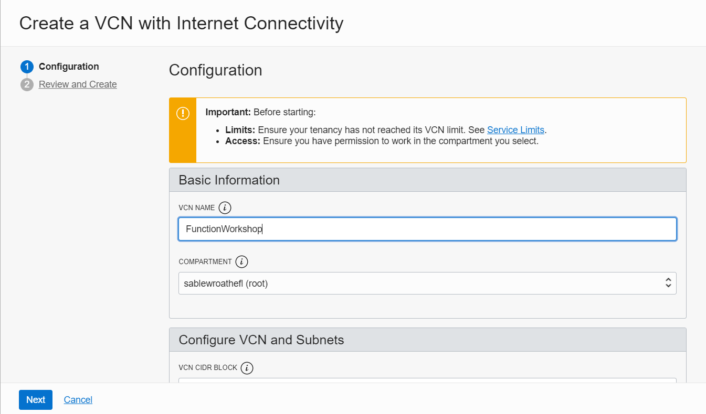  
    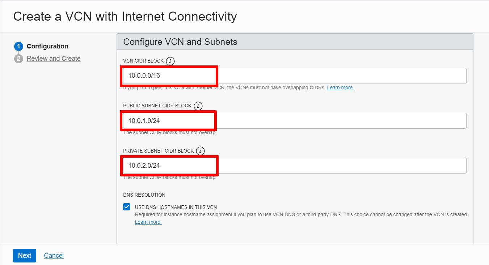  
4. Verify all the information and Click **Create**.
    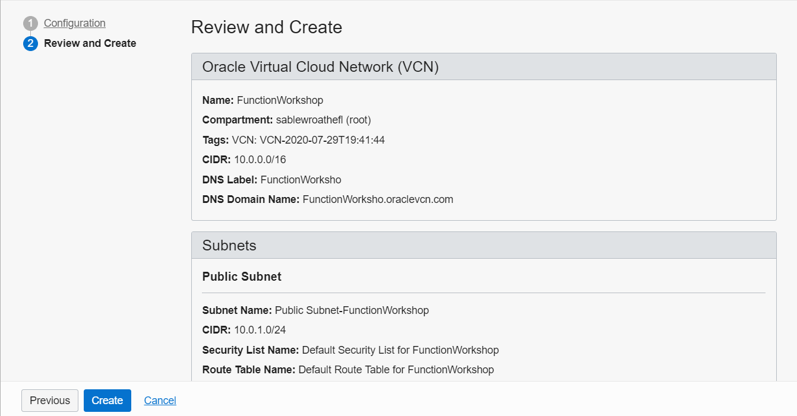 
5. This will create a VCN with the following components.
    - VCN
    - Public subnet
    - Private subnet
    - Internet gateway (IG)
    - NAT gateway (NAT)
    - Service gateway (SG)
6. Click **View Virtual Cloud Network** to display your VCN details.
    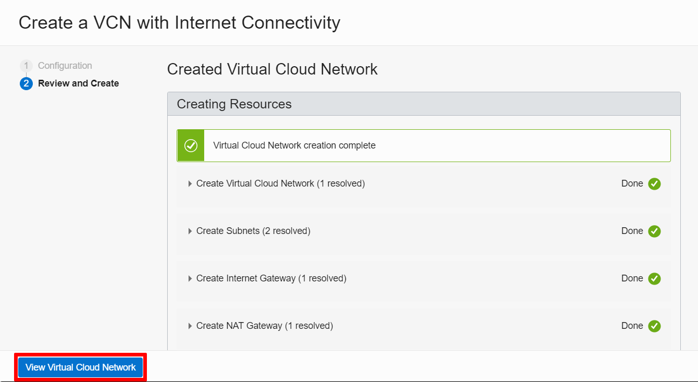  
    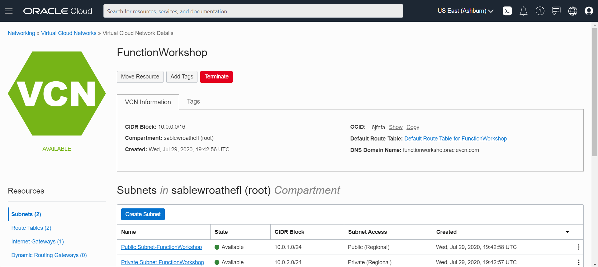  

## Step2: Setup Policy
If you are using *emeaccoe* tenancy or a tenancy is provided for you for the workshop, policies might be created for you. In that case you do not need to setup policies, skip this step. Ask you trainer!

1. From the OCI services menu click **Policies** under **Identity**.
    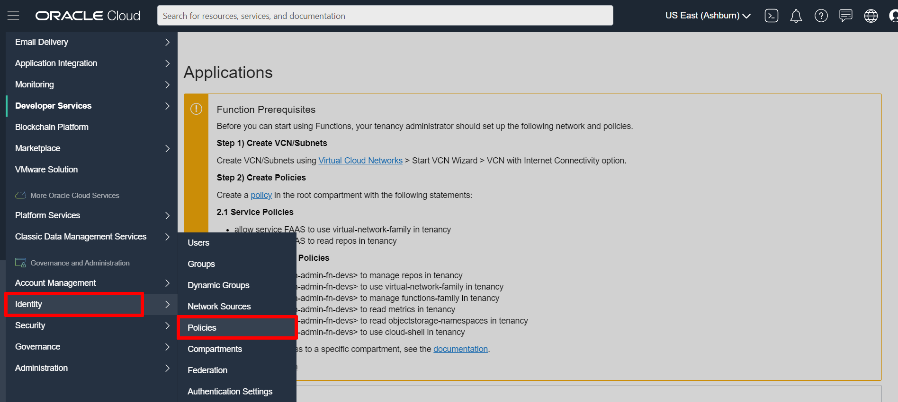  
2. Make sure that the compartment you created your VCN in is selected and then click Create Policy.
    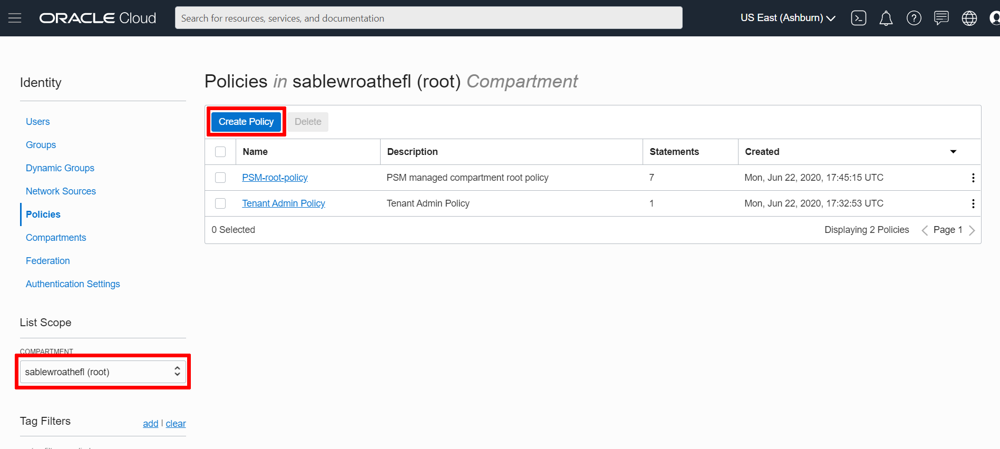  
3. Type `FunctionApplicationPolicies` into the name section and type `Allow functions to work` in the description section. Scroll down to the Policy statements section. Click the **+ Another Statement**.
      
    Copy and paste the following as your first policy statement.
    ```
    allow service FAAS to use virtual-network-family in tenancy
    ```
    Copy and paste the following as your second policy statement.
    ```
    allow service FAAS to read repos in tenancy
    ```
    Click **Create**.
    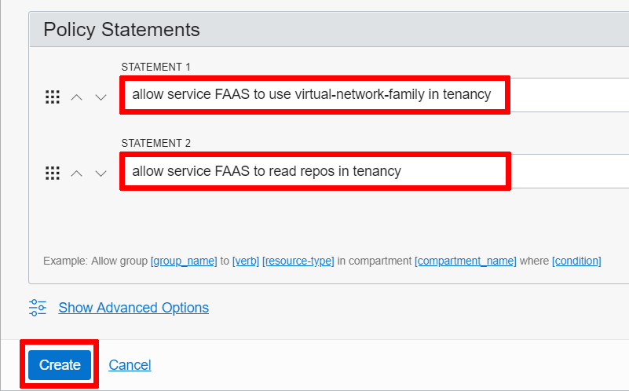  
    Verify that your policy has been added to the policy list.
    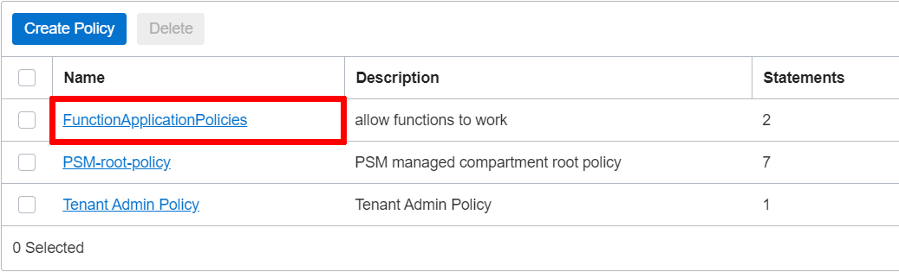  

## Step3: OCIR Login
Follow the guide for [Log in to Oracle Cloud Infrastructure Registry](https://docs.oracle.com/en-us/iaas/Content/Functions/Tasks/functionslogintoocir.htm)


## Step4: Create a Function Application
Next we will create our first application.
1. From the OCI services menu click **Functions** under **Developer Services**.
    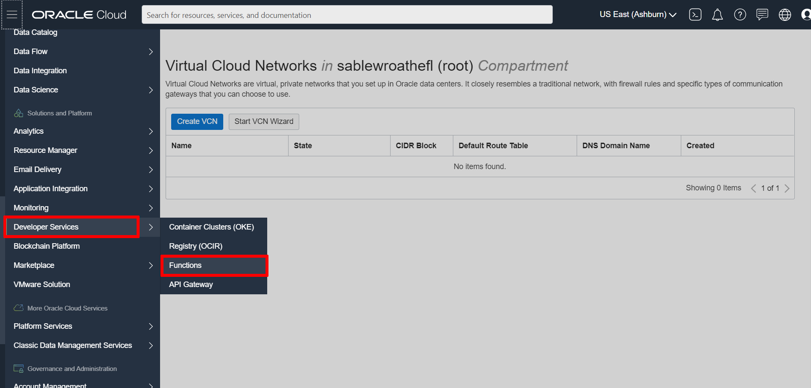  
2. Click **Create Application** and fill out the dialog box.
    - **NAME**: WorkshopFunctionApplication
    - **VCN in** : Choose the compartment where your VCN was created
    - **SUBNETS** : Choose your VCN's public subnet
    
    Click **Create**.
    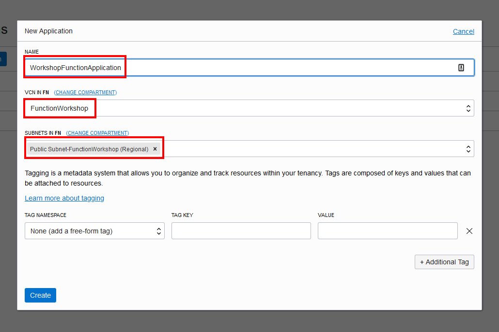  
3. Scroll down and click on **Getting Started**. and **Local Setup**
    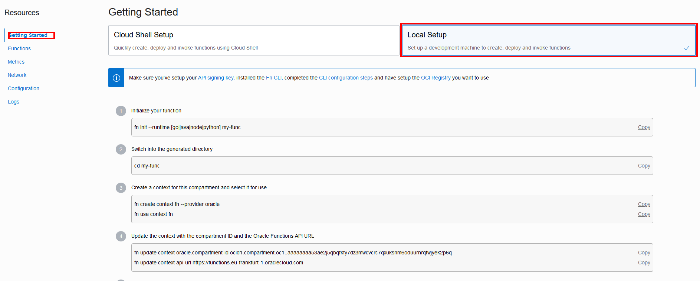  
    Follow the steps documented within Getting Started. On the first step, you need to make a choice of a lanugage selection. You need to delete the other options.

    **Important**: While giving a name for repository, on a shared tenancy environment, make sure that it is unique.

## Step5: Invoke function
In the last step of the **Getting Started**, you have invoked the function, with a command like this:
```shell
$ fn invoke WorkshopFunctionApplication my-func
```
If your application name or function name is different, adjust further steps accordingly

There are other ways to invoke that function. You can invoke a function:
- using fn cli
- using OCI cli
- signed API call  
    Creating a signed API call from scratch is tricky. You either need need go through documentation or use an SDK. It is not covered within this exercise

### Invoke using OCI CLI
The format for invoking function using OCI CLI is the following:
```shell
$ oci fn function invoke <function-ocid> --file "<output-filepath>" --body "<request-parameters>"
```
You can get the OCID of the function in the following steps:
1. Open Application
2. Underfunctions, find the row of the function
3. Click to the most right context menu
    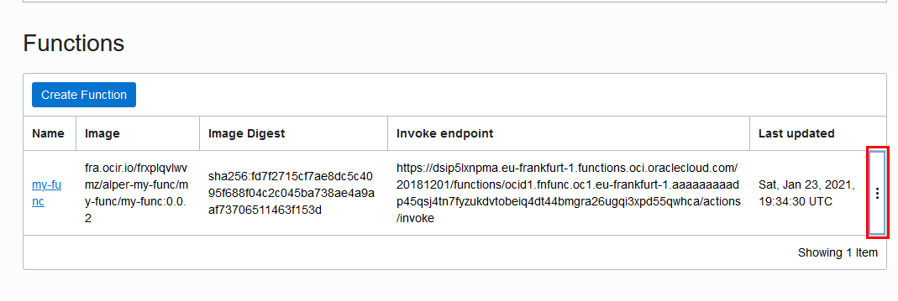  
4. Click to **Copy OCID**
    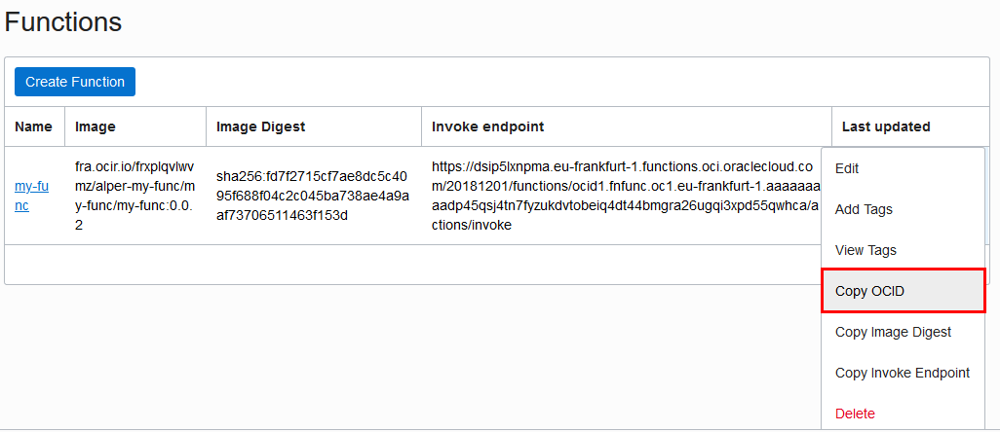  

```shell
$ oci fn function invoke --function-id ocid1.fnfunc.oc1.phx.aaaa____uxoa --file "-" --body ""

> {"message":"Hello World"}
```
You can call the function as above, by replacing the OCID

### Invoke with an argument
It is possible to pass arguments to functions. Some functions accept an argument, some does not, based on the code. This Hello World application, if argument is not provided, prints `Hello World` otherwise, will print `Hello <name>`

#### Invioke via fn cli
With fn cli, you need to pipe the output of a program to fn cli to be parsed
```shell
$ echo -n '{"name":"John"}' | fn invoke WorkshopFunctionApplication my-func

> {"message":"Hello John"}
```

#### Invoke via OCI cli
This time, body argument is modified accordingly
```shell
$ oci fn function invoke --function-id ocid1.fnfunc.oc1.phx.aaaa____uxoa --file "-" --body '{"name":"John"}'

> {"message":"Hello John"}
```