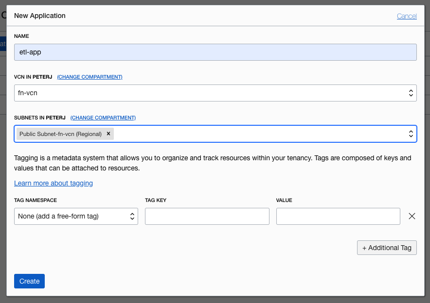
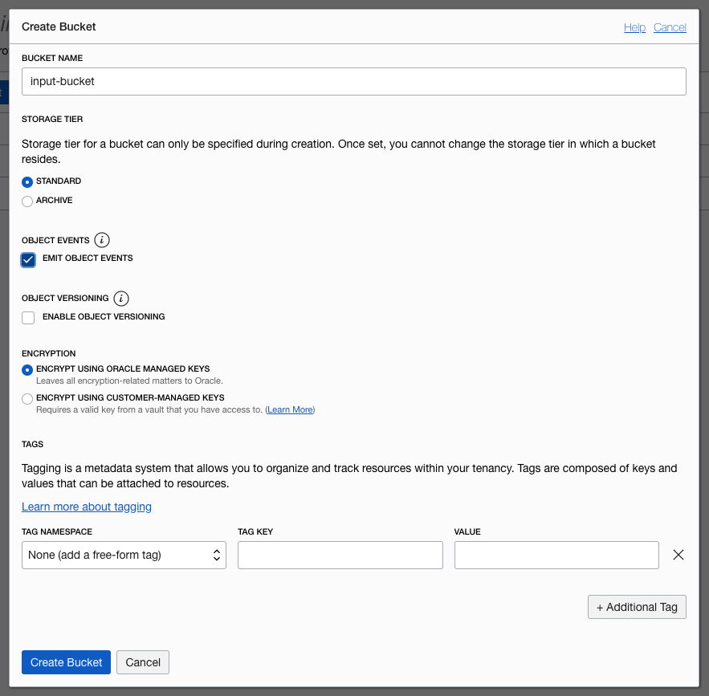
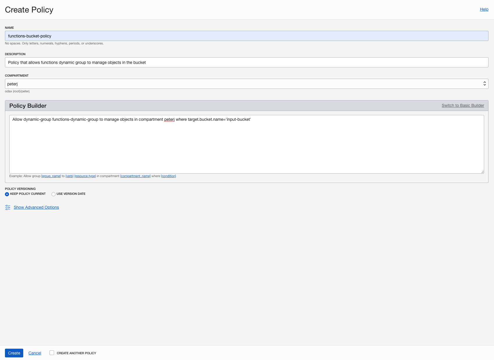
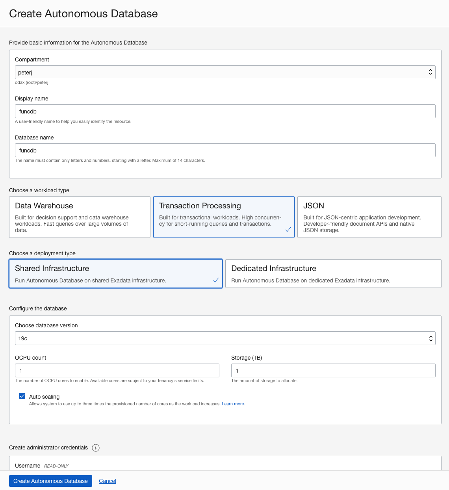
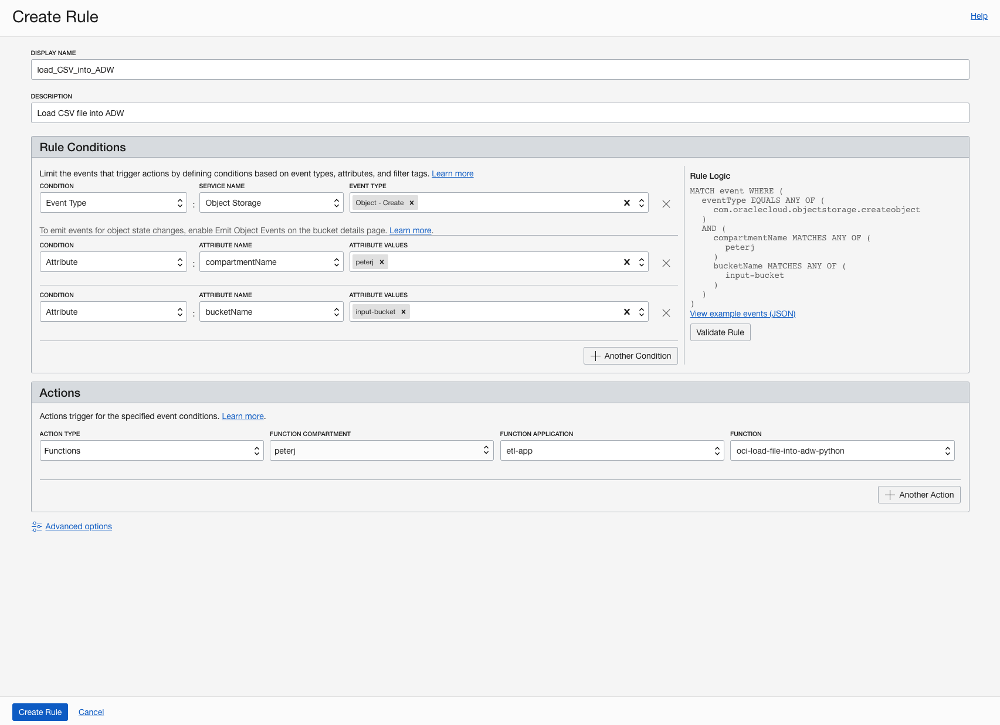

# Automatic File Parsing
In this lab you will create an Object Storage Buckets, Oracle Function, Autonomous Database and trigger the function whenever a file is uploaded to the Object Storage. The function will take the file and write it to the database.

Objectives:
    - Create an application.
    - Create a Dynamic Group.
    - Create Object Storage Bucket.
    - Create an Autonomous Data Warehouse Database.
    - Deploy a Function.
    - Create an Event rule.
    - Test the created Function

If you have completed lab earlier, make sure that you are in a different folder, by `cd ..` OR `cd ~`

## Step 1: Create an application
In this step, you will create an application and set up Fn CLI on Cloud Shell.

1. Under Solutions and Platform, select **Developer Services** and click **Functions**.
2. Select your development compartment from the **Compartment** list.
3. Click Create Application.
4. For name, enter `etl-app`.
5. Select the VNC you created earlier (e.g. fn-vcn).
6. Select the public subnet.
7. Click Create.
8. Click on the created application to open the application details.
9. Click the Getting Started link and follow the Begin your Cloud Shell session and Setup fn CLI on Cloud Shell sections in the Cloud Shell Setup.

      

## STEP 2: Create a Dynamic Group
To use other OCI Services, your function must be part of a **dynamic group**. For information on creating dynamic groups, refer to the [documentation](https://docs.cloud.oracle.com/iaas/Content/Identity/Tasks/managingdynamicgroups.htm#To).

Before you create a dynamic group, you need to get your development compartment OCID. You will use the compartment OCID in the dynamic group matching rule.
1. Open the navigation menu, select **Identity**, and then **Compartments**.
2. Find your development compartment from the list, hover over the cell in the OCID column and click **Copy**, to copy the compartment OCID to your clipboard.
3. Store the compartment OCID as you will use it soon.

Now you're ready to create a dynamic group.

1. To create a dynamic group, open the navigation menu, select Identity, and then Dynamic Groups.
2. Click Create Dynamic Group.
3. For name, enter functions-dynamic-group. *In a shared tenancy, give it a unique name - delete this group at the end of the workshop*
4. For description, enter Group with all functions in a compartment.
5. To select the functions that belong to the dynamic group, [write matching rules](https://docs.cloud.oracle.com/en-us/iaas/Content/Identity/Tasks/managingdynamicgroups.htm#Writing). Write the following matching rule that includes all functions within a compartment you created your application in:
```
All {resource.type = 'fnfunc', resource.compartment.id = 'ocid1.compartment.oc1..example'}
```
<span style="color: red">Note:</span> Make sure you replace the above value with the compartment OCID you stored earlier.

## STEP 3: Create Object Storage Bucket
You need a `input-bucket` bucket in Object Storage. You will use the `input-bucket` to drop-in the CSV files. The function will process the file and import them into Autonomous Datawarehouse.

Let's create the `input-bucket` first:
1. Open the navigation menu, select **Object Storage**, and then select **Object Storage**.
2. Select your development compartment from the **Compartment** list.
3. Click the **Create Bucket**.
4. Name the bucket **input-bucket**. *Make the name unique within your tenancy's Object Storage namespace; such as add your initials to the end*
5. Select the **Standard** storage tier.
6. Check the **Emit Object Events** check box.
7. Click Create **Bucket**.
      
8. Now repeat the same process, to create another bucket to store the processed files, **without** selecting **Emit Object Events**. Name this as **processed-bucket**. *Make the name unique within your tenancy's Object Storage namespace; such as add your initials to the end*

## STEP 4: Create IAM policies
Create a new policy that allows the dynamic group (*functions-dynamic-group*) to manage objects in the bucket.

1. Open the navigation menu, select **Identity**, and then select **Policies**.
2. On the left side, make sure you are in the correct compartment with your functions
3. Click **Create Policy**.
4. For name, enter `functions-buckets-policy`.
5. For description, enter `Policy that allows functions dynamic group to manage objects in the bucket`.
6. Click the **Customize (Advanced)** link and paste the policy statements into the Policy Builder field: 
    ```
    Allow dynamic-group [functions-dynamic-group] to manage objects in compartment [compartment-name] where target.bucket.name='[input-bucket]'
    Allow dynamic-group [functions-dynamic-group] to manage objects in compartment [compartment-name] where target.bucket.name='[processed-bucket]'
    ```
    Important: Do not forget to replace the values with brackets: `functions-dynamic-group`, `compartment-name`, `input-bucket` and `processed-bucket` corresponding to your previous entries. *The policy syntax is without brackets, do not forget to remove brackets*
    
7. Click **Crete**.
      

## STEP 5: Create an Autonomous Database
The function accesses the Autonomous Database using SODA (Simple Oracle Document Access) for simplicity. You can use the other type of access by modifying the function.

1. Open the navigation menu, select **Autonomous Data Warehouse**.
2. Click **Create Autonomous Database**.
3. From the list, select your development compartment.
4. For display name and database name, enter `funcdb`.
5. For the workload type, select **Transaction Processing**.
6. For deployment type, select **Shared Infrastructure**.
7. Enter the admin password. *Keep that password safe, you will use this later*
8. Click **Create Autonomous Database**.
      
Wait for OCI to provision the Autonomous Database, and then click the **Service Console** button.

1. Click **Development** from the sidebar.
2. Under RESTful Services and SODA, click **Copy URL**.
3. From your terminal, create the collection called `regionsnumbers` by running the command below. Make sure you replace the `<ORDS_BASE_URL>` with the value you copied in the previous step, and `<DB-PASSWORD>` with the admin password you set when you created the Autonomous Database.
    ```shell
    $ export ORDS_BASE_URL=<ORDS_BASE_URL>
    $ curl -X PUT -u 'ADMIN:<DB-PASSWORD>' -H "Content-Type: application/json" $ORDS_BASE_URL/admin/soda/latest/regionsnumbers
    ```
4. To double check collection was created, you can list all collections. The output should look similar as below:
    ```shell
    $ curl -u 'ADMIN:<DB-password>' -H "Content-Type: application/json" $ORDS_BASE_URL/admin/soda/latest/

    > {"items":[{"name":"regionsnumbers","properties":{"schemaName":"ADMIN","tableName":"REGIONSNUMBERS","keyColumn":{"name":"ID","sqlType":"VARCHAR2","maxLength":255,"assignmentMethod":"UUID"},"contentColumn":{"name":"JSON_DOCUMENT","sqlType":"BLOB","jsonFormat":"OSON"},"versionColumn":{"name":"VERSION","type":"String","method":"UUID"},"lastModifiedColumn":{"name":"LAST_MODIFIED"},"creationTimeColumn":{"name":"CREATED_ON"},"readOnly":false},"links":[{"rel":"canonical","href":"https://.../ords/admin/soda/latest/regionsnumbers"}]}],"hasMore":false}
    ```
## STEP 6: Deploy the function
In this step, you will clone the functions source code repository and use the `fn deploy` command to build the Docker image, push the image to OCIR, and deploy the function to Oracle Functions in your application.
1. Clone the Functions source code repository:
    ```shell
    $ git clone https://github.com/oracle/oracle-functions-samples.git
    ```
2. Go to the `samples/oci-load-file-into-adw-python` folder:
    ```shell
    $ cd oracle-functions-samples/samples/oci-load-file-into-adw-python
    ```
3. Deploy the function to the `etl-app`:
    ```shell
    $ fn -v deploy --app etl-app
    ```
    Note that, this time we did not entered API endpoint, provider as Oracle and compartment that we are working in, docker registry. Those are coming from the previous exercise. You can rewiew those values by entering the following command:
    ```shell
    $ fn i ctx
    ```
    After you deploy the function, you need to set function configuration values so the function knows how to connect to the Autonomous Database.
4. Using the Fn CLI, set the following configuration values. Make sure you replace the `[INPUT-BUCKET]`, `[PROCESSED-BUCKET]` and `[DB_PASSWORD]` with your values:
    ```shell
    $ fn config function etl-app oci-load-file-into-adw-python ords-base-url $ORDS_BASE_URL
    $ fn config function etl-app oci-load-file-into-adw-python db-schema admin
    $ fn config function etl-app oci-load-file-into-adw-python db-user admin
    $ fn config function etl-app oci-load-file-into-adw-python dbpwd-cipher [DB-PASSWORD]
    $ fn config function etl-app oci-load-file-into-adw-python input-bucket [INPUT-BUCKET]
    $ fn config function etl-app oci-load-file-into-adw-python processed-bucket [PROCESSED-BUCKET]
    ```
## STEP 7: Create an Event rule
In this step, you will configure a Cloud Event to trigger the function when you drop the files into the `input-bucket`.
1. From Console UI, open navigation and select **Application Integration** and click **Events Service**.
2. Select your development compartment from the **Compartment** list.
3. Click **Create Rule**.
4. For display name, enter `load_CSV_into_ADB`.
5. For description, enter `Load CSV file into ADB`.
6. Create three rules. You can click **Another Condition** to add more conditions:
    | Condition  | Service/Attribute Name | Event Type/Attribute Values |
    |:----------:|:----------------------:|:---------------------------:|
    | Event Type | Object Storage         | Object - Create             |
    | Attribute  | compartmentName        | `[COMPARTMENT_NAME]`        |
    | Attribute  | bucketName             | `[INPUT-BUCKET]`            |
7. Under Actions, select **Functions**:
    - For function compartment, select your development compartment.
    - For function application, select `etl-app`.
    - For function, select `oci-load-file-into-adw-python`.
8. Click **Create Rule**.
      

## STEP 8: Test the function
To test the function, you can upload a .csv file to the input-bucket. You can do that from the Console UI or the Cloud Shell using the OCI CLI.
1. Make sure you are in the same folder where you have deployed the function, if not, you can run the following:
    ```shell
    $ cd ~/oracle-functions-samples/samples/oci-load-file-into-adw-python
    ```
2. Use the OCI CLI to upload file1.csv to the input-bucket:
    ```shell
    $ oci os object put  --bucket-name [INPUT-BUCKET] --file file1.csv
    ```

To see the data in the database, follow these steps:
1. From the OCI console, navigate to **Autonomous Data Warehouse**.
2. Select your development compartment from the **Compartment** list.
3. Select **Transaction Processing** from the **Workload Type** list.
4. Click on the database name (`funcdb`).
5. Click the **Service Console**.
6. Click **Development** link from the side bar.
7. Click **SQL Developer Web**.
8. Use **ADMIN** and the admin password to authenticate.
9. In the worksheet, enter the following query:
    ```sql
    select UTL_RAW.CAST_TO_VARCHAR2( DBMS_LOB.SUBSTR( JSON_DOCUMENT, 4000, 1 )) AS json from regionsnumbers
    ```
10. Click the green play button to execute the query.
11. The data from the CSV file is in the **Query Result** tab.

You can also check the file uploaded to `input-bucket` from the OCI web console

This concludes this exercise.