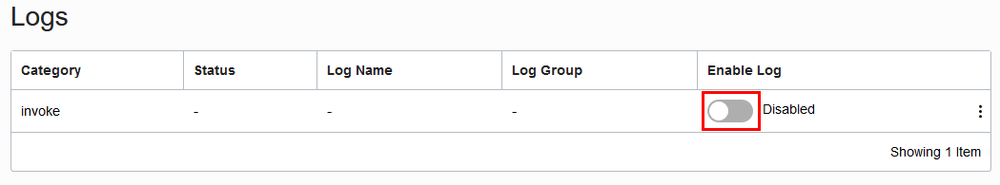
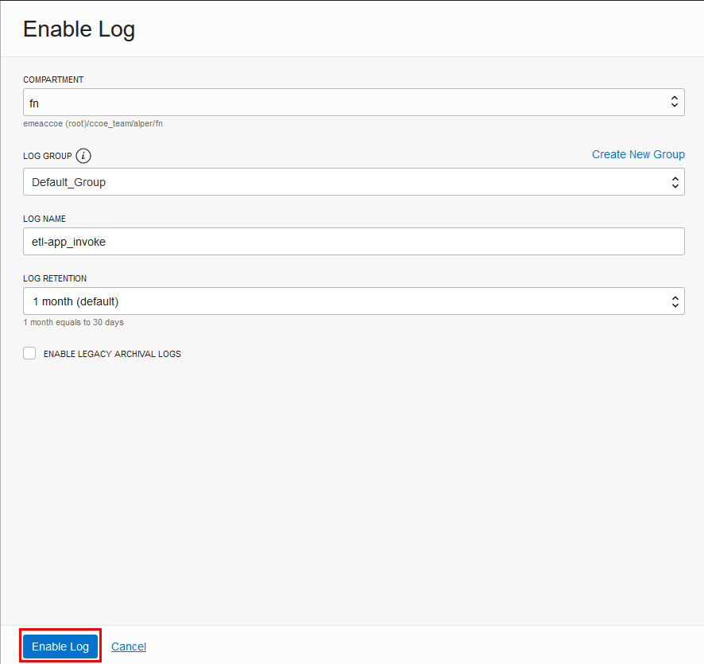
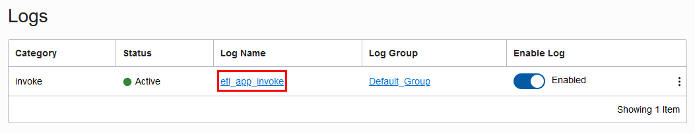
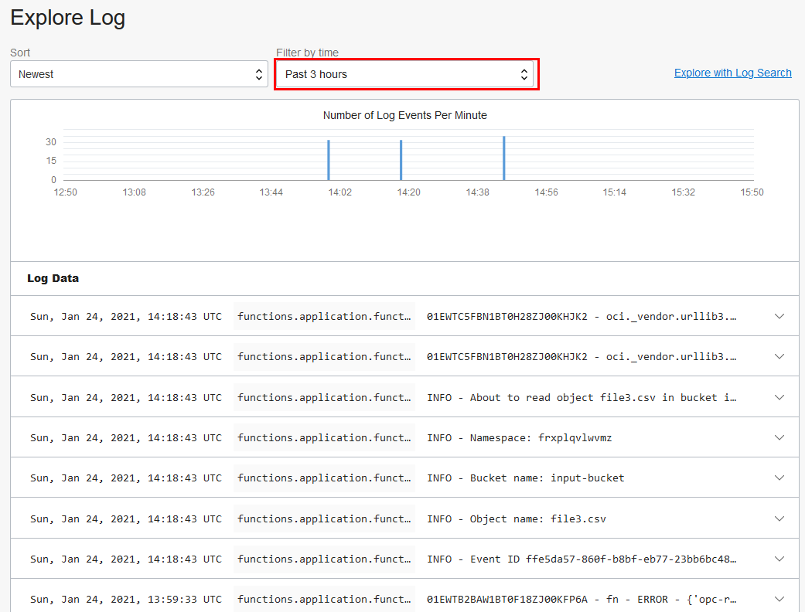
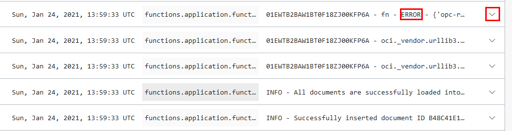
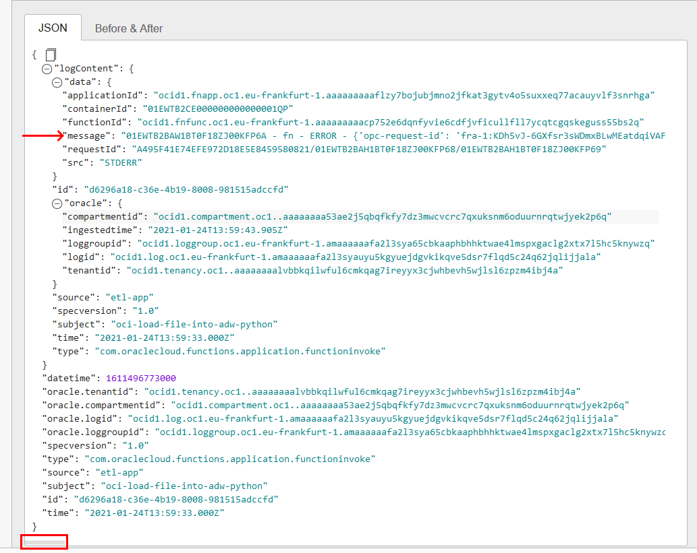

# Troubleshooting
In the previous [exercise](../2-lab/README.md) we have uploaded file to the `input-bucket`, an event fired, invoking a function. Function parses the file, writes to ADB and finaly moves the file from `input-bucket` to `processed-bucket`.

As you have checked so far, the last step does not happen. The file still remains on the `input-bucket` and nothing written on the `processed-bucket`. So the function is partially working. Let's see what is wrong

## Step 1: Enable Logs
1. Go to the `etl-app` under **Functions**.
2. **Resources** on the left side, click to **Logs**
3. For the invoke category, enable logs
      
4. Leave the values as is and click to **Enable Log**
      


## Step 2: Invoke function and check logs
1. Execute following command from terminal
    ```shell
    $ oci os object put  --bucket-name input-bucket --file file2.csv
    ```
    Replace `input-bucket` name accordingly
    
    This will upload second file to the bucket and event automatically will pick it up. This time, since logs are enabled, function will log *COUT* and *CERR* streams
2. Click on the name of the log
      
3. This will display the most recent log on top. If you have invoked function earlier, change the filter duration accordingly
      
4. Look through the logs, you will find a log with **ERROR** keyword in it. Locate that row and expand that log record
      
5. **message** value holds the necessary information to give us insight about the cause. The message body is long and that frame can be scrolled to left-right
      
6. As you dig thurgh, you will notice following words `InsufficientServicePermissions` and `Permissions granted to the object storage service principal "objectstorage-eu-frankfurt-1" to this bucket are insufficient`
    The `objectstorage-eu-frankfurt-1` could be different in your case if you are on a different region

## Step 3: The fix
Think about what is missing or wrong? You can check the code, check the steps done in previous exercise. To reveal the fix, click to [THE FIX](./fix.md)