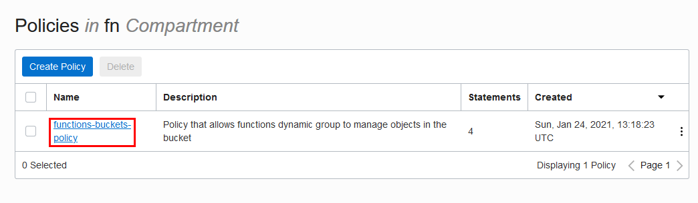
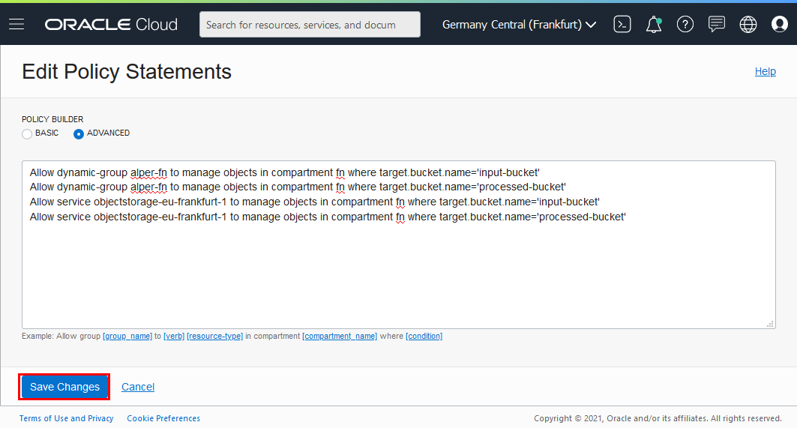

# The fix

## Cause
Line [60](https://github.com/oracle/oracle-functions-samples/blob/d050def206b256d6fed975e70d9f90aa01eefaf9/samples/oci-load-file-into-adw-python/func.py#L60) in `func.py` says Object Storage service to copy file from a bucket to another

Object Storage service, as a service does not have necessary permission to perform tasks on that bucket

Since Object Storage service is a regional service, for each region, permission needs to be granted for that region specific

## Apply the fix
1. Open the navigation menu, select **Identity**, and then select **Policies**.
2. On the left side, make sure you are in the correct compartment with your functions
3. Find the policy that you have created earlier, such as `functions-buckets-policy`; open it
      
4. Click to **Edit Policy Statements**
5. Change policy builder to advanced
      
6. Keep the existing statements, add the following lines:
    ```
    Allow service [OBJECTSTORAGE-EU-FRANKFURT-1] to manage objects in compartment [COMPARTMENT] where target.bucket.name='[INPUT-BUCKET]'
    Allow service [OBJECTSTORAGE-EU-FRANKFURT-1] to manage objects in compartment [COMPARTMENT] where target.bucket.name='[PROCESSED-BUCKET]'
    ```
    Where you need to change the values with brackets `[OBJECTSTORAGE-EU-FRANKFURT-1]`, `[COMPARTMENT]`, `[INPUT-BUCKET]` and `[PROCESSED-BUCKET]` *with removing the brackets*
7. **Save Changes**
      


## Test the fix
1. Execute following command from terminal
    ```shell
    $ oci os object put  --bucket-name input-bucket --file file3.csv
    ```
    Replace `input-bucket` name accordingly
2. Open `input-bucket`. In the **Objects** section new file will be visible for a brief of time; until processing finishes. If you do not see the file:
    1. Console might not have refreshed, just navigate to another section or come back (Same as refreshing the page, but faster)
    2. File might have been processed and moved to `processed-bucket`
3. Query the database, see new records. *Each file contains 4 rows, so 3 files makes 12 records*
4. Open `processed-bucket` and look into **Objects** section. If you do not see the file:
    1. This is not happening instantly, give it little time under a minute
    2. You migh have done something wrong in as fix