# Public Access using API Gateway
The [API Gateway](https://www.oracle.com/cloud-native/api-gateway/) service enables you to publish APIs with private endpoints that are accessible from within your network, and which you can expose with public IP addresses if you want them to accept internet traffic. The endpoints support API validation, request and response transformation, CORS, authentication and authorization, and request limiting. 

If you are working on your own tenancy, please review [Required IAM Service Policy](https://docs.oracle.com/en-us/iaas/Content/APIGateway/Concepts/apigatewayoverview.htm#requiredpolicy)

API Gateway will make an internal request to the Functions endpoint, invoking the function. In this exercise, we will not put any authentication for requests. This method is fastest way of exposing functions to the public internet, also a recommended way for exposing functions to web applications.

## Step 1: Update VCN for public access
We are going to deploy the API Gateway in the same VCN with our Applications/Functions. That network is not accessible from external requests on HTTPS port.

1. From the OCI Services menu, click **Virtual Cloud Networks** under **Networking**. Select the compartment assigned to you from the drop down menu on the left side of the screen(you may need to scroll down to see the dropdown)
2. Select the VCN that you have created earlier
    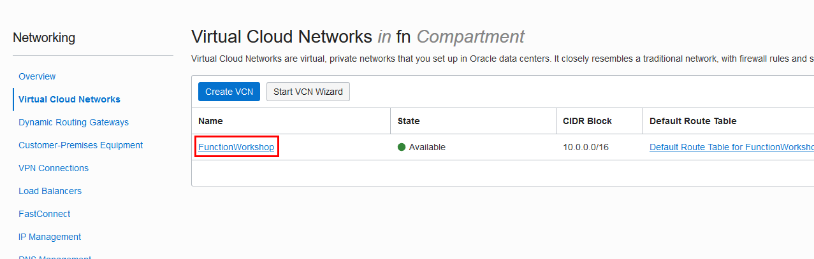  
3. Click to **Security Lists** on the left than open the **Default Security List for ...**
    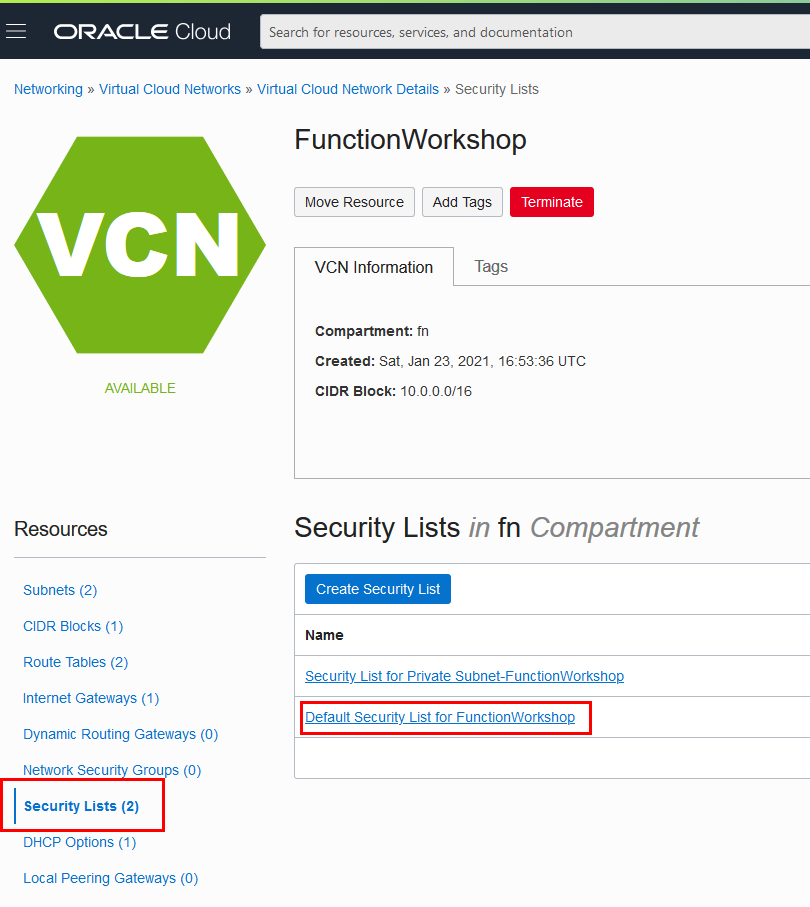  
4. Click to add Ingress Rules
    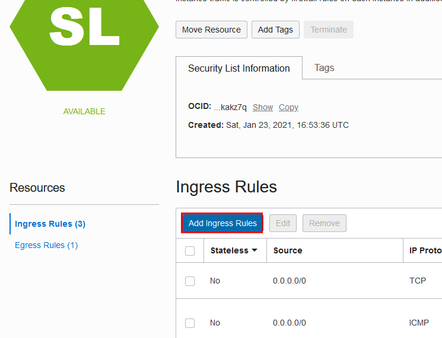  
5. In the dialog enter the following and click to **Add Ingress Rules**
    - Source: `0.0.0.0/0`
    - Destination Port Range: `443`
    - Description: `HTTPS`  
    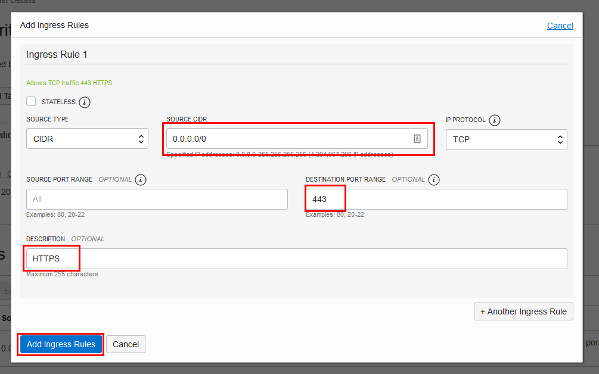  

## Step 2: Create API Gateway and add deployment
1. From the OCI services menu click **API Gateway** under **Developer Services**, press to **Create Gateway**
    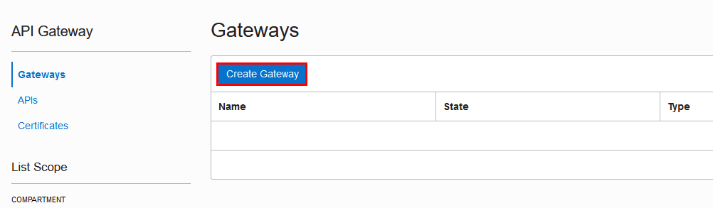  
2. Fill the form as following and press **Create**
    - Name: `fnGateway` (or something you like)
    - Type: `Public`
    - Compartment: *same as your functions [or leave it as is]*
    - Virtual Cloud Network: *same virtual network that you have just modified*
    - Subnet: `Public Subnet`  
    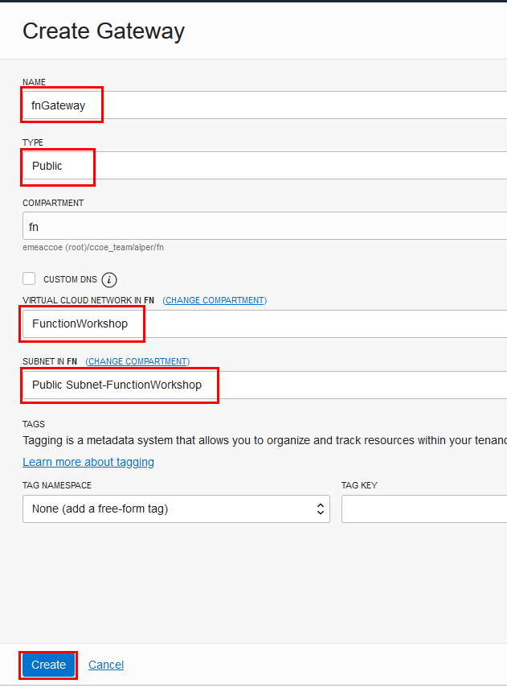  
    This will take a little while. You can freely dismiss any pop-up notification about gateways
3. When the status becomes active, click to the name of it `fnGateway`
4. On the left side, select **Deployments** than press **Create Deployment**
    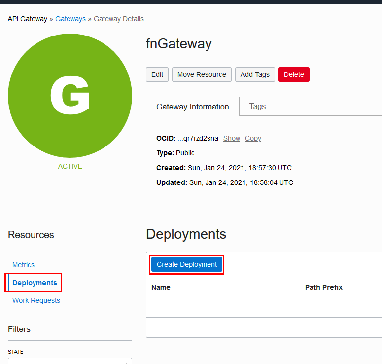  
5. Create deployment with the following information:
    1. **Basic Information**
        - From Scratch
        - Name: `Functions`
        - Path Prefix: `v1`
        - Compartment: *same as your functions [or leave it as is]*
        - Press **Next**
        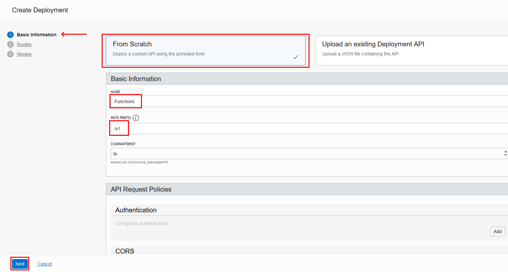  
    2. **Routes**
        - Path: `/hello`
        - Methods, add two: `GET` and `POST`
        - Type: `Oracle Functions`
        - Application: `WorkshopFunctionApplication` *the application name that you have created in exercise 1*
        - Function Name: `my-func` *the function name that you have created in exercise 1*
        - Press **Next**
        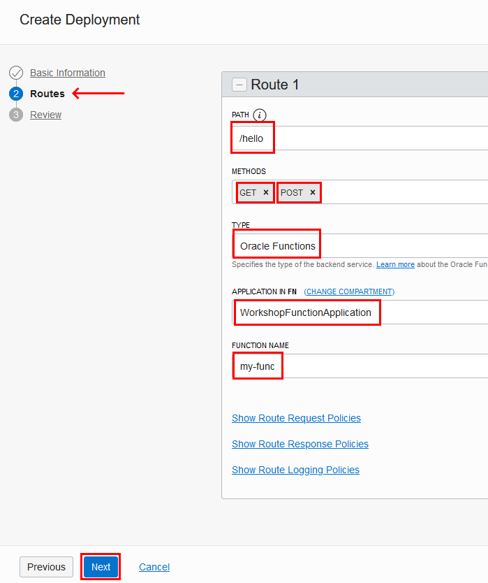  
    3. **Review**
        - Press **Create**. It will take some time creating the deployment
6. When the deployment status becomes active, copy the **Endpoint**
    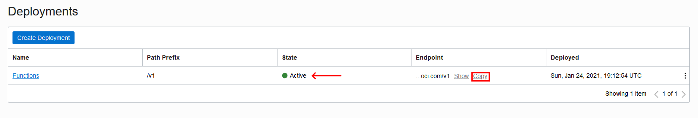  
    You will use this url in item 7 and 8
7. Open a new browser tab, paste that URL, append `/hello` *, otherwise you will get 404 error*
    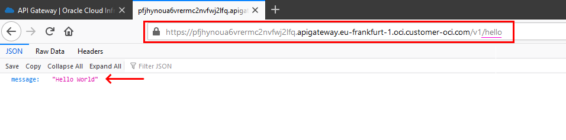  
8. In the terminal execute the following command, by replacing the url. Do not forget the add `/hello` to the end of the `URL`
    ```shell
    $ curl -X POST -H "Content-Type: application/json" -d '{"name": "John"}' [URL]

    > {"message":"Hello John"}
    ```
    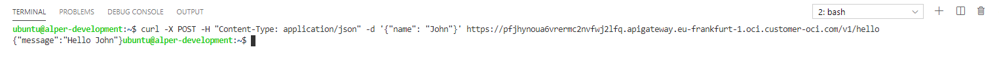  


