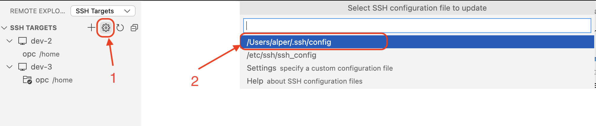

# Lab 1: Installation
In this lab we will make sure that we have the right enviornment for the workshop
- Linux - bash
- git 
- SSH key
- Visual Studio Code
- OCI CLI
- kubectl
- Helm

## Linux - bash
The guides in this workshop are prepared for a linux bash system. Using other systems might not generate expected results. If you have a native bash or equvalent enviornment OR a local linux VM or container will work for you.

If you do not have this enviornment, create a VM instance on OCI and connect this instance using SSH. If you do not know how to do it, ask it to your instructor. Also check [git](#git) & [ssh](#ssh) sections first.

If you are to use a remote development enviornment, some of the components are to be installed on your local computer or remote or both! If you are to use local development, the steps indicated for remote, you will be performing for local instead.

## Git
> *Local and remote (both)*

Make sure git is installed on your system (your system). On windows, make sure that you have installed from the [official site](https://git-scm.com/downloads); you will be using git bash.

On linux, you can either use the pacakage manager (such as yum) or the link above.

You need to run the following lines on terminal, to correctly configure git for commits

```shell
git config --global user.name "Your Name"
git config --global user.email "youremail@yourdomain.com"
```
Email should be same as your corporate email that you have registered to OCI

## SSH
> *Local and remote (both)*

SSH key will be used in:
- If you are to use Local computer to connect remote linux
- To be added on VBS profile on (remote) computer

### Generate SSH
If you have an ssh key already, skip this step (but you need to create on remote)

To generate the key, follow the steps [Generating a new SSH key and adding it to the ssh-agent](https://docs.github.com/en/authentication/connecting-to-github-with-ssh/generating-a-new-ssh-key-and-adding-it-to-the-ssh-agent) document.
- On local windows you will be using git bash as terminal (this is installed via git)
- You will be using your corporate email (not necessarly GitHub)
- Follow the steps in **Generating a new SSH key** and **Adding your SSH key to the ssh-agent**. We will not be using ~~Generating a new SSH key for a hardware security key~~

### Get public key
1. Open your terminal (if you have it open, you can use the same)
2. You need to run following, display content of a file, ending with `.pub`. Based on your supported key either:
    ```shell
    cat ~/.ssh/id_ed25519.pub
    ```
    OR
    ```shell
    cat ~/.ssh/id_rsa.pub
    ```
    OR
    ```shell
    cat ~/.ssh/id_dsa.pub
    ```
3. Copy the output. That will be your public key value.

## Visual Studio Code
> *Local*

This guide is prepared assuming you will be using Visual Studio Code. If you have another favorite IDE or Text Editor and familiar with terminal based text editing, you can use as you like and skip this step.

1.  If you do not have VS code, [download](https://code.visualstudio.com/download) and install it
    > Skip further steps if you are to use local development
2. Install VS code extensions:
    - [Remote Development](https://marketplace.visualstudio.com/items?itemName=ms-vscode-remote.vscode-remote-extensionpack)
3. Connect to development environment over SSH. Within VS code:
    1. Open **Remote Explorer**  
    
    2. Open Config file  
    
    3. Add the target host. You need to use the public IP of your remote linux. Here is a sample file
        ```
        Host a-name-for-host
          HostName 127.0.0.1
          User opc

        Host *
          AddKeysToAgent yes
          IdentityFile ~/.ssh/id_ed25519
        ```
        Perform necessary changes as needed in the example above. (such as name of the host, ip, identity file path)
    4. On the **SSH TARGETS** of **Remote Explorer**, for the name you have given host, connect to host (does not matter current or new window)
    5. On **Explorer** you can open the user home path

## OCI CLI
> *Remote*

Follow the [OCI CLI: Quickstart](https://docs.oracle.com/en-us/iaas/Content/API/SDKDocs/cliinstall.htm) guide.

After installation, make sure:
1. Config file needs to be configured for the OCI user (you may ask your instructor)
2. Config file permissions should be applied

## kubectl
> *Remote*

Follow the [Install and Set Up kubectl on Linux](https://kubernetes.io/docs/tasks/tools/install-kubectl-linux/) guide

- On OCI you will be most likely to get an Oracle Linux, it is considered as a Red-Hat based distribution according to the guide
- You cannot perform validations yet, cluster configuration will happen in future labs

## Helm
> *Remote*

Follow the [Installing Helm](https://helm.sh/docs/intro/install/) guide

---
# Navigation
- [Home](./README.md)
- Next: [Lab2: Configuration](./Lab2-Configuration.md)