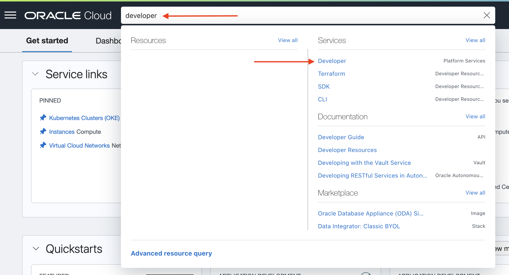
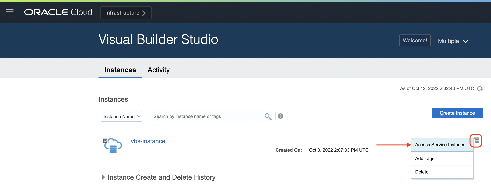
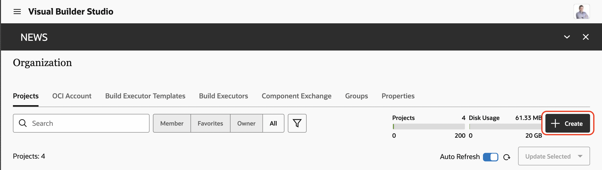
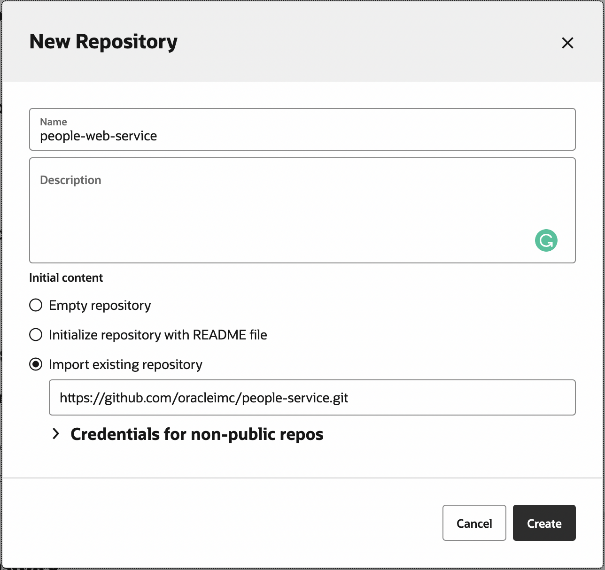
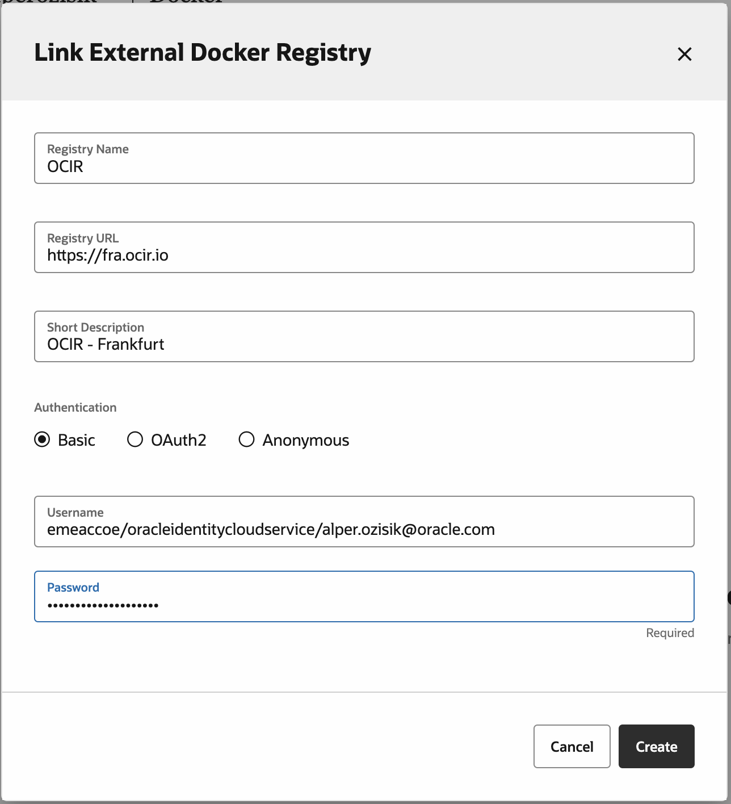
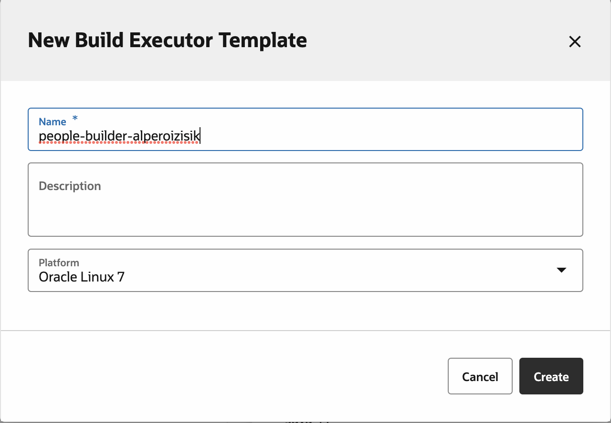
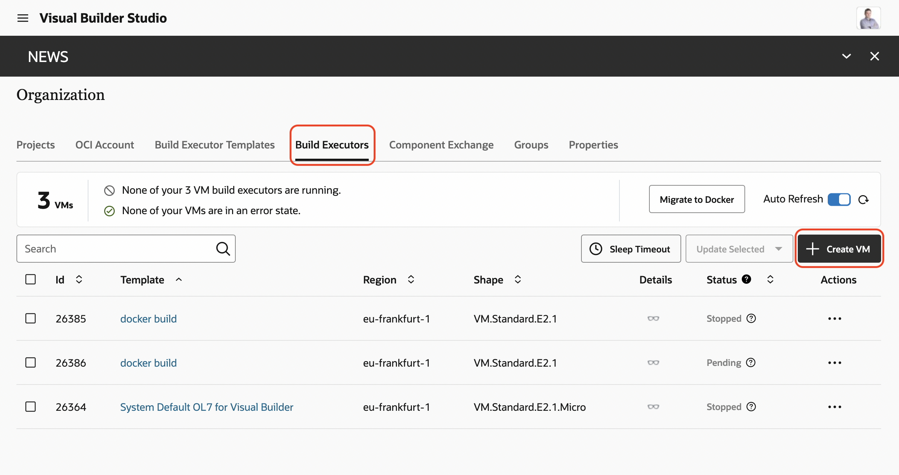
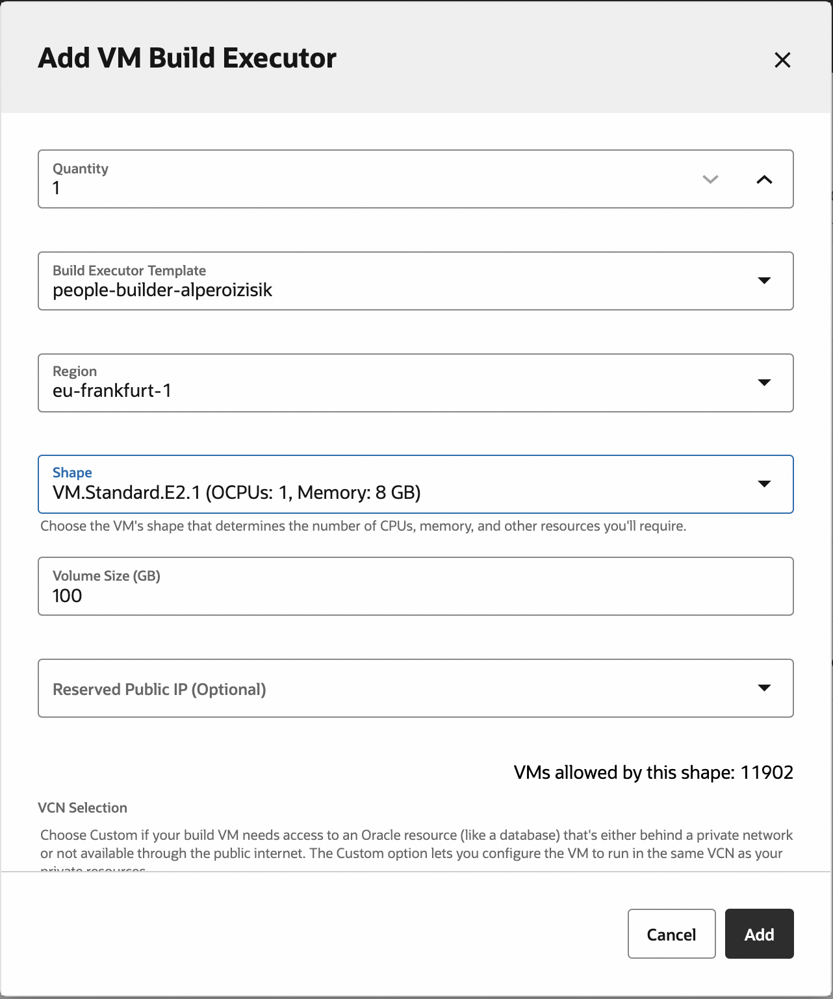

# Lab 3: Visual Builder Studio
In this lab, we are going to create the Visual Builder Studio project.

## Access VBS instance
You can acsess to VBS instance either by direct URL OR from webconsole. 

If you do not know the direct URL, instructor can provide you.

If you want to access from OCI Web Console:
1. On search, type `developer` and under Services, select Developer  
    
2. There should be single row for a VBS instance. On your tenancy the name of the instance could be different, this is irrelevant. Click to right side of the row, the context menu and select `Access Service Instance`  
    

## Create Project
1. Press create button  
    
2. Name it `people-web-`**Your Name**
3. Select Empty project, Wiki Markup as `Markdown` and Finish
4. Import two repositories:
    1. Go to `Project Administration` > `Repositories` > `Create Hosted Repository`
    2. Create for:  
       **name:** people-web-service  
       **Import existing repository:** https://github.com/oracleimc/people-service.git  
       
    3. Create another hosted repository for:
       **name:** people-web-app  
       **Import existing repository:** https://github.com/oracleimc/people-web-app.git
    
## Add OCIR as Docker Registry to project
Folow the steps in [Link an External Docker Registry to Your Project](https://docs.oracle.com/en/cloud/paas/visual-builder/visualbuilder-manage-development-process/access-external-docker-registries.html#GUID-D69DCE1D-7DC9-48EF-87B2-F4F93A0A47DE)

- You will not be using Docker hub
- It is better to select same region as your cluster

## Build Executor
1. Go to `Organization` > `Build Executor Templates`
2. Create template named `people-builder-`**YourName** and create  
   
3. For that template, `Configure Software`
4. Select, latest versions of:
    - Docker
    - Helm
    - Kubectl
    - Node.js
    - OCIcli  
    and press Done
5. Go to `Build Executors` tab, press create VM  
   
6. Select:
    - **Quantity:** 1
    - **Build Executor Template:** *the one that you have created*
    - **Region:** *same region as your cluster*
    - **Shape:** *a small 1 cpu core shape is enough. Select any one available to you*
    - **Volume Size:** 100
    - No reseverved Public IP
    Press Add  
    

---
# Navigation
- Previous: [Lab2: Configuration](./Lab2-Configuration.md)
- [Home](./README.md)  
- Next: [Lab4: MySQL](./Lab4-MySQL.md)