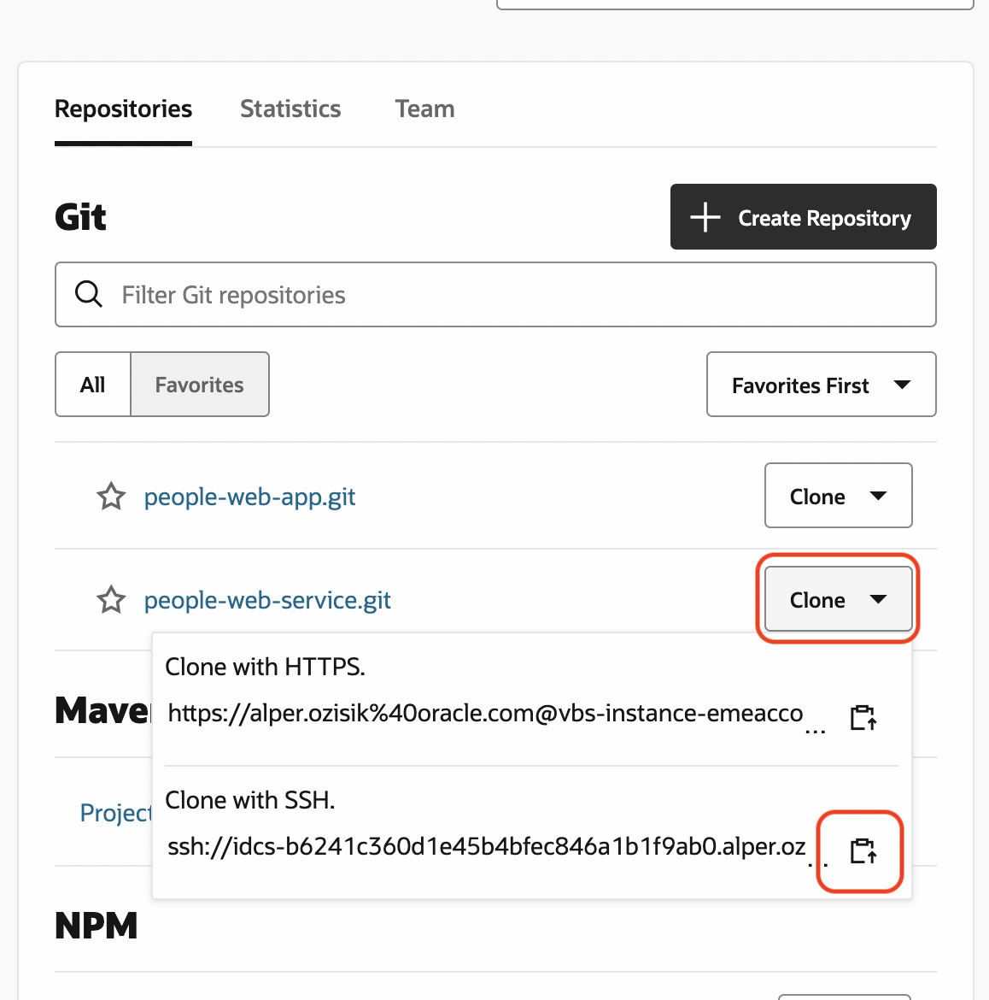
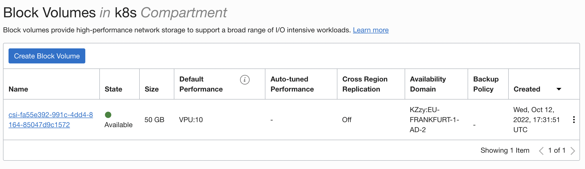

# Lab4: MySQL
In this lab we will be:
- Cloning People Web Service
- Crete a PVC
- Deploy MySQL
- Create MySQL database
- Create Kubernetes Secret for DB

## Clone People Web Service
1. On VBS, go to Project Home or Git page
2. Press Clone for `people-web-service.git` and select **SSH**  
   
3. On (remote) development machine go to project root folder (create new if you like) and git clone the URL
    ```shell
    mkdir project-home
    cd project-home
    git clone ssh://idcs-XXXXXXXX
    cd people-web-service
    ```
    - Do not use https
    - If you get error for SSH, you have not added SSH key to VBS, [Upload Your Public SSH Key](https://docs.oracle.com/en/cloud/paas/visual-builder/visualbuilder-manage-development-process/get-yourself-set.html#GUID-8DC528AF-4F24-4C1A-8AC1-2DBAF413839B)
    - If asked to trust, answer yes `Are you sure you want to continue connecting (yes/no/[fingerprint])? yes`

## Create Database password as K8s secret
Execute the following command
```shell
kubectl create secret generic mysql-pass --from-literal=password=123456
```

## Create PVC
Content of the Volume Claim:
```yaml
apiVersion: v1
kind: PersistentVolumeClaim
metadata:
  name: mysqlclaim
spec:
  storageClassName: "oci-bv"
  accessModes:
    - ReadWriteOnce
  resources:
    requests:
      storage: 50Gi
```
Apply PVC:
```shell
kubectl apply -f k8s/claims/mysql-volume-claim.yaml
```
Expected output:
```shell
persistentvolumeclaim/mysqlclaim-yourname created
```
When you query, list of pvc, you will get pending
```shell
$ kubectl get pvc
> NAME               STATUS    VOLUME   CAPACITY   ACCESS MODES   STORAGECLASS   AGE
 mysqlclaim-yourname Pending                                      oci-bv         55s
```
The PVC has a status of `Pending` because the `oci-bv` storage class's definition includes `volumeBindingMode: WaitForFirstConsumer`.

## Deploy MySQL
Now that we have our password stored, it's now time to deploy our MySQL server on to our cluster. This deployment file will create the MySQL pod and the MySQL service. To do this:

```shell
kubectl apply -f k8s/deployments/mysql-deployment.yaml 
```

Output:
```
deployment.extensions/mysql created
service/mysql created
```

You can check if the pod is running:

```shell
kubectl get pods
```

Output:
```
NAME                     READY   STATUS              RESTARTS   AGE
mysql-777df7fcd9-zz67c   0/1     ContainerCreating   0          13s
```

You can check if the mysql service is running:

```shell
kubectl get svc
```
Output:
```
NAME    TYPE        CLUSTER-IP      EXTERNAL-IP   PORT(S)    AGE
mysql   ClusterIP   10.96.105.166   <none>        3306/TCP   55s
```

Continue to run `kubectl get pods` until you get status for MySQL to get `Running`

### Check PV/C
You can check the status of the claim:
```shell
kubectl get pvc
```
```
NAME         STATUS   VOLUME                                     CAPACITY   ACCESS MODES   STORAGECLASS   AGE
mysqlclaim   Bound    csi-fa55e392-991c-4dd4-8164-85047d9c1572   50Gi       RWO            oci-bv         21m
```
Also check the persistent volume:
```shell
kubectl get pv
```
```
NAME                                       CAPACITY   ACCESS MODES   RECLAIM POLICY   STATUS   CLAIM                    STORAGECLASS   REASON   AGE
csi-fa55e392-991c-4dd4-8164-85047d9c1572   50Gi       RWO            Delete           Bound    alperozisik/mysqlclaim   oci-bv                  17m
```
Go to OCI Console to check [Block Volumes](https://cloud.oracle.com/block-storage/volumes). You will notice, after the PVC is bound, the block volume is provisioned.



As you can see in the picture above, te name of the PV matches the name of the block volume on OCI

## Create people_db
Let now create the **people_db** that is used by the backend api to store data. You will need to connect to the mysql docker container that is running (wait until status in `kubectl get pods` becomes `Running`) in your cluster and then login to the mysql server and create your database. To connect you will need the name of the pod, in my case **mysql-777df7fcd9-zz67c** and use the kubectl exec command as shown below. mysql password is **123456**

```shell
kubectl exec -it mysql-777df7fcd9-zz67c -- /bin/bash
```
Then:
```shell
root@mysql-777df7fcd9-zz67c:/# mysql -u root -p
Enter password: 
Welcome to the MySQL monitor.  Commands end with ; or \g.
Your MySQL connection id is 1
Server version: 5.6.51 MySQL Community Server (GPL)

Copyright (c) 2000, 2021, Oracle and/or its affiliates. All rights reserved.

Oracle is a registered trademark of Oracle Corporation and/or its
affiliates. Other names may be trademarks of their respective
owners.

Type 'help;' or '\h' for help. Type '\c' to clear the current input statement.

mysql> create database people_db;
Query OK, 1 row affected (0.00 sec)

mysql> exit;
Bye
root@mysql-777df7fcd9-zz67c:/# exit
exit
```
---
# Navigation
- Previous: [Lab3: Visual Builder Studio](./Lab3-VBS.md)
- [Home](./README.md)
- Next: [Lab5: Ingress Controller](./Lab5-Ingress-Controller.md)