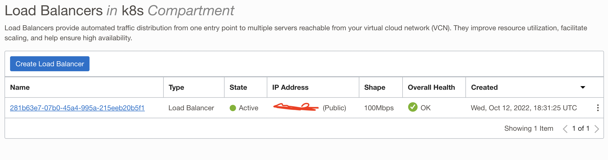

# Lab5: Ingress Controller
If you are not OCI admin and have not completed adding [RBAC cluster admin role](https://github.com/oracleimc/workshops/blob/master/appdev/cloudnative/k8s/OKE-VBS/Lab2-Configuration.md#kubernetess-cluster), go back and perform this action

## Create an Ingress Controller (Load Balancer) for the kubernetes cluster
Here we will be creating the ingress controller. This setup is for multi-user scenario for workshop scope.
```shell
helm install --repo https://kubernetes.github.io/ingress-nginx $YOUR_NAME ingress-nginx --namespace $YOUR_NAME --create-namespace --set controller.electionID=$YOUR_NAME --set controller.ingressClassResource.name=$YOUR_NAME --set controller.ingressClassResource.enabled=true --set controller.ingressClassResource.default=false --set controller.ingressClassResource.controllerValue="k8s.io/$YOUR_NAME"
```
Output:
```
NAME: yourname
LAST DEPLOYED: Wed Oct 12 18:31:20 2022
NAMESPACE: yourname
STATUS: deployed
REVISION: 1
TEST SUITE: None
NOTES:
The ingress-nginx controller has been installed.
It may take a few minutes for the LoadBalancer IP to be available.
You can watch the status by running 'kubectl --namespace yourname get services -o wide -w yourname-ingress-nginx-controller'

An example Ingress that makes use of the controller:
  apiVersion: networking.k8s.io/v1
  kind: Ingress
  metadata:
    name: example
    namespace: foo
  spec:
    ingressClassName: yourname
    rules:
      - host: www.example.com
        http:
          paths:
            - pathType: Prefix
              backend:
                service:
                  name: exampleService
                  port:
                    number: 80
              path: /
    # This section is only required if TLS is to be enabled for the Ingress
    tls:
      - hosts:
        - www.example.com
        secretName: example-tls

If TLS is enabled for the Ingress, a Secret containing the certificate and key must also be provided:

  apiVersion: v1
  kind: Secret
  metadata:
    name: example-tls
    namespace: foo
  data:
    tls.crt: <base64 encoded cert>
    tls.key: <base64 encoded key>
  type: kubernetes.io/tls
```

Now check the services deployed:
```shell
kubectl get svc
```
Output:
```
yourname-ingress-nginx-controller             LoadBalancer   10.96.43.98     441.847.609.974   80:31466/TCP,443:32642/TCP   2m45s
yourname-ingress-nginx-controller-admission   ClusterIP      10.96.123.38    <none>           443/TCP                      2m45s
mysql                                            ClusterIP      10.96.105.166   <none>           3306/TCP                     62m
```
> The public IP is a fake value there

Go and check the [Load Balancer](https://cloud.oracle.com/load-balancer/load-balancers) on OCI Web Console:



---
# Extra
> This section is just for information purpose. Do not execute during the workshop

For vanilla ingress-nginx installation, you can check:
1. [Oracle Cloud Infrastructure](https://github.com/kubernetes/ingress-nginx/blob/main/docs/deploy/index.md#oracle-cloud-infrastructure) script deployment. Download the deployment file, perform necessary changes.
2. [Quick start](https://github.com/kubernetes/ingress-nginx/blob/main/docs/deploy/index.md#quick-start), Helm deployment is also good. Helm charts are more easy to update the installed  version. Making customizations are are also possible, but require more digging.

Both of them will provision the infrastructure load balancer. [Load balancer based customizations](https://github.com/oracle/oci-cloud-controller-manager/blob/master/docs/load-balancer-annotations.md) could be applied in both of the methods.

---
# Navigation
- Previous: [Lab4: MySQL](./Lab4-MySQL.md)
- [Home](./README.md)  
- Next: [Lab6: Build & Deploy People Service](./Lab6-Build-Deploy-People-Service.md)
