# Build People Service on VBS and Deploy it
In this lab we will:
- Create OCIR repository
- Create a build job on VBS
- Create Docker Registry Secret
- Deploy People Service to Kubernetes

## Create OCIR Repository
When a container image is pushed to registry, if the repository is not there, it will be created under root compartment. It is possible to move it to correct compartment after creation. Best practice is to create the repository before in correct compartment pusing it for the first time.

1. Open OCIR from OCI Web Console `Developer Services` > `Container Registry`
2. Make sure that `workshops` compartment is selected and press `Create repository`  
   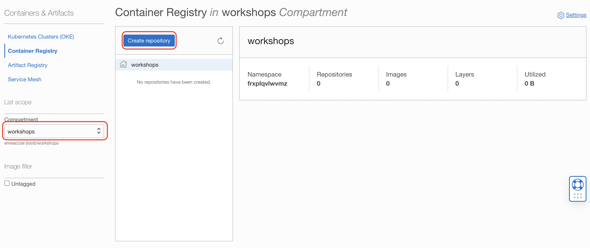
3. Enter **yourname**`/people-service` name  
   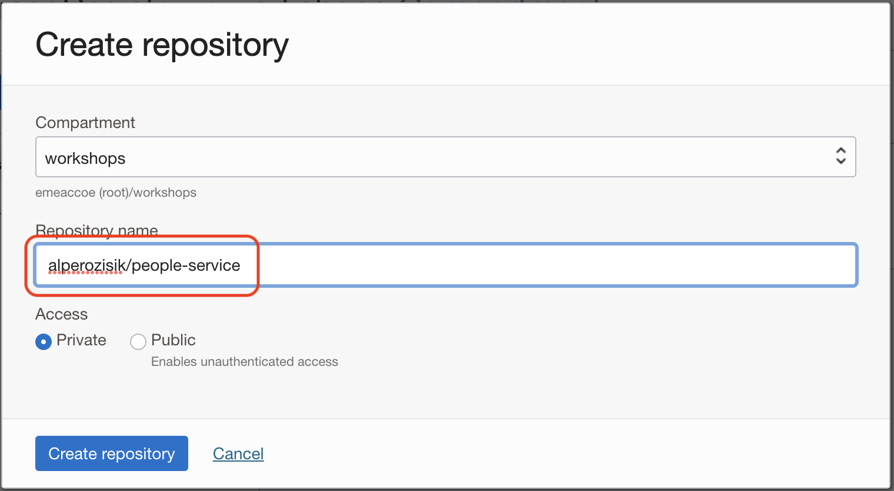

The repository is be created under selected compartment 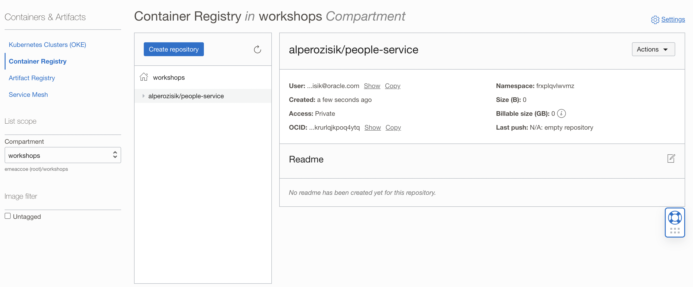

## Create (docker) build job on VBS
1. Go to Builds and create a new job  
   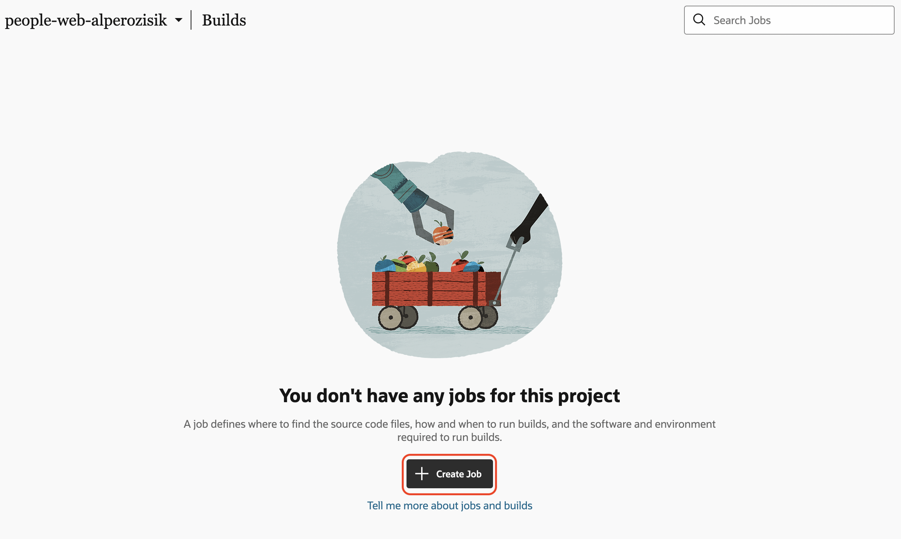
2. Name the job build `build-people-service`. Select the template that you have created earlier  
   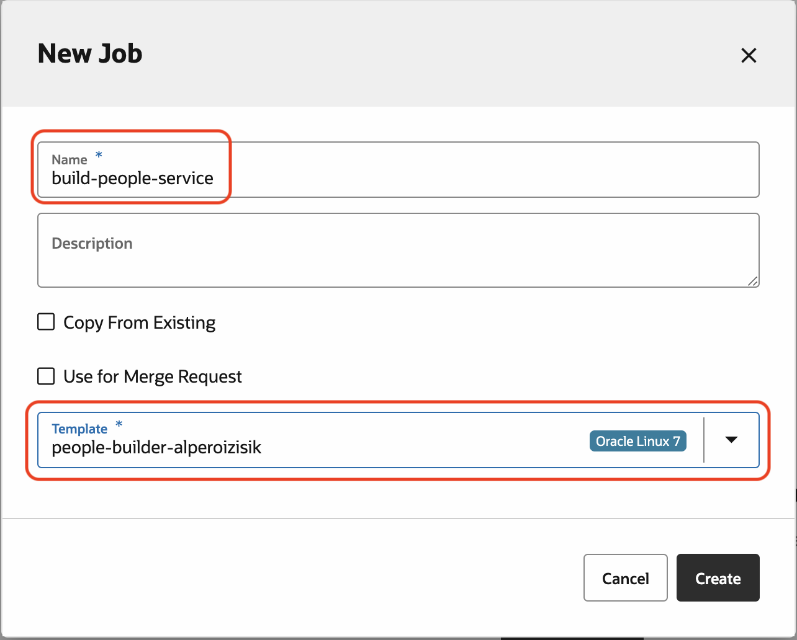
3. The job will come empty, add git  
   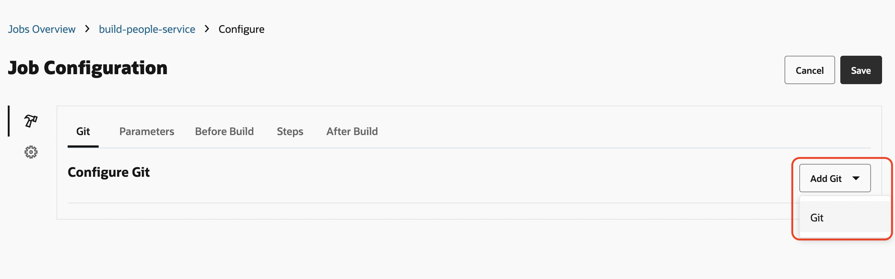
4. Select repository `people-web-service`    
   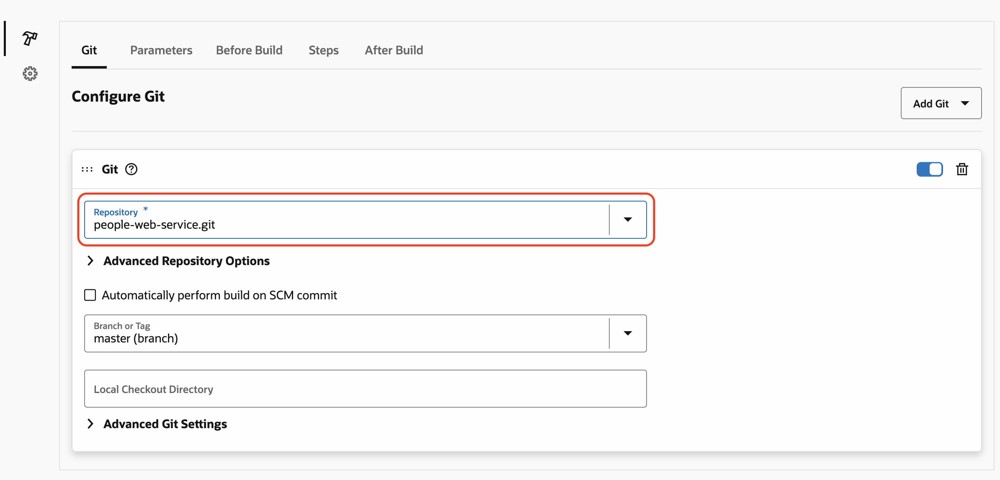
5. On the tab, go to (build) steps  
   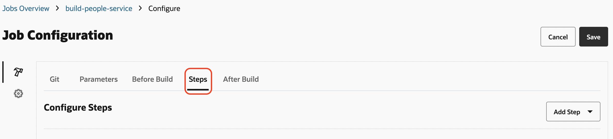
6. Select docker login  
   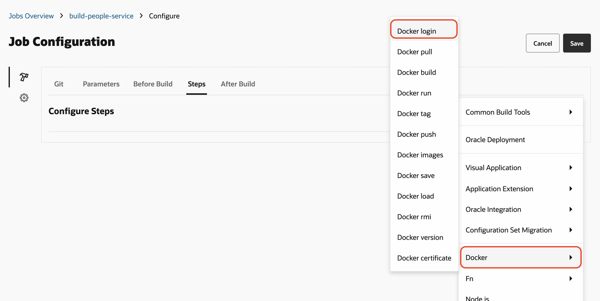
7. Select `OCIR` from the dropdown for Docker login step. That `OCIR` is the one that you have created earlier  
   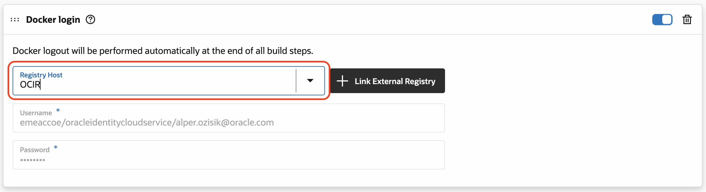
8. Add Docker build step  
   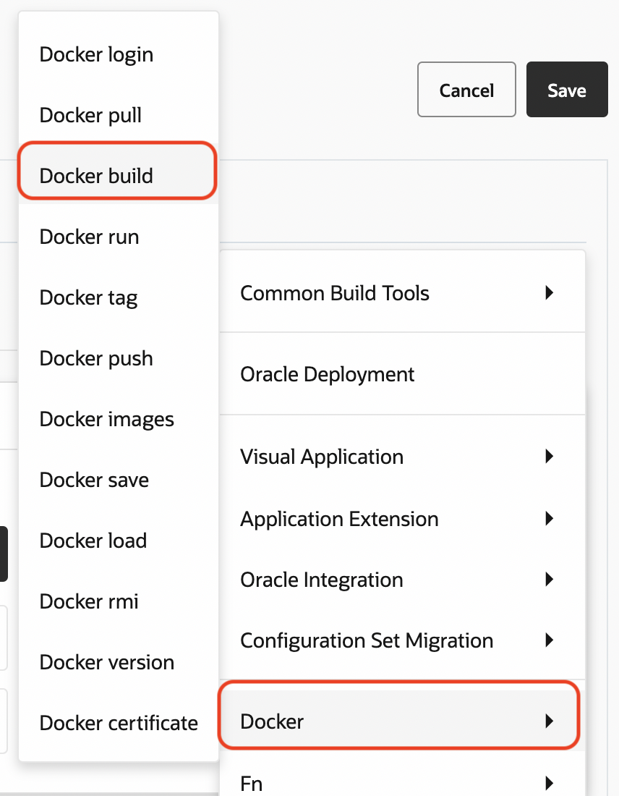
9. Fill:
    - **Registry Host:** OCIR
    - **Image Name:** *tenancy_namespace*`/`*yourname*`/people-service`
    - **Version Tag:** `latest`
    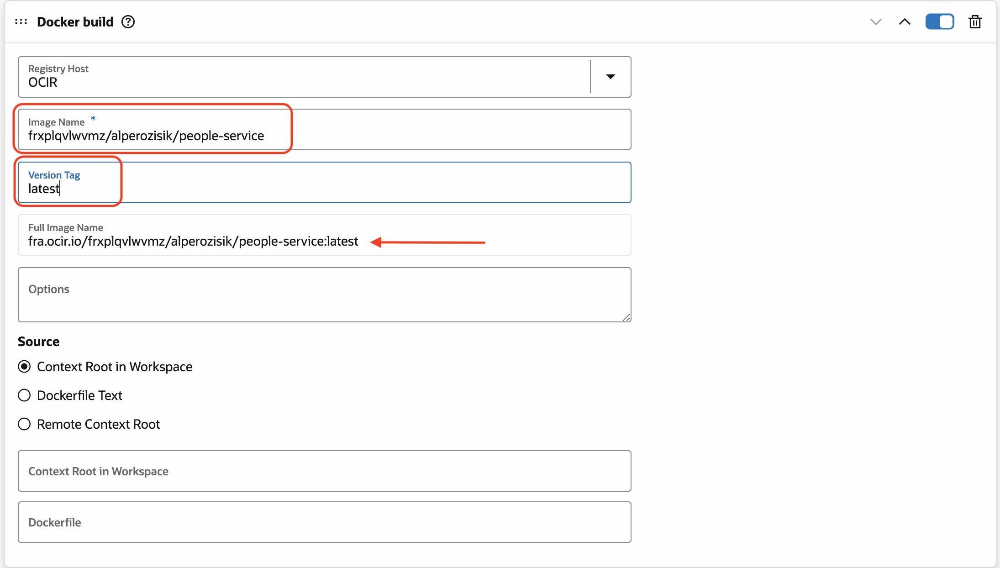
10. Add Docker push step. Details are automatically filled from previous steps  
    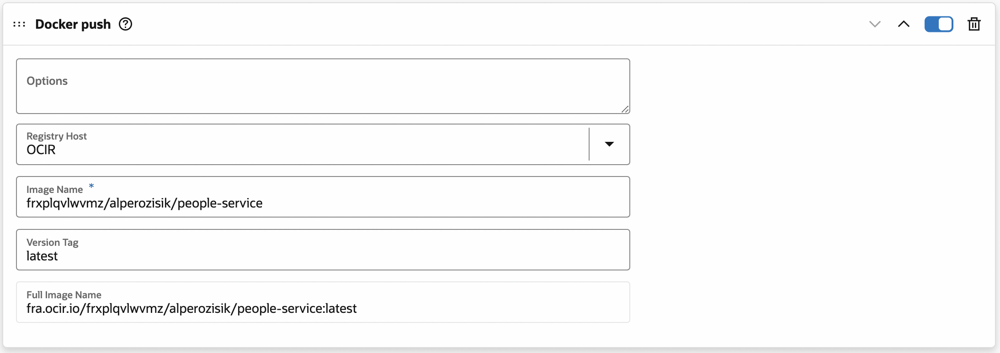
11. Save  
    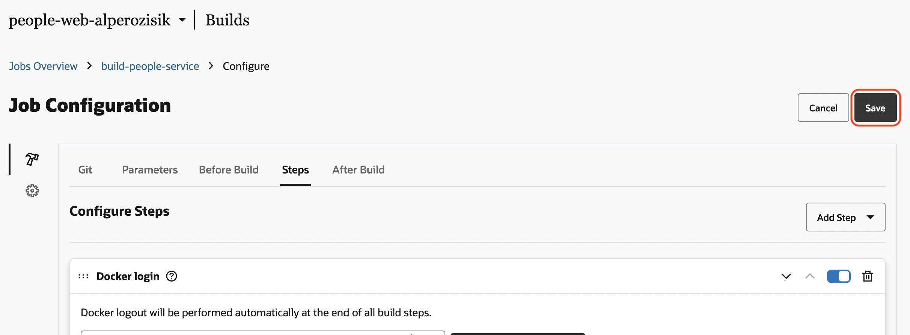
12. Run the job!  
    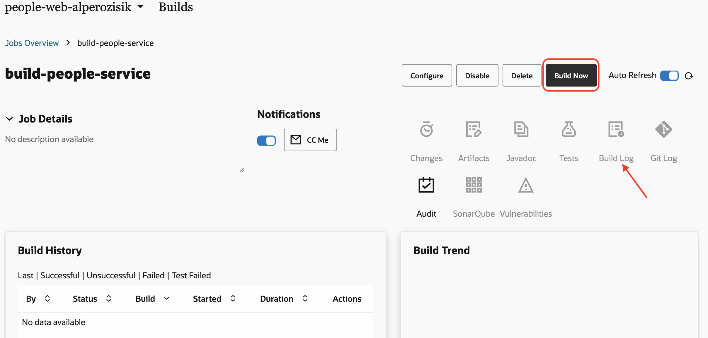
    > This build job is going to use the build executor that we have created earlier. That machine is going to start for the first time. When it is going to start for the first time, it will install the (configured) software. First build is going to take time to start. You can check the status of the executor within Overview > Build Executors and the status of the build under Build Log
13. A successful build will look like this  
    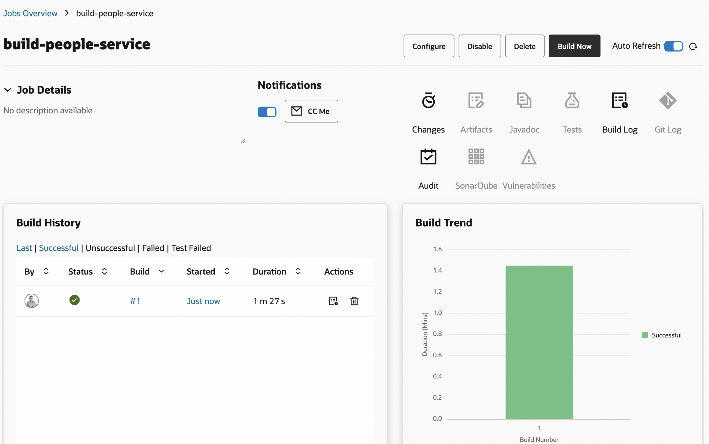
14. Check OCIR for the pushed container image. You may need to press the *refresh* button and expand the repository to see the pushed tag
    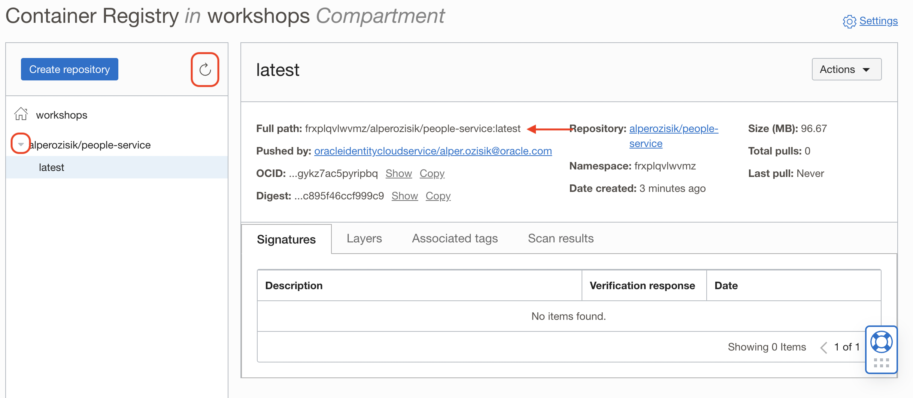  
    You can also pull that image, to get the pull command expand Actions menu on right top:
    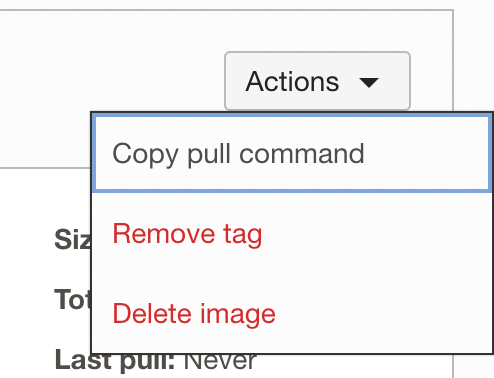  
    > We have not installed docker on your (remote) development envionment. You need docker to pull it. In order to pull, [docker login](https://docs.oracle.com/en-us/iaas/Content/Functions/Tasks/functionslogintoocir.htm) command needs to be executed first.

## Create Docker Registry Secret
For the kubernetes to be able to pull images from OCIR, we have to added our Auth Token to our cluster as a secret. 

+ Replace {tenancynamespace}/{username} and {Auth Token}

**Please note if you are in another region apart from eu-frankfurt please also change the --docker-server**

```shell
kubectl create secret docker-registry ocirsecret --docker-username='{tenancynamespace}/{username}' --docker-password='{Auth Token}' --docker-server=fra.ocir.io --docker-email='api.user@acme.com'
```

Output:

```shell
secret/ocirsecret created
```

## Deploy People Service to Kubernetes
In order to deploy it to Kubernetes, some configuration in the deployment file needs to be changed.

### Deploy people-sevice application
Open `k8s/deployments/people-service-deployment.yaml` file to edit.

Replace the `spec.template.spec.containers[0].image` value as *full path of the container image* from OCIR.

```shell
kubectl apply -f k8s/deployments/people-service-deployment.yaml
```
Output:
```
deployment.apps/people-service created
```
You can check the status of the deployment:
```shell
$ kubectl get pods
NAME                                                   READY   STATUS    RESTARTS   AGE
yourname-ingress-nginx-controller-cc4d5786c-wrvl4      1/1     Running   0          72m
mysql-777df7fcd9-5sltd                                 1/1     Running   0          72m
people-service-54979fbbd7-bz4ts                        1/1     Running   0          6s

$ kubectl get deployments.apps 
NAME                                   READY   UP-TO-DATE   AVAILABLE   AGE
yourname-ingress-nginx-controller      1/1     1            1           3h49m
mysql                                  1/1     1            1           4h48m
people-service                         1/1     1            1           16s
```

### Deploy people-service Service
Execute the following:
```shell
kubectl apply -f k8s/services/people-service.yaml
```
Output:
```
service/people-service created
```
Check
```shell
$ kubectl get svc
NAME                                             TYPE           CLUSTER-IP      EXTERNAL-IP      PORT(S)                      AGE
yourname-ingress-nginx-controller                LoadBalancer   10.96.43.98     441.847.609.974   80:31466/TCP,443:32642/TCP   3h55m
yourname-ingress-nginx-controller-admission      ClusterIP      10.96.123.38    <none>           443/TCP                      3h55m
mysql                                            ClusterIP      10.96.105.166   <none>           3306/TCP                     4h54m
people-service                                   ClusterIP      10.96.148.129   <none>           8080/TCP                     67s
```

### People Service Ingress
Ingress class of the ingress definition should be updated with the ingress controller that we are using. `spec.ingressClassName: yourname`. Edit the `k8s/services/ingress.yaml` file accordingly.

```yaml
apiVersion: networking.k8s.io/v1
kind: Ingress
metadata:
  name: people-service-ing
  annotations:
    ingress.kubernetes.io/rewrite-target: /
spec:
  ingressClassName: yourname #replace here
  rules:
  - http:
      paths:
      - path: /people
        pathType: Prefix
        backend:
          service:
            name: people-service
            port:
              number: 8080
```

```shell
kubectl apply -f k8s/services/ingress.yaml
```
Output:
```
ingress.networking.k8s.io/people-service-ing created
```

# Test
Now your backend API server is up and running. You can test it.

Get your public ip, by executing
```shell
kubectl get svc
```
Your load balancer public IP is listed under `EXTERNAL-IP` column. Append `/people` path to it and run that url in your browser: *http://441.847.609.974/people*

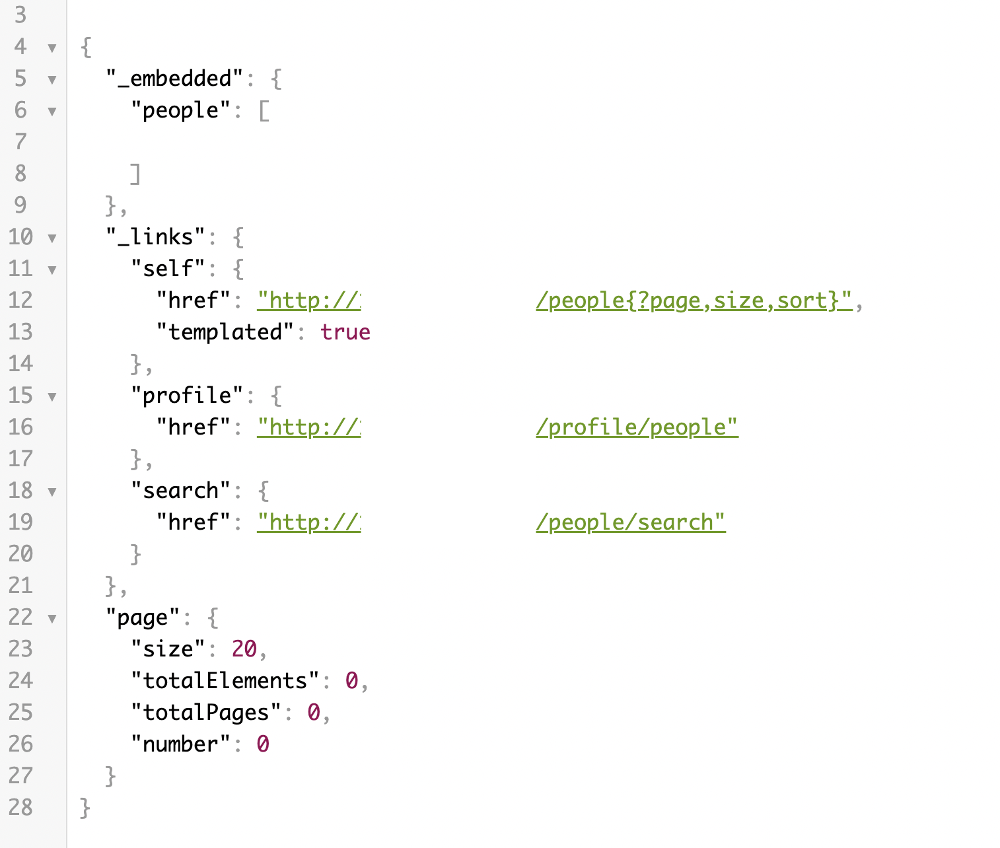

# Commit changes in People Service
You can easly create a commit and push:
```shell
git commit -am "performed modifications for the project"
git push
```


---
# Navigation
- Previous: [Lab5: Ingress Controller](./Lab5-Ingress-Controller.md)
- [Home](./README.md)
- Next: [Lab7: Build & Deploy People App](./Lab7-Build-Deploy-People-App.md)