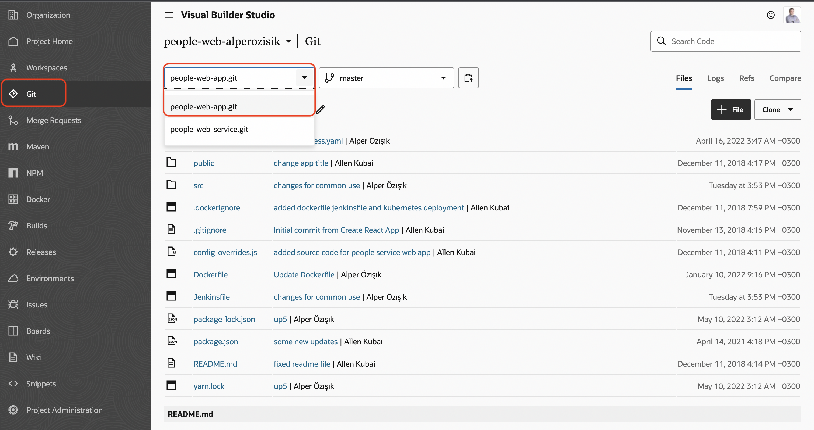
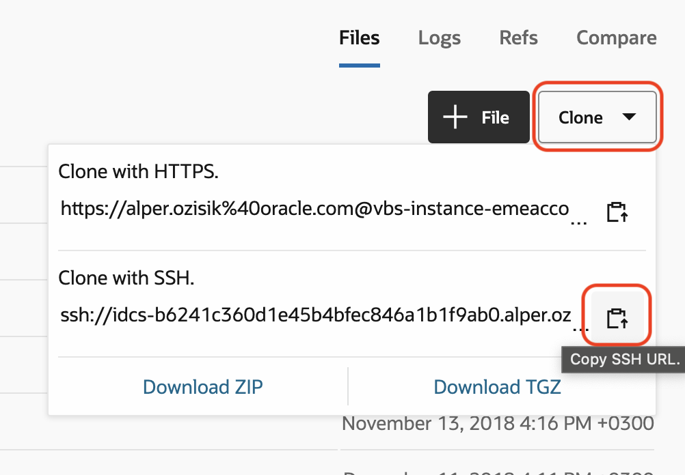
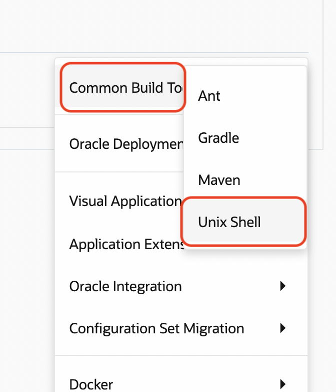
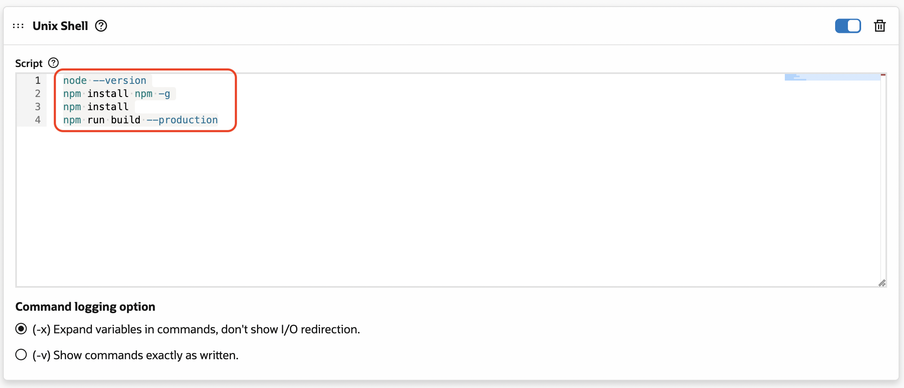
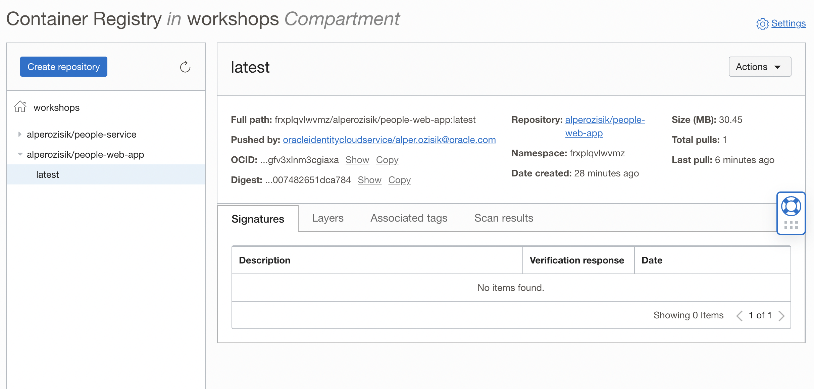

# Build People Web App on VBS and Deploy it
In this lab, we are going to perform similar task to previous, but with front-end Web App
- Create OCIR repository
- Modify source code to target backend
- Create a build job on VBS
- Deploy People Service to Kubernetes

Since the topics covered here similar to previous, screenshots are ommited.

## Crete OCIR repository

1. Open OCIR from OCI Web Console `Developer Services` > `Container Registry`
2. Make sure that `workshops` compartment is selected and press `Create repository`  
3. Enter **yourname**`/people-web-app`

## Modify backend path
Front end is using backend URL to perform activities. This is hard-coded within the source code.

### Clone from VBS
1. Go to VBS Project > Git
2. Select `people-web-app.git` from top dropdown
   
3. Copy SSH Clone URL
   
4. Go to `project-home` folder. Either:
    ```shell
    cd project-home
    ```
    OR
    ```shell
    cd ..
    ```
5. Clone the repo
    ```shell
    git clone SSH-URL
    ```
6. Get into `people-web-app` folder
    ```shell
    cd people-web-app
    ```
### Change source
The change is in `src/constants/index.js` file
```shell
code src/constants/index.js
```
Replace the URL with the one that you have tested from previous lab.  
*http://441.847.609.974*
> That URL should **not** end with people and a slash ( / )

### Commit & Push
Execute the following:
```shell
git commit -am "Backend URL is set"
git push
```

## Create (docker) build job on VBS
1. Go to Builds and create a new job  
2. Name the job build `build-people-web-app`. Select the template that you have created earlier  
3. The job will come empty, add git  
4. Select repository `people-web-app`    
5. On the tab, go to (build) steps  
6. Select Common Build Tools > Unix Shell
   
7. Add the following build script
    ```shell
    node --version
    npm install npm -g
    npm install
    npm run build --production
    ```
    
8. Select docker login  
9. Select `OCIR` from the dropdown for Docker login step. That `OCIR` is the one that you have created earlier  
10. Add Docker build step  
11. Fill:
    - **Registry Host:** OCIR
    - **Image Name:** *tenancy_namespace*`/`*yourname*`/people-web-app`
    - **Version Tag:** `latest`
12. Add Docker push step. Details are automatically filled from previous steps  
13. Save  
14. Run the job!  
15. A successful build will look like this  
16. Check OCIR for the pushed container image. You may need to press the *refresh* button and expand the repository to see the pushed tag
      

## Deploy People Web App to Kubernetes
In order to deploy it to Kubernetes, some configuration in the deployment file needs to be changed.

### Deploy people-web-app Application
```shell
code k8s/deployments/people-service-web-app-deployment.yaml
```

Replace the image url in the file

```shell
kubectl apply -f k8s/deployments/people-service-web-app-deployment.yaml
```

You can check status of pod and deployment:
```shell
$ kubectl get pods
NAME                                                   READY   STATUS    RESTARTS   AGE
yourname-ingress-nginx-controller-cc4d5786c-wrvl4      1/1     Running   0          3h41m
mysql-777df7fcd9-5sltd                                 1/1     Running   0          3h41m
people-service-54979fbbd7-bz4ts                        1/1     Running   0          149m
people-web-app-554bb9784d-6lr7x                        1/1     Running   0          23s

$ kubectl get deployments.apps 
NAME                                   READY   UP-TO-DATE   AVAILABLE   AGE
yourname-ingress-nginx-controller      1/1     1            1           6h19m
mysql                                  1/1     1            1           7h19m
people-service                         1/1     1            1           150m
people-web-app                         1/1     1            1           81s
```

### Deploy people-web-app Service
```shell
kubectl apply -f k8s/services/people-service-web-app.yaml
```

### People Web App Ingress
```shell
code k8s/services/ingress.yaml
```
Ingress class of the ingress definition should be updated with the ingress controller that we are using. `spec.ingressClassName: yourname`. Edit the `k8s/services/ingress.yaml` file accordingly.

```yaml
apiVersion: networking.k8s.io/v1
kind: Ingress
metadata:
  name: people-service-web-app-ing
  annotations:
    ingress.kubernetes.io/add-base-url: 'true'
    ingress.kubernetes.io/rewrite-target: /
spec:
  ingressClassName: yourname #replace here
  rules:
  - http:
      paths:
      - path: /
        pathType: Prefix
        backend:
          service:
            name: people-web-app
            port:
              number: 5000
```

```shell
kubectl apply -f k8s/services/ingress.yaml
```
Output:
```
ingress.networking.k8s.io/people-service-web-app-ing created
```

# Test
Now your app is ready deployed and can be tested.
Go to the root path of your public IP.

On top right, add user button

---
# Navigation
- Previous: [Lab6: Build & Deploy People Service](./Lab6-Build-Deploy-People-Service.md)
- [Home](./README.md)  
- Next: [Lab8: Continuous Deployment](./Lab8-Continuous-Deployment.md)