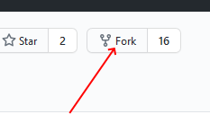

# Container Engine for Kubernetes (OKE) on OCI Workshop #

## Introduction

Oracle Cloud Infrastructure Container Engine for Kubernetes is a fully-managed, scalable, and highly available service that you can use to deploy your containerized applications to the cloud. Use Container Engine for Kubernetes (sometimes abbreviated to just OKE) when your development team wants to reliably build, deploy, and manage cloud-native applications. 
 
Container Engine for Kubernetes uses Kubernetes - the open-source system for automating deployment, scaling, and management of containerized applications across clusters of hosts. Container Engine for Kubernetes is integrated with Oracle Cloud Infrastructure Identity and Access Management (IAM), which provides easy authentication with native Oracle Cloud Infrastructure identity functionality.

In this workshop, you will learn how to setup: 

+ **Set up Kubernetes and OCI Policies**
+ **Deployments - Storage, services**
+ **Load Balancer - Ingress Controller** 
+ **Oracle Cloud Infrastructure Registry (OCIR)**

## Prerequisites ##

For this workshop you require and Oracle cloud Account. You may request a trial account [here](https://myservices.us.oraclecloud.com/mycloud/signup?language=en&sourceType=_ref_coc-asset-opcHome) or if you are in an event an account maybe provided.

Please review [prerequisites](./prerequisites.md) in detail

### GitHub imports

+ Fork https://github.com/oracleimc/people-service.git into your github account. Use the same name
+ Fork https://github.com/oracleimc/people-web-app.git into your github account. Use the same name

Fork button is on top left on each repository. _You do not require to fork this repository_

## Workshop execution
- If this workshop to be executed on emeaccoe tenancy, please follow the steps in the [emeaccoe guide](./emeaccoe.md)
- If you are to execute the flows on region other than Frankfurt, please review steps in [region guide](./region.md)

## Steps to follow ##

1. Creating a Kubernetes Cluster on Oracle Cloud Infrastructure
    - Please note that if are using a instructor provided environment you might already have a cluster and you need to skip this step
    - If you want to [create your own cluster](create-cluster.OKE1.md)
2. [Initial Setup](initial.setup.OKE2.md) - *please note the kubernetes cluster need to be up and running for this step*.
3. [Deployment: Persistent Storage](deployments.storage.OKE3.md)
4. [Create an Ingress Controller (Load Balancer) for the kubernetes cluster](deployments.services.OKE4.md).
5. [Setup the Oracle Cloud Infrastructure Registry (OCIR)](deployments.services.OKE5.md)
6. [Deploy the people-service Backend API](deployments.services.OKE6.md)
7. [Deploy the people-web-app](deployments.services.OKE7.md)

