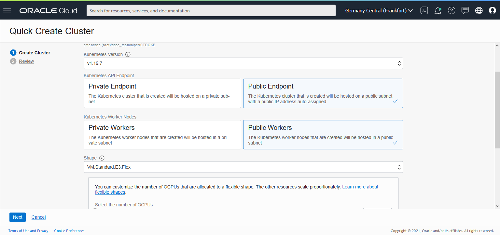

# Create your own cluster
1. Navigate to Menu > Developer Services > Kubernetes Clusters
2. From the left side, select target compartment  

3. Make sure you are in desired region  

1. Follow the [Guide](https://www.oracle.com/webfolder/technetwork/tutorials/obe/oci/oke-full/index.html)
You can create using the Quick create option.
    1. Select Quick Create 
    2. Give a name to your cluster
    3. Kubernetes version = latest
    4. Kubernetes api endpoint = Public
    5. Select Visiblity = Public
    6. Shape = VM.Standard.E3.Flex; 1 CPU 16 GB Ram (default)
    7. Number of Nodes = 3  
    
    8. Next & Create Cluster
    9. This workflow dialog will quickly complete. Howerver this will not finish creating it. It will take some time to fully create the cluster  
    
    10. When it is fully created, the state will be updated automatically, no need to refresh the page.  
    
    11. After seeing Active state, you can proceed with next steps

---

[Container Engine for Kubernetes (OKE) on OCI Workshop Home page](README.md)

[Next](initial.setup.OKE2.md)

