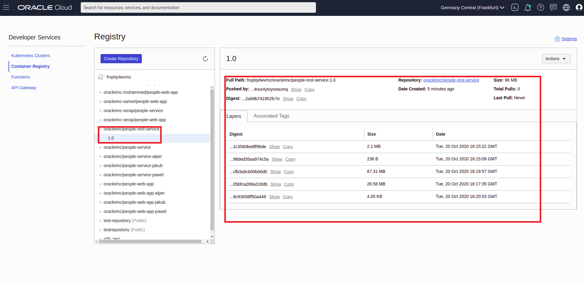
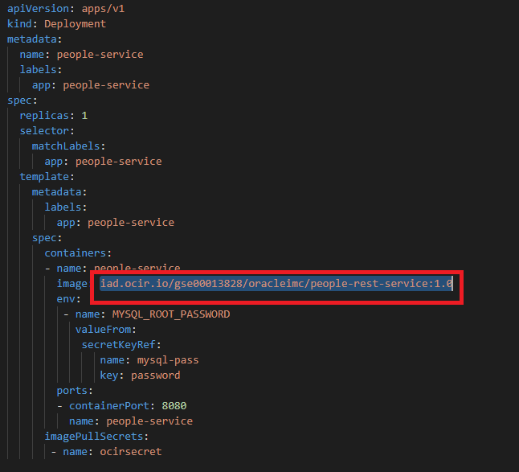
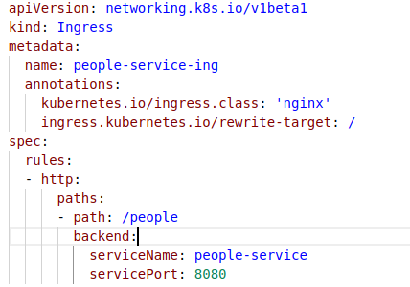

# Container Engine for Kubernetes (OKE) on OCI Workshop #

# Prerequisites
+ Setup the Oracle Cloud Infrastructure Registry (OCIR) [Go Back](deployments.services.OKE5.md).


# Deploy the people-service Rest API #
Now we now ready to deploy our backend container people-service to our kubernetes cluster. To do this, you will need to first build the application, then build the docker image and push the image to the oracle cloud image registry (OCIR), then deploy the people-service k8s deployment.

+ Build Springboot Application 
+ Build Image and Push to Registry
+ Deploy to Kubernetes 

## Build Springboot Application ##

This is quite a simple application. It just a java application that expose rest endpoint.

To build this application will are going to use gradle.

```
cd oracle_projects/people-service

./gradlew clean build
```

Output:

```
BUILD SUCCESSFUL in 3m 54s
4 actionable tasks: 3 executed, 1 up-to-date
```
This action will create a jar file *people-service-0.1.0.jar* in the build folder. Something like *build/libs/people-service-0.1.0.jar*

This location is quite important as will are going to use this to copy the jar file into the image during the docker image build.

## Build Image and Push to Registry ##
Even before we build our image, let first have a look at our image file, more commonly know as a docker file. *Dockerfile* is a text document that contains all the commands a user could call on the command line to assemble an image.

In our case we have defined a Dockerfile at the root of the project. Below is the file

```
FROM openjdk:8-jdk-alpine
VOLUME /tmp
EXPOSE 8080
ARG JAR_FILE=build/libs/people-service-0.1.0.jar
COPY ${JAR_FILE} app.jar
ENTRYPOINT ["java","-jar","/app.jar"]

```

Basically, this file define that during the image build it will copy the jar file from the build director and in to the image and call the jar file app.jar.

The ENTRYPOINT allows you to configure a container that will run as an executable.

I think the rest is quite self explanatory.

For more information on who to create build docker file click [here](https://docs.docker.com/engine/reference/builder/)

Now it's time to think of how we are going to build our image. 

The simplest command is *docker build* which will build the image locally. However, since we want to store our image in Oracle Cloud Infrastcure Registry (OCIR) we need to use tagging to enable us to push our image to our OCIR repository. 

So how do we do this? We need to tag our image in a special format. Here is the format of tag: *{region-key}.ocir.io/{tenancy-namespace}/{repo-name}/{image-name}:{tag}*

**For Shared env, Please replace the repo-name with your own name. Instead of oracleimc, maybe allenkubai**

```
fra.ocir.io/emeaccoe/oracleimc/people-rest-service:1.0
```

+ {region-key} -  is the key for the Oracle Cloud Infrastructure Registry region you're using. For example, fra. See the [Availability by Region](https://docs.cloud.oracle.com/iaas/Content/Registry/Concepts/registryprerequisites.htm#Availab) topic in the Oracle Cloud Infrastructure Registry documentation.
+ {tenancy-namespace} - is the auto-generated Object Storage namespace string of the tenancy (as shown on the **Tenancy Information page**) to which you want to push the image. For example, the namespace of the emeaccoe tenancy might be emeaccoe. Note that your user must have access to the tenancy.
+ {repo-name} -  (if specified) is the name of a repository to which you want to push the image (for example, oracleimc). Note that specifying a repository is optional. If you don't specify a repository name, the name of the image is used as the repository name in Oracle Cloud Infrastructure Registry.
+ {image-name} -  is the name you want to give the image in Oracle Cloud Infrastructure Registry (for example, people-rest-service).
* {tag} - is an image tag you want to give the image in Oracle Cloud Infrastructure Registry (for example, 1.0).

Now that we have that out of the way and we have constructed our tag, it's now time to build our image. To build and tag the image you can use the following command: **Note the space and . at the end**

```
docker build -t fra.ocir.io/emeaccoe/oracleimc/people-rest-service:1.0 . 
```

Output:

```
Sending build context to Docker daemon  39.37MB
Step 1/6 : FROM openjdk:8-jdk-alpine
 ---> 54ae553cb104
Step 2/6 : VOLUME /tmp
 ---> Using cache
 ---> 1d58d13c4df1
Step 3/6 : EXPOSE 8080
 ---> Running in 35ce36445944
Removing intermediate container 35ce36445944
 ---> 2fccc524378d
Step 4/6 : ARG JAR_FILE=build/libs/people-service-0.1.0.jar
 ---> Running in 20b14cecb3e9
Removing intermediate container 20b14cecb3e9
 ---> d4e40145e594
Step 5/6 : COPY ${JAR_FILE} app.jar
 ---> aa9eb6047949
Step 6/6 : ENTRYPOINT ["java","-jar","/app.jar"]
 ---> Running in 0d7fb953b60e
Removing intermediate container 0d7fb953b60e
 ---> 909821496d6d
Successfully built 909821496d6d
Successfully tagged fra.ocir.io/emeaccoe/oracleimc/people-rest-service:1.0
```

We are using '-t' to tell the build to tag the image during the build.

To confirm that the image was build and tagged you can use the command:

```
docker images
```

Output:

```
REPOSITORY                                              TAG                 IMAGE ID            CREATED             SIZE
fra.ocir.io/emeaccoe/oracleimc/people-rest-service      1.0                 909821496d6d        56 seconds ago      134MB
```

Confirm that the tagging is fine. Next we can now push our image to our OCIR using the command *docker push {tagname}*

``` 
docker push fra.ocir.io/emeaccoe/oracleimc/people-rest-service:1.0
```

Output:

```
The push refers to repository [fra.ocir.io/emeaccoe/oracleimc/people-rest-service]
0608bcf688c3: Pushed 
f2ec1bba02a6: Pushed 
0c3170905795: Pushed 
df64d3292fd6: Pushed 
1.0: digest: sha256:bed6caa96ea890512c39095efb0eef2dcdd58a56404287eea2a99b741902fc7e size: 1159
```
We can check the container registry on the Oracle cloud infrastructure console:



That was easy right??? Now let deploy to OKE

## Deploy to Kubernetes ##

To deploy to kubernetes we are going to using deployment YAML files. 

First we need to update our *./k8s/deployments/people-service-deployment.yaml* with the image location on OCIR. This follows the same format at the tagging: *{region-key}.ocir.io/{tenancy-namespace}/{repo-name}/{image-name}:{tag}*

Therefore we need to update this on the deployment file.



**Replace the image part of the file with your image location** 

For example:

```
fra.ocir.io/emeaccoe/oracleimc/people-rest-service:1.0
```

Once this is done, you are now ready to start deployment.

To do this we use the kubectl commands.

To deploy our people service deployment:

```
kubectl apply -f ./k8s/deployments/people-service-deployment.yaml
```

To confirm that people-service is up, you get check the pods:

```
kubectl get pods
```
Output:
```
NAME                              READY     STATUS    RESTARTS   AGE
mysql-69cfc89647-fjk7c            1/1       Running   0          4h42m
people-service-57f5f77574-wjdhg   1/1       Running   0          5m8s
```

To deploy our people service deployment service:

```
kubectl apply -f ./k8s/services/people-service.yaml
```

Also check the service was created

```
kubectl get svc
```
Output:
```
NAME               TYPE        CLUSTER-IP      EXTERNAL-IP   PORT(S)     AGE
kubernetes         ClusterIP   10.96.0.1       <none>        443/TCP     6h37m
mysql              ClusterIP   10.96.217.28    <none>        3306/TCP    5h54m
people-service     ClusterIP   10.96.65.158    <none>        8080/TCP    6m
```

**Please note that you can combine these two files into one file and execute with only one command** 

Lastly we now need to expose our service via the Load balance or the ingress. To do this we use the *./k8s/services/ingress.yaml* service deployment. 

```
kubectl apply -f ./k8s/services/ingress.yaml
```
The Backend API is using a shared load balance, you need to check the ingress.yml file to confirm it's url path. The ingress file is located under k8s/services/ingress.yaml under the people-service. In my case it's *'/people'*. As shown in the image below.



Therefore my url will be ***http://< ip  >/< restendpoint >***. Input this a browser of you choice. 


As you can see you backend api is now up and running!!

---
[Container Engine for Kubernetes (OKE) on OCI Workshop Home page](README.md)

[Previous](deployments.services.OKE5.md)

[Next](deployments.services.OKE7.md)