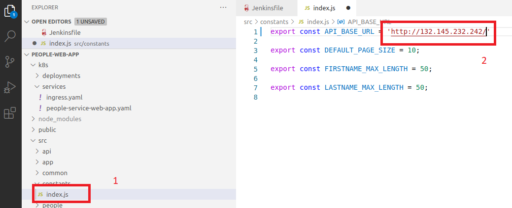
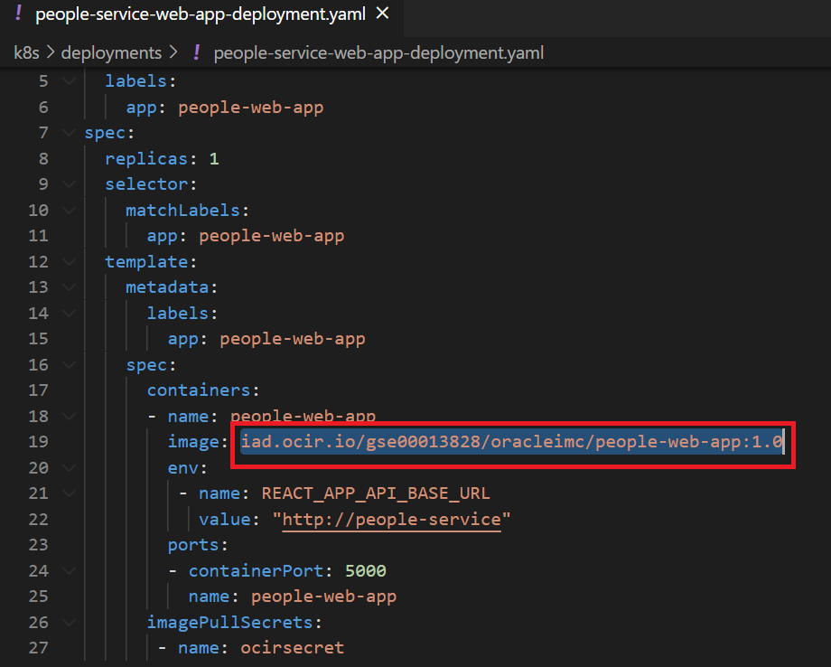
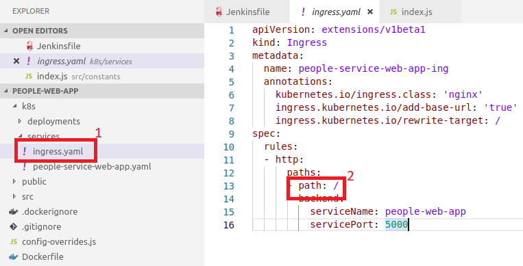
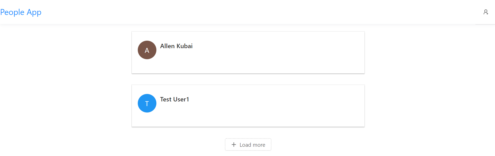

# Container Engine for Kubernetes (OKE) on OCI Workshop #

# Prerequisites
+ Deploy the people-service Rest API [Go Back](deployments.services.OKE6.md).


# Deploy the people-web-app #
Now we now ready to deploy our Frontend container people-web-app to our kubernetes cluster. To do this, you will need to first build the application, then build the docker image and push the image to the oracle cloud image registry (OCIR), then deploy the people-web-app k8s deployment.

+ Build ReactJS Application 
+ Build Image and Push to Registry
+ Deploy to Kubernetes 

## Build ReactJS Application ##

This is quite a simple application. It just a ReactJS application that consumes a rest endpoint.

Before you can build the application, you need to update the API rest endpoint in the people-web-app with the api endpoint. Open the file **src/constants/index.js** and replace with the Base IP of the ingress controller.



To build this application will are going to use **npm**.

```
cd oracle_projects/people-web-app

npm install

npm run build --production

```

Output:

```
The build folder is ready to be deployed.
You may serve it with a static server:

  yarn global add serve
  serve -s build

```
This action will create a build folder containing all the ReactJS components to run the web application.

This location is quite important as will are going to use this to copy the contents of the build folder into the image during the docker image build.

## Build Image and Push to Registry ##
Even before we build our image, let first have a look at our image file, more commonly know as a docker file. *Dockerfile* is a text document that contains all the commands a user could call on the command line to assemble an image.

In our case we have defined a Dockerfile at the root of the project. Below is the file

```
FROM node:9.4

# Create app directory
WORKDIR /usr/src/app

# Expose port for service
EXPOSE 5000

# Install and configure `serve`.
RUN npm install -g serve

# Copy source code to image
COPY ./build /usr/src/app/build

CMD serve -s build
```

Basically, this file define that during the image build. It will copy the  contents from the build directory and into the image to /usr/src/app/build 

The CMD will execute serve command in the container

I think the rest is quite self explanatory.

For more information on who to create build docker file click [here](https://docs.docker.com/engine/reference/builder/)

Now it's time to think of how we are going to build our image. 

The simplest command is *docker build* which will build the image locally. However, since we want to store our image in Oracle Cloud Infrastcure Registry (OCIR) we need to use tagging to enable us to push our image to our OCIR repository. 

So how do we do this? We need to tag our image in a special format. Here is the format of tag: *{region-key}.ocir.io/{tenancy-namespace}/{repo-name}/{image-name}:{tag}*

**For Shared env, Please replace the repo-name with your own name. Instead of oracleimc, maybe allenkubai**

```
fra.ocir.io/emeaccoe/oracleimc/people-web-app:1.0
```

+ {region-key} -  is the key for the Oracle Cloud Infrastructure Registry region you're using. For example, fra. See the [Availability by Region](https://docs.cloud.oracle.com/iaas/Content/Registry/Concepts/registryprerequisites.htm#Availab) topic in the Oracle Cloud Infrastructure Registry documentation.
+ {tenancy-namespace} - is the auto-generated Object Storage namespace string of the tenancy (as shown on the **Tenancy Information page**) to which you want to push the image. For example, the namespace of the emeaccoe tenancy might be emeaccoe. Note that your user must have access to the tenancy.
+ {repo-name} -  (if specified) is the name of a repository to which you want to push the image (for example, oracleimc). Note that specifying a repository is optional. If you don't specify a repository name, the name of the image is used as the repository name in Oracle Cloud Infrastructure Registry.
+ {image-name} -  is the name you want to give the image in Oracle Cloud Infrastructure Registry (for example, people-web-app).
* {tag} - is an image tag you want to give the image in Oracle Cloud Infrastructure Registry (for example, 1.0).

Now that we have that out of the way and we have constructed our tag, it's now time to build our image. To build and tag the image you can use the following command: **Note the space and . at the end**

```
docker build -t fra.ocir.io/emeaccoe/oracleimc/people-web-app:1.0 . 
```

Output:

```
Sending build context to Docker daemon  4.901MB
Step 1/6 : FROM node:9.4
 ---> c888d933885c
Step 2/6 : WORKDIR /usr/src/app
 ---> Using cache
 ---> 1cfe46491e70
Step 3/6 : EXPOSE 5000
 ---> Using cache
 ---> 6f51869f0e69
Step 4/6 : RUN npm install -g serve
 ---> Using cache
 ---> e85cd99dea72
Step 5/6 : COPY ./build /usr/src/app/build
 ---> 1b8a43a61e5a
Step 6/6 : CMD serve -s build
 ---> Running in 18c5b90419aa
Removing intermediate container 18c5b90419aa
 ---> 3baa998c2f19
Successfully built 3baa998c2f19
Successfully tagged fra.ocir.io/emeaccoe/oracleimc/people-web-app:1.0
```

We are using '-t' to tell the build to tag the image during the build.

To confirm that the image was build and tagged you can use the command:

```
docker images
```

Output:

```
REPOSITORY                                              TAG                 IMAGE ID            CREATED             SIZE
fra.ocir.io/emeaccoe/oracleimc/people-web-app           1.0                 3baa998c2f19        39 seconds ago      686MB
fra.ocir.io/emeaccoe/oracleimc/people-rest-service      1.0                 909821496d6d        29 minutes ago      134MB
```

Confirm that the tagging is fine. Next we can now push our image to our OCIR using the command *docker push {tagname}*

``` 
docker push fra.ocir.io/emeaccoe/oracleimc/people-web-app:1.0
```

Output:

```
The push refers to repository [fra.ocir.io/emeaccoe/oracleimc/people-web-app]
6a2a349d621d: Pushed 
694a4033f91c: Pushed 
a1a7dd69eaf8: Pushed 
cbe2c090ad21: Pushed 
818281c5d4fb: Pushed 
50599c766115: Pushed 
d4141af68ac4: Pushed 
8fe6d5dcea45: Pushed 
06b8d020c11b: Pushed 
b9914afd042f: Pushed 
4bcdffd70da2: Pushed 
1.0: digest: sha256:d3dd00ab3b9983eb1a69a48aba34c02c1ffee70a2fa0ac6b625b9c21289dd466 size: 2635
```

That was easy right??? Now let deploy to OKE

## Deploy to Kubernetes ##

To deploy to kubernetes we are going to using deployment YAML files. 

First we need to update our *./k8s/deployments/people-service-web-app-deployment.yaml* with the image location on OCIR. This follows the same format at the tagging: *{region-key}.ocir.io/{tenancy-namespace}/{repo-name}/{image-name}:{tag}*

Therefore we need to update this on the deployment file.



**Replace the image part of the file with your image location** 

For example:

```
fra.ocir.io/emeaccoe/oracleimc/people-web-app:1.0
```

Once this is done, you are now ready to start deployment.

To do this we use the kubectl commands.

To deploy our people service deployment:

```
kubectl apply -f ./k8s/deployments/people-service-web-app-deployment.yaml
```

To confirm that people-web-app is up, you get check the pods:

```
kubectl get pods
```
Output:
```
NAME                              READY     STATUS    RESTARTS   AGE
mysql-69cfc89647-fjk7c               1/1       Running   0          4h58m
people-service-57f5f77574-wjdhg      1/1       Running   0          21m
people-web-app-86468bb8dc-9c6qx      1/1       Running   0          2m55s
```

To deploy our people service deployment service:

```
kubectl apply -f ./k8s/services/people-service-web-app.yaml
```

Also check the service was created

```
kubectl get svc
```
Output:
```
NAME               TYPE        CLUSTER-IP      EXTERNAL-IP   PORT(S)     AGE
kubernetes         ClusterIP   10.96.0.1       <none>        443/TCP     6h37m
mysql              ClusterIP   10.96.217.28    <none>        3306/TCP    5h54m
people-service     ClusterIP   10.96.65.158    <none>        8080/TCP    6m
people-web-app     ClusterIP   10.96.65.159    <none>        5000/TCP    3m
```

**Please note that you can combine these two files into one file and execute with only one command** 

Lastly we now need to expose our service via the Load balance or the ingress. To do this we use the *./k8s/services/ingress.yaml* service deployment. 

```
kubectl apply -f ./k8s/services/ingress.yaml
```
TThe Backend API is using a shared load balance, you need to check the ingress.yml file to confirm it's url path. The ingress file is located under k8s/services/ingress.yaml under the people-web-app. In my case it's '/'. As shown in the image below.




Therefore my url will be **http://< ip >/**. Input this a browser of you choice. 


To add some data click on the icon. The add your first and last name and click Create Person


After clicking Create Person the application goes back to the main page and the person is listed there.



We can also check the REST endpoint to see if how the API presents the data.


As you can see your application is now up and running!!


---
[Container Engine for Kubernetes (OKE) on OCI Workshop Home page](README.md)

[Previous](deployments.services.OKE6.md)

[Next](deployments.services.OKE7.md)