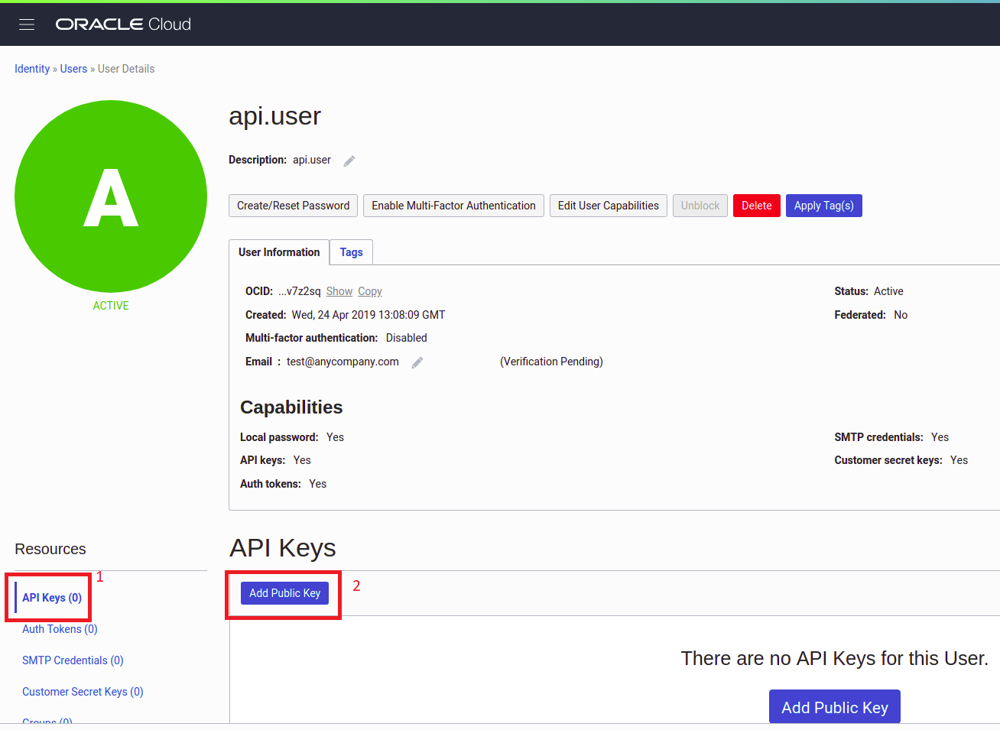
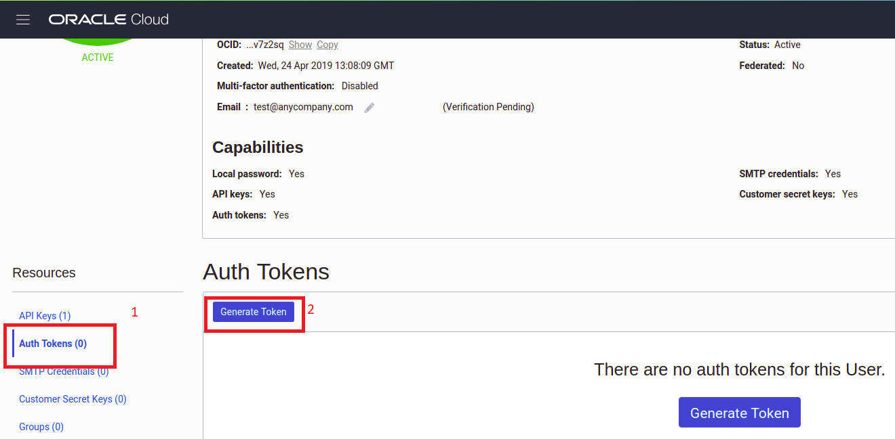
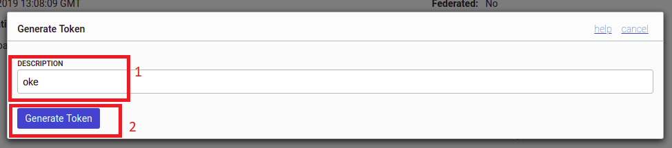
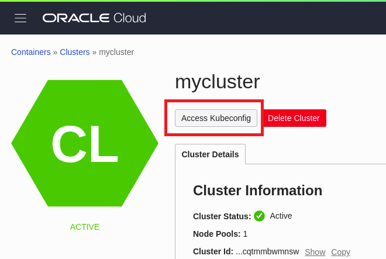
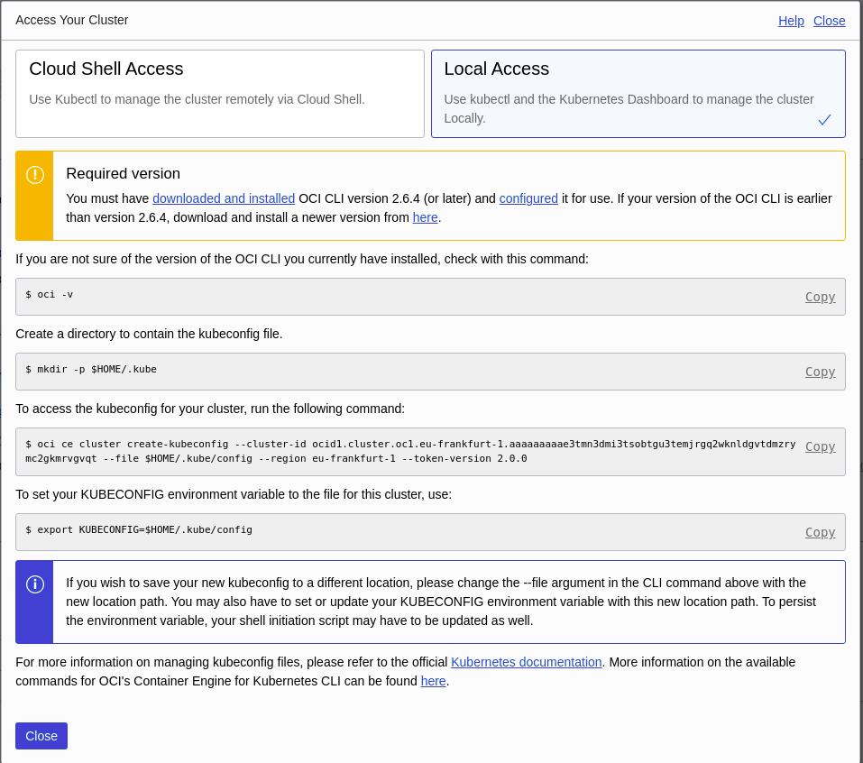
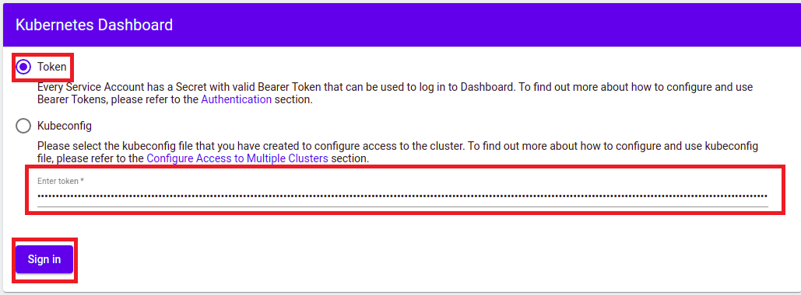

# Container Engine for Kubernetes (OKE) on OCI Workshop #

**Step 1** - *Assumption* You have a Kubernetes Cluster.
+ Make sure that you have completed all [prerequisites](./prerequisites.md)

# Prerequisites

You have a Kubernetes Cluster

# Initial Setup #

For you to effectively work on this workshop, you will need to set up a couple of tools on your machine/laptop. This tools include:

+ **oci cli** - *Oracle Cloud Infrastructure Command Line tool. You will need this for you to download the kubeconfig file that is required by kubectl for it to connect to your cluster.*


Once this tools are installed and configured, you will now be able to download the **kubeconfig** file and use it to connect to your cluster.


## Install oci command line interface and download kubeconfig ##

Oracle provides you with different options for installing and supports different OSes.

Once you have oci cli installed you need to set up the config file. Before you can do that, you need to collect some information that will be required when doing the oci config setup. You need to collect:

+ Tenancy OCID
+ User OCID
+ OCI Region

### Getting Tenancy OCID and OCI Region ###

1. Login to your OCI console
2. Click on *'Burger Menu' on the top left > Scroll to Adminstration > Tenancy Details*. Click on *Copy* as shown in the image below.


3. Copy the Tenancy OCID into a file somewhere for reference later.
4. Copy the region name, then go to [Regions](https://docs.oracle.com/en-us/iaas/Content/General/Concepts/regions.htm) and get the Region Identifier into a file somewhere for reference later. For example *Germany Central (Frankfurt)* Region Identifier is **eu-frankfurt-1**
5. Copy the tenancy namespace into a file somewhere fore reference later.

### Getting User OCID ###

1. Login to your OCI console
2. Click on *'Burger Menu' on the top left > Scroll to Identity > Users*
3. Select your user, in this my case 'api.user'. Click on *Copy* OCID as shown on the image below.

3. Copy the OCID into a file somewhere for reference later.

### Installing OCI CLI ### 

Now that we have those three items, you are ready to install and configure oci cli.
To install oci cli go [here](https://docs.cloud.oracle.com/iaas/Content/API/SDKDocs/cliinstall.htm?tocpath=Developer%20Tools%20%7CCommand%20Line%20Interface%20(CLI)%20%7C_____1) if you have don't so already. Once it's installed, use the *Use the Setup Dialog* to setup the configuration file by executing the command below. Follow the prompts and allow it to create the private and public API keys for you.

```
oci setup config
```

For oci cli to work, you must upload your public key to the oci console under your user to the API keys.

You will need copy the contents of your generated API public key. You can execute the command below:

```
cat ~/.oci/oci_api_key_public.pem 
```

Copy everything including:

```
-----BEGIN PUBLIC KEY-----
-----END PUBLIC KEY-----
```

Now got to your oci console and:

1. Click on *'Burger Menu' on the top left > Scroll to Identity > Users*
2. Click your user, in this my case 'api.user' to open the user details page.

3. Click on *API Keys > Add Public Key* as shown on the image below:




4. Paste your public key as show in the image below and click *OK*


You are now ready to download your kubeconfig file.

### Getting User Auth Token ###

1. Click on *'Burger Menu' on the top left > Scroll to Identity > Users*
2. Click your **OWN** user, in this my case 'api.user' to open the user details page.

3. Click on *Auth Tokens > Generate Token* as shown on the image below:




4. Add a description then click *Generate Token*



5. The generated token appears. **Please click on copy and save it in a file somewhere. You cannot retrive it later**


You are now ready to download your kubeconfig file.

### Download your Kubeconfig file ###

1. Click on *'Burger Menu' on the top left > Scroll to Developer Services > Container Clusters*
2. Click on your Cluster. In my case *'mycluster'* as shown on the image below:


3. Under the cluster details Click on *'Access Kubeconfig'*



4. Follow the instructions on the pop window. **Do not use the commands on the screenshot below. Use the ones on your pop up window**. It's just an example!




5. You can now test if you can connect to you kubernets cluster:

```
kubectl get nodes


NAME        STATUS    ROLES     AGE       VERSION
10.0.10.2   Ready     node      40m       v1.17.9
10.0.10.3   Ready     node      39m       v1.17.9
10.0.10.4   Ready     node      39m       v1.17.9

```
6. Deploy the Kubernetes Dashboard on the new cluster you've created. In a terminal window, enter the following command

```
kubectl apply -f https://raw.githubusercontent.com/kubernetes/dashboard/v2.5.0/aio/deploy/recommended.yaml
```

output:

```
namespace/kubernetes-dashboard created
serviceaccount/kubernetes-dashboard created
service/kubernetes-dashboard created
secret/kubernetes-dashboard-certs created
secret/kubernetes-dashboard-csrf created
secret/kubernetes-dashboard-key-holder created
configmap/kubernetes-dashboard-settings created
role.rbac.authorization.k8s.io/kubernetes-dashboard created
clusterrole.rbac.authorization.k8s.io/kubernetes-dashboard created
rolebinding.rbac.authorization.k8s.io/kubernetes-dashboard created
clusterrolebinding.rbac.authorization.k8s.io/kubernetes-dashboard created
deployment.apps/kubernetes-dashboard created
service/dashboard-metrics-scraper created
deployment.apps/dashboard-metrics-scraper created
```
7. Next, we can verify that we can use the Kubernetes Dashboard to connect to the cluster. We are going to create an administrator service account and a clusterrolebinding, both called oke-admin
+ Here is how the **oke-admin-service-account.yaml** file looks like: 
```yaml
apiVersion: v1
kind: ServiceAccount
metadata:
  name: oke-admin
  namespace: kube-system
---
apiVersion: rbac.authorization.k8s.io/v1
kind: ClusterRoleBinding
metadata:
  name: oke-admin
roleRef:
  apiGroup: rbac.authorization.k8s.io
  kind: ClusterRole
  name: cluster-admin
subjects:
- kind: ServiceAccount
  name: oke-admin
  namespace: kube-system
```

+ To execute it and create the service account

```
kubectl apply -f https://raw.githubusercontent.com/oracleimc/workshops/master/appdev/cloudnative/k8s/oke-admin-service-account.yaml
```

Output:

```
serviceaccount/oke-admin created
clusterrolebinding.rbac.authorization.k8s.io/oke-admin created
```
You can now use the oke-admin service account to view and control the cluster, and to connect to the Kubernetes dashboard.

+ Now lets obtain an authentication token for the oke-admin account:

```
kubectl -n kube-system describe secret $(kubectl -n kube-system get secret | grep oke-admin | awk '{print $1}')
```

The output from the above command includes an authentication token (a long alphanumeric string) as the value of the token: element, as shown below:

```
Name: oke-admin-token-gwbp2
Namespace: kube-system
Labels: <none>
Annotations: kubernetes.io/service-account.name: oke-admin
kubernetes.io/service-account.uid: 3a7fcd8e-e123-11e9-81ca-0a580aed8570
Type: kubernetes.io/service-account-token
Data
====
ca.crt: 1289 bytes
namespace: 11 bytes
token: eyJh______px1Q

```
In the example above, eyJh______px1Q (abbreviated for readability) is the authentication token.
+ Copy the value of the token: element from the output. You will use this token to
connect to the dashboard.

+ In a terminal window, enter the following command:

```
kubectl proxy
```

+ Open a new browser window and go to http://localhost:8001/api/v1/namespaces/kubernetes-dashboard/services/https:kubernetes-dashboard:/proxy/. to display the Kubernetes Dashboard.



### You are now ready to get started. ###

---
[Container Engine for Kubernetes (OKE) on OCI Workshop Home page](README.md)

[Previous](create-cluster.OKE1)

[Next](deployments.storage.OKE3.md)
