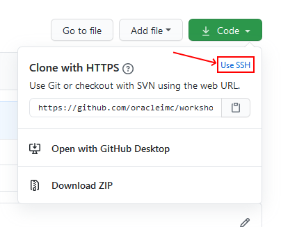

# Prerequisites

1. Create [GitHub](https://github.com/) account, if you do not have one
2. If you have not set up [Git ssh](https://docs.github.com/en/github/authenticating-to-github/generating-a-new-ssh-key-and-adding-it-to-the-ssh-agent), please do so. This gives you the option to clone and push without password.
3. If you are going to use your own tenancy, you need to make sure that correct permissions are in place, check [Own Tenancy](#own-tenancy) section. If you are to use the **emeaccoe** enviornment, please follow instructions of your trainer. Also check information about using [emeaccoe](./emeaccoe.md).

## Using Git & GitHub
After completing the step 2 (Git ssh), you can clone and push repositories via SSH.
On the root of the repository, when you press to the top-right green button, it will display the address. This address might be displayed in HTTPS format. In that case, press to the **Use SSH** button to convert it to SSH format

After you have changed it to SSH, you can copy its address and use during clone commands

## Own Tenancy
You need to provide necessary permissions for OKE and OCIR to work. A user with necessary privididges (such as admin of the tenancy) can create the policies at the root level. You should **not** be doing this on the shared environment.

On the left side **List Scope** section, make sure that you are in the root compartment.This policy will add necessary permissions to the service
1. Press `Create policy`
2. Give it a name and description, such as `Container Services`
3. Add Statement: `allow service OKE to manage all-resources in tenancy`
4. Press `Create`

If you want to resrict the access of the OKE with desired `<compartment>`, you can replace the last one to the `allow service OKE to manage all-resources in compartment <compartment>`

The following policies will grant permissions to specific "group" to work. Replace `<group>` with corresponding group name and `<compartment>` with corresponding compartment
1. On `root` level compartment
2. Add policy named `<group>Access`
3. Add Statement: `allow group <group> to manage repos in tenancy`
4. Press `+ Another Statement`, please repeat for each statement
4. Add Statement: `allow group <group> to manage all-resources in compartment <compartment>`

---

[Container Engine for Kubernetes (OKE) on OCI Workshop Home page](README.md)