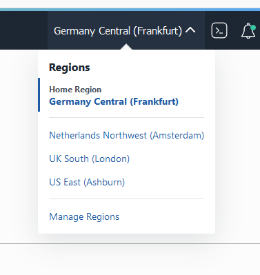

# Using different region
Based on limited number of Kubernetes clusters per region, you might be using a different region or you are using your own tenancy with a different region. This guide is aimed to target the changes that is required to run on the designated region.

## Changing a region
Region change is done within the OCI console. On the top right, press to the current region name (such as Germany Central (Frankfurt)). This will list availabe (subcribed) regions. By clicking to the target region name will make that current.  
  
Resources created on a region are not visible to another region in the OCI console.  
For further information please review [Managing Regions](https://c/en-us/iaas/Content/Identity/Tasks/managingregions.htm) documentation


## Using a different region for OKE
Using a different cluster does not change much for the OKE. Only important part is to change the persistent volume claims (pvc) to be on the same region of the cluster. Otherwise pvc creation will hang on pending state. If you have already applied the claims yaml file already, you need to delete it first.  
In the examles below MySQL pvc is used. 

**If you have created the claim, delete the claim before applying the correct one:**
```sh
kubectl delete -f ./k8s/claims/mysql-volume-claim.yaml 
```

**Fix and apply correct claim:**
1. Edit the claim file (mysql-volume-claim.yaml)
2. Replace `EU-FRANKFURT-1-AD-1` to the correct one* (such as `UK-LONDON-1-AD-1` if you are using London region)
3. Save
4. (Re)apply the file
    ```sh
    kubectl create -f ./k8s/claims/mysql-volume-claim.yaml 
    ```

*More information and region names can be found in [Creating a Persistent Volume Claim](https://docs.cloud.oracle.com/en-us/iaas/Content/ContEng/Tasks/contengcreatingpersistentvolumeclaim.htm) documentation

## Using a different region for OCIR
Not changing the OCIR region will not break anything, this will only affect the transfer speed of container images between your cluster and registry. Double check with your trainer before applying the changes below.

More information about [OCIR regions](https://docs.cloud.oracle.com/en-us/iaas/Content/Registry/Concepts/registryprerequisites.htm#regional-availability) can be found in the documentation

### Change OCIR secret
On step 7, while creating the secret, command needs to be changed. Here below is an example for London region:
```sh
kubectl create secret docker-registry ocirsecret --docker-username='{tenancy}/{username}' --docker-password='{Auth Token}' --docker-server=lhr.ocir.io --docker-email='api.user@acme.com'
```
If you have created the secret and need to change it, you need to delete it:
```sh
kubectl delete secret ocirsecret
```

----

[Container Engine for Kubernetes (OKE) on OCI Workshop Home page](README.md)