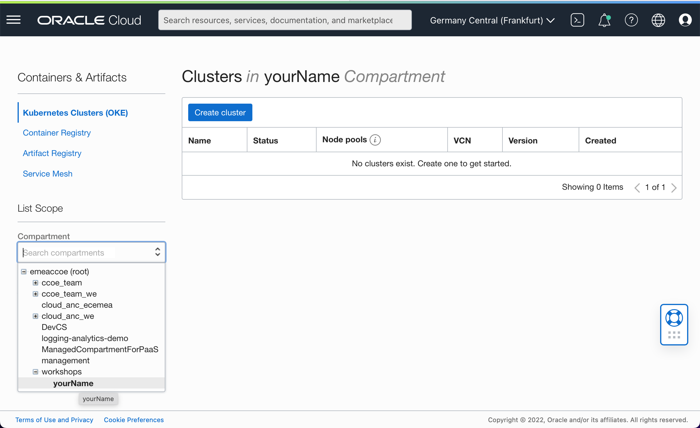

# EMEA CCoE
EMEA = Europe, the Middle East and Africa  
CCoE = Cloud Center of Excellence  
IMC = Innovation and Modernization Center

If this workshop is being delivered to you by CCoE or IMC, you might be provided an Oracle Cloud tenancy (emeaccoe).

## Account and Compartment

1. You will be provided a link to create an account. Follow the instructions of your trainer. This will create a federated account.
2. Login to [OCI Console](https://console.eu-frankfurt-1.oraclecloud.com/), tenant name = `emeaccoe`. You will be using left side of the login screen for federated account login. 
3. Open Identity > Users 
4. Here you are going to create an OCI user. Press `Create User` button
5. Provide user name, rest is optional and press `Create` button
6. Add user to `Workshops` group.
7. Press `Create/Reset Password` button and in the dialog
8. New password is generated for the user. Note this password by copying. You need to press to `Copy` button. `Show` button is optional
9. You need to have a clear session. You can either log out, use a different browser or run in incognito mode or private browser
10. Login with the new user (second one) to [OCI Console](https://console.eu-frankfurt-1.oraclecloud.com/), tenant name = `emeaccoe`. This time you will be using the right side for OCI account login. 
11. You will be forced to change your password
12. Go go Menu > Identity > Compartments
13. Open `workshops` compartment and press `Create Compartment` button
14. Give your name to the compartment and create it
15. You need to select this compartment during resource creation. Not doing this, is one of the reasons for getting auth error during resource creation. 
16. Number of Kubernetes Clusters per region is limited to 3. Your trainer might assign you to a different region than Frankfurt. In that case please review [region](./region.md) guide.

## Artifact names
In this workshop, global artifacts are to be created. In that case, someone can write on top of the artifact created by other. In order to avoid this, names for global artifacts should be unique.  
On steps [7](./jenkins.pipelines.OKE7.md) & [8](./jenkins.pipelines.OKE8.md), in two repositories `people-service` and `people-web-app`, `JenkinsFile`, in each line #2 needs to be updated. Append your name to the end of the value there

