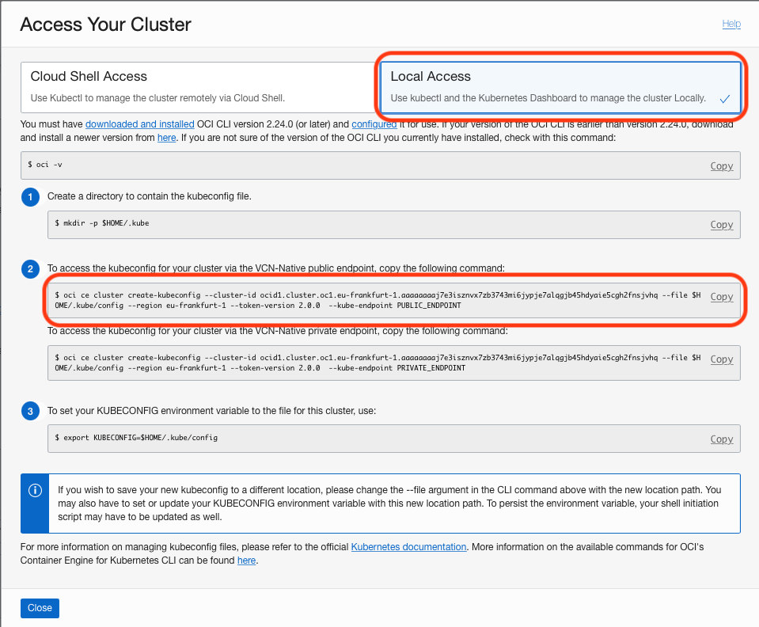

# DevOps: Deploying Microservices to OKE with Jenkins Pipelines (CI/CD) #

**Step 1** - *Assumption* You have a Kubernetes Cluster.
+ Git Client is installed
+ You have installed your favorited IDE (I am using visual code just for the purposes of the workshop)

**Installation of these two tools is out of scope of this workshop.** 


# Prerequisites

You have a Kubernetes Cluster

# Step 2 - Initial Setup #

For you to effectively work on this workshop, you will need to set up a couple of tools on your machine/laptop. This tools include:

+ **oci cli** - *Oracle Cloud Infrastructure Command Line tool. You will need this for you to download the kubeconfig file that is required by kubectl for it to connect to your cluster.*
+ **kubectl** - *Kubernetes commandline tool*

Once this tools are installed and configured, you will now be able to download the **kubeconfig** file and use it to connect to your cluster.

## Install kubectl ##

This is the kubernetes command-line tool. You will be able to execute command to your cluster. To install it go [here](https://kubernetes.io/docs/tasks/tools/install-kubectl/)

## Install oci command line interface and download kubeconfig ##

Oracle provides you with different options for installing and supports different OSes.

Once you have oci cli installed you need to set up the config file. Before you can do that, you need to collect some information that will be required when doing the oci config setup. You need to collect:

+ Tenancy OCID
+ User OCID
+ OCI Region

### Getting Tenancy OCID and OCI Region ###

1. Login to your OCI console
2. Click on *'Burger Menu' on the top left > Scroll to Adminstration > Tenancy Details*. Click on *Copy* as shown in the image below.


3. Copy the Tenancy OCID into a file somewhere for reference later.
4. Copy the region name into a file somewhere for reference later.

### Getting User OCID ###

1. Login to your OCI console
2. Click on *'Burger Menu' on the top left > Scroll to Identity > Users*
3. Select your user, in this my case 'api.user'. Click on *Copy* OCID as shown on the image below.

3. Copy the OCID into a file somewhere for reference later.

### Installing OCI CLI ###

Now that we have those three items, you are ready to install and configure oci cli.
To install oci cli go [here](https://docs.cloud.oracle.com/iaas/Content/API/SDKDocs/cliinstall.htm?tocpath=Developer%20Tools%20%7CCommand%20Line%20Interface%20(CLI)%20%7C_____1). Once it's installed, use the *Use the Setup Dialog* to setup the configuration file by executing the command below. Follow the prompts and allow it to create the private and public API keys for you.

```
oci setup config
```

For oci cli to work, you must upload your public key to the oci console under your user to the API keys.

You will need copy the contents of your generated API public key. You can execute the command below:

```
cat ~/.oci/oci_api_key_public.pem 
```

Copy everything including:

```
-----BEGIN PUBLIC KEY-----
-----END PUBLIC KEY-----
```

Now got to your oci console and:

1. Click on *'Burger Menu' on the top left > Scroll to Identity > Users*
2. Click your user, in this my case 'api.user' to open the user details page.

3. Click on *API Keys > Add Public Key* as shown on the image below:


4. Paste your public key as show in the image below and click *OK*


You are now ready to download your kubeconfig file.

### Getting User Auth Token ###

1. Click on *'Burger Menu' on the top left > Scroll to Identity > Users*
2. Click your user, in this my case 'api.user' to open the user details page.

3. Click on *Auth Tokens > Generate Token* as shown on the image below:


4. Add a description then click *Generate Token*


5. The generated token appears. **Please click on copy and save it in a file somewhere. You cannot retrive it later**


You are now ready to download your kubeconfig file.


### Add User to Group ###

1. Click on *'Burger Menu' on the top left > Scroll to Identity > Users*
2. Click your user, in this my case 'api.user' to open the user details page.

3. Click on *Groups > Add to Group* as shown on the image below:


4. Select the Group you want from the drop-down. In my case i'll choose *Administrators* Then Click *Add*.


**You are now ready to download your kubeconfig file.**

### Download your Kubeconfig file ###

1. Click on *'Burger Menu' on the top left > Scroll to Developer Services > Container Clusters*
2. Click on your Cluster. In my case *'mycluster'* as shown on the image below:


3. Under the cluster details Click on *'Access Kubeconfig'*


4. Follow the instructions on the pop window. **Do not use the commands on the screenshot below. Use the ones on your pop up window**. It's just an example!




5. You can now test if you can connect to you kubernets cluster:

```
kubectl get nodes


NAME        STATUS    ROLES     AGE       VERSION
10.0.10.2   Ready     node      1d        v1.12.7
10.0.11.2   Ready     node      1d        v1.12.7
10.0.12.2   Ready     node      1d        v1.12.7
```

### You are now ready to get started. ###

---
[Go back to Jenkins Pipelines Workshop Home page](README.md)


[Next](jenkins.pipelines.OKE3.md)
