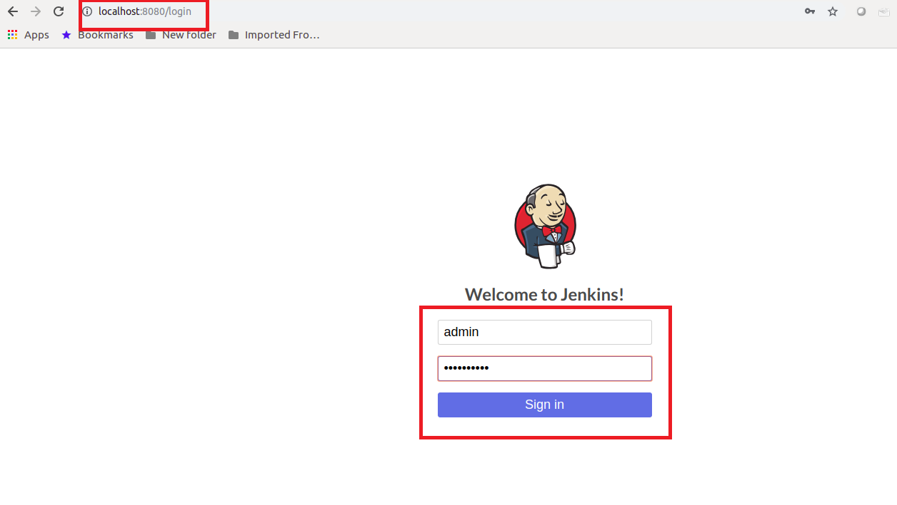

# DevOps: Deploying Microservices to OKE with Jenkins Pipelines (CI/CD) #

**Step 2** - Assumption [Initial Setup](jenkins.pipelines.OKE2) is complete.
# Step 3 - Create Jenkins Instance in your kubernetes cluster #
In this lab, you are going to install, set up and configure Jenkins in your kubernetes clusters. To do this, we are going to use **Helm chats**. [Helm](https://helm.sh/) helps you manage your kubernetes applications.

1. Install Helm. Instruction to install helm are [here](https://helm.sh/docs/using_helm/#installing-helm)
2. Once Helm is installed, check if the version of helm that's running on you machine is the same as on your kubernetes cluster. To do this execute the following command:
```
helm version
```

Expected output:

```
Client: &version.Version{SemVer:"v2.11.0", GitCommit:"2e55dbe1fdb5fdb96b75ff144a339489417b146b", GitTreeState:"clean"}
Server: &version.Version{SemVer:"v2.8.2", GitCommit:"a80231648a1473929271764b920a8e346f6de844", GitTreeState:"clean"}
```

As you can see the client version is higher than the one in the cluster. To upgrade, execute the command below:

```
helm init --upgrade

Tiller (the Helm server-side component) has been upgraded to the current version.
Happy Helming!
```

If you check the version again, they should be the same now.

3. Now that helm all setup you can now start Jenkins setup. First, we are going to clone a git repository on to your machine. 

```
mkdir oracle_projects

cd oracle_projects

git clone https://github.com/allenkubai/kubernetes.git
```

Once you have cloned the project, change into the project directory:

```
cd kubernetes
```
4. The next step before we install Jenkins, we need to create a persistance storage volume for jenkins in the kubernetes cluster. This is where jenkins will store it's data. To do this, use the deployment file already provided for you in this project: [https://github.com/allenkubai/kubernetes/blob/master/oracle/oke/helm/jenkins/jenkins-volume-claim.yaml](https://github.com/allenkubai/kubernetes/blob/master/oracle/oke/helm/jenkins/jenkins-volume-claim.yaml)

To use this deployment file to create a volume claim execute the following command:

```
kubectl create -f ./oracle/oke/helm/jenkins/jenkins-volume-claim.yaml

persistentvolumeclaim/jenkinsclaim created
```

To check if the persistent volume claim has been create:

```
kubectl get pvc

NAME           STATUS    VOLUME    CAPACITY   ACCESS MODES   STORAGECLASS   AGE
jenkinsclaim   Bound     ocid1.**   100Gi      RWO            oci            66s
```
5. We can install Jenkins now using a helm chart. To do this, we will install jenkins with a values descriptor file, which define which plugins and their version to installs. You can have a look at it here [https://github.com/allenkubai/kubernetes/blob/master/oracle/oke/helm/jenkins/values.yaml](https://github.com/allenkubai/kubernetes/blob/master/oracle/oke/helm/jenkins/values.yaml).

execute the following command:

```
helm install -n cd stable/jenkins -f ./oracle/oke/helm/jenkins/values.yaml --wait
```
Once it's done installing you will see the output below with instructions on how to get jenkins admin password and to get access to jenkin via port forwarding:

```
cd-jenkins-84695c79d8-r4vmh  1/1    Running  0         2m

1. Get your 'admin' user password by running:
  printf $(kubectl get secret --namespace default cd-jenkins -o jsonpath="{.data.jenkins-admin-password}" | base64 --decode);echo
2. Get the Jenkins URL to visit by running these commands in the same shell:
  export JENKINS_POD=$(kubectl get pods --namespace default -l "component=cd-jenkins-master" -o jsonpath="{.items[0].metadata.name}")
  echo http://127.0.0.1:8080
  kubectl port-forward $ JENKINS_POD 8080:8080
```

Let's execute the first command to get our admin password:

```
printf $(kubectl get secret --namespace default cd-jenkins -o jsonpath="{.data.jenkins-admin-password}" | base64 --decode);echo

ZYV1o****
```
Now you have our password **ZYV1o****** copy it somewhere:

Next let setup our port forwarding for us to get access to Jenkin interface

```
export JENKINS_POD=$(kubectl get pods --namespace default -l "component=cd-jenkins-master" -o jsonpath="{.items[0].metadata.name}")

kubectl port-forward $JENKINS_POD 8080:8080
```
**Please note that you can change the local port if you have something else running on port 8080 on you local machine**

Now you can got your browser and enter [http://localhost:8080/](http://localhost:8080/)

Here is the Jenkins login page:



Here is the initial dashboard once you login. 


**Please note that you might have some updates to make for some of the plugins that were installed using the values descriptor file. They  might be out of date depending on when you do this lab** 

---
[Go back to Jenkins Pipelines Workshop Home page](README.md)

[Next](jenkins.pipelines.OKE4.md)