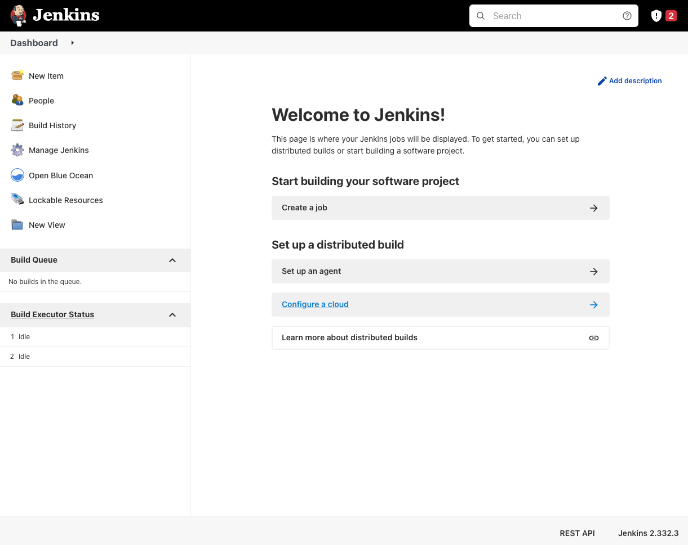
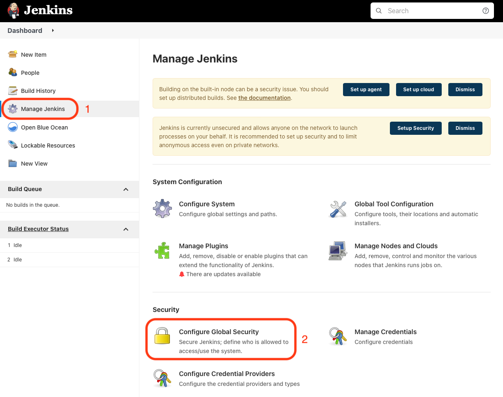
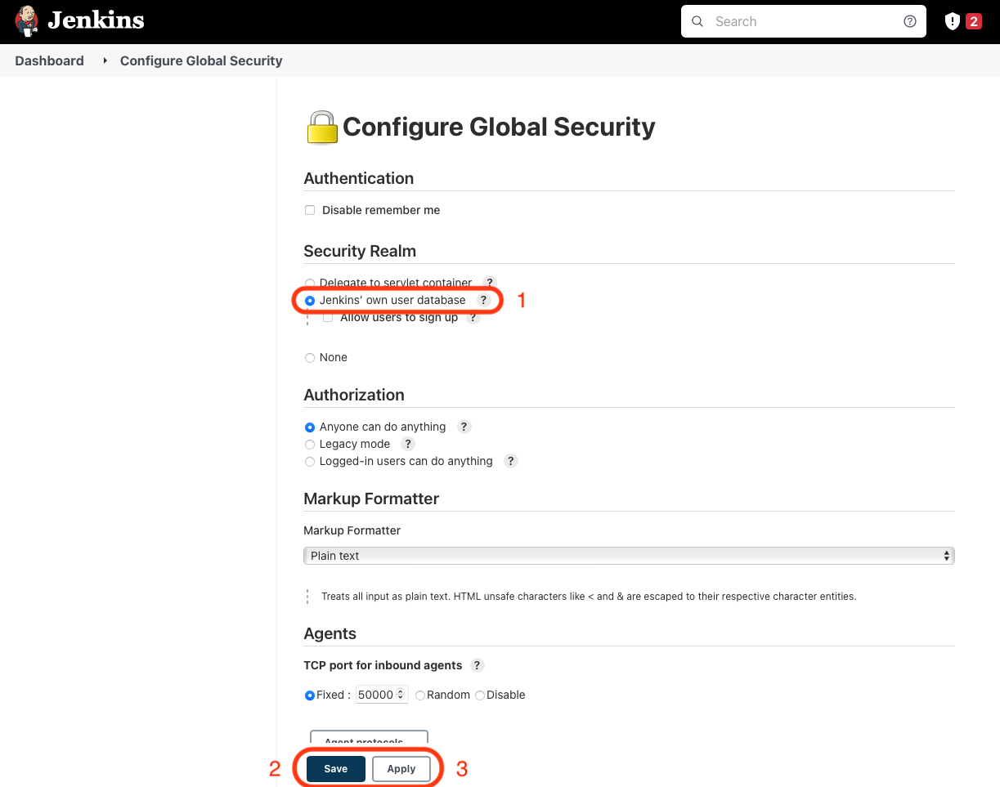
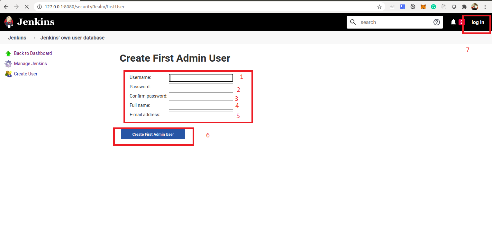

# DevOps: Deploying Microservices to OKE with Jenkins Pipelines (CI/CD) #

**Step 2** - Assumption [Initial Setup](jenkins.pipelines.OKE2) is complete.
# Step 3 - Create Jenkins Instance in your kubernetes cluster #
In this lab, you are going to install, set up and configure Jenkins in your kubernetes clusters. To do this, we are going to use **Helm chats**. [Helm](https://helm.sh/) helps you manage your kubernetes applications.

## Install Jenkins via Helm

1. Install Helm. Instruction to install helm are [here](https://helm.sh/docs/using_helm/#installing-helm). Using [chocolatey](https://chocolatey.org/) is recommended
2. Once Helm is installed, check if the version of helm that's running on you machine is the same as on your kubernetes cluster. To do this execute the following command:
```sh
helm version
```

Expected output:

```
version.BuildInfo{Version:"v3.8.1", GitCommit:"5cb9af4b1b271d11d7a97a71df3ac337dd94ad37", GitTreeState:"clean", GoVersion:"go1.17.5"}
```


If you check the version again, they should be the same now.

3. Now that helm all setup you can now start Jenkins setup. First, we are going to clone a git repository on to your machine. 

```sh
mkdir oracle_projects
cd oracle_projects
git clone https://github.com/oracleimc/kubernetes.git
```

Once you have cloned the project, change into the project directory:

```sh
cd kubernetes
```
4. The next step before we install Jenkins, we need to create a persistance storage volume for jenkins in the kubernetes cluster. This is where jenkins will store it's data. To do this, use the deployment file already provided for you in this project: [https://github.com/oracleimc/kubernetes/blob/master/oracle/oke/helm/jenkins/jenkins-volume-claim.yaml](https://github.com/oracleimc/kubernetes/blob/master/oracle/oke/helm/jenkins/jenkins-volume-claim.yaml)

To use this deployment file to create a volume claim execute the following command:

```sh
kubectl create -f ./oracle/oke/helm/jenkins/jenkins-volume-claim.yaml
```
Output:
```sh
persistentvolumeclaim/jenkinsclaim created
```

To check if the persistent volume claim has been create:

```sh
kubectl get pvc
```
Output:
```sh
NAME           STATUS    VOLUME    CAPACITY   ACCESS MODES   STORAGECLASS   AGE
jenkinsclaim   Bound     ocid1.**   100Gi      RWO            oci            66s
```

> :warning: If you do not get status as **Bound**, you might be on a different region. In that case update the yaml file with matching cluster region. If you have applied the file, delete the pvc first and reapply with the updated file.


5. We can install Jenkins now using a helm chart. To do this, we will install jenkins with a values descriptor file, which define which plugins and their version to installs. You can have a look at it here [https://github.com/oracleimc/kubernetes/blob/master/oracle/oke/helm/jenkins/values.yaml](https://github.com/oracleimc/kubernetes/blob/master/oracle/oke/helm/jenkins/values.yaml).

execute the following command:

```sh
helm repo add jenkins https://charts.jenkins.io
helm repo update
helm install cd-jenkins jenkins/jenkins -f ./oracle/oke/helm/jenkins/values.yaml --wait
```

Once it's done installing you will see the output below with instructions on how to get jenkins admin password and to get access to jenkin via port forwarding _(if yours is different, use the one in your output)_:

```sh
NAME: cd-jenkins
LAST DEPLOYED: Mon May  9 21:18:38 2022
NAMESPACE: default
STATUS: deployed
REVISION: 1
NOTES:
1. Get your 'admin' user password by running:
  kubectl exec --namespace default -it svc/cd-jenkins -c jenkins -- /bin/cat /run/secrets/chart-admin-password && echo
2. Get the Jenkins URL to visit by running these commands in the same shell:
  echo http://127.0.0.1:8080
  kubectl --namespace default port-forward svc/cd-jenkins 8080:8080

3. Login with the password from step 1 and the username: admin
4. Configure security realm and authorization strategy
5. Use Jenkins Configuration as Code by specifying configScripts in your values.yaml file, see documentation: http:///configuration-as-code and examples: https://github.com/jenkinsci/configuration-as-code-plugin/tree/master/demos

For more information on running Jenkins on Kubernetes, visit:
https://cloud.google.com/solutions/jenkins-on-container-engine

For more information about Jenkins Configuration as Code, visit:
https://jenkins.io/projects/jcasc/


NOTE: Consider using a custom image with pre-installed plugins
```

Let's execute the first command to get our admin password:

```sh
kubectl exec --namespace default -it svc/cd-jenkins -c jenkins -- /bin/cat /run/secrets/chart-admin-password && echo

ZYV1o****
```
Now you have our password **ZYV1o****** copy it somewhere:

## Access Jenkins
Next let setup our port forwarding for us to get access to Jenkin interface

```sh
kubectl --namespace default port-forward svc/cd-jenkins 8080:8080
```
**Please note that you can change the local port if you have something else running on port 8080 on you local machine**

**Running the `kubectl port-forward` command will keep your terminal busy. Pressing to Ctrl + C will terminate port forwarding**


Now you can got your browser and enter [http://127.0.0.1:8080](127.0.0.1:8080)

Here is the Jenkins main page:



**PLEASE NOTE: that if your Jenkins instance logs you in AUTOMATICALLY then you have to configure security. WITHOUT security enabled on Jenkins, you won't be able to setup your pipelines.**

**Jenkins Security**

1. Click in Manage Jenkins > Configure Global Security



2. Go to Security Realm and select 'Jenkins' Own user database'. Then 'Save' and 'Apply'



3. The will take you to the 'Create First Admin User' page. Fill in the details and click 'Create First Admin User'. Then top right click 'log in'



Note the login is similar to steps shown above. 
**Please note that you might have some updates to make for some of the plugins that were installed using the values descriptor file. They  might be out of date depending on when you do this lab** 

---
[Go back to Jenkins Pipelines Workshop Home page](README.md)

[Previous](jenkins.pipelines.OKE2.md)

[Next](jenkins.pipelines.OKE4.md)