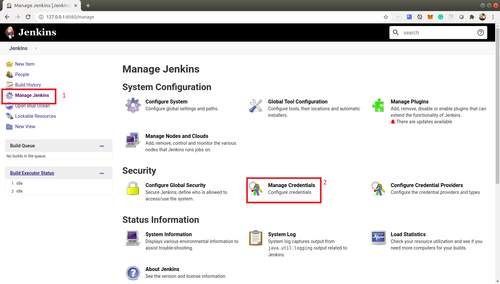
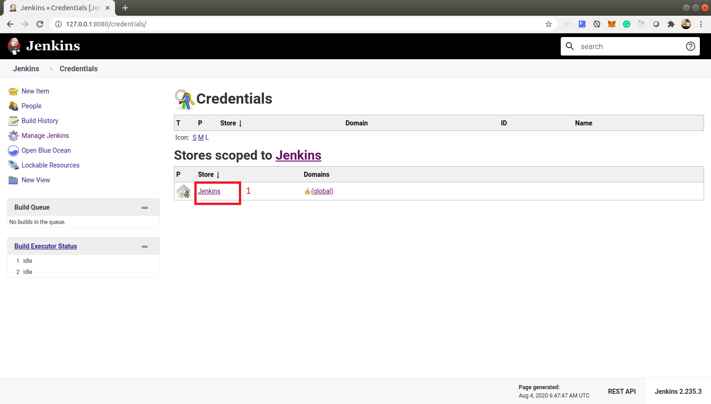
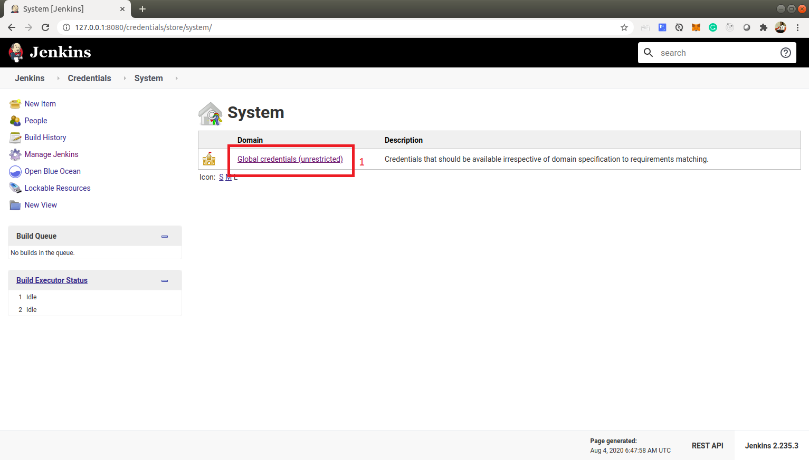
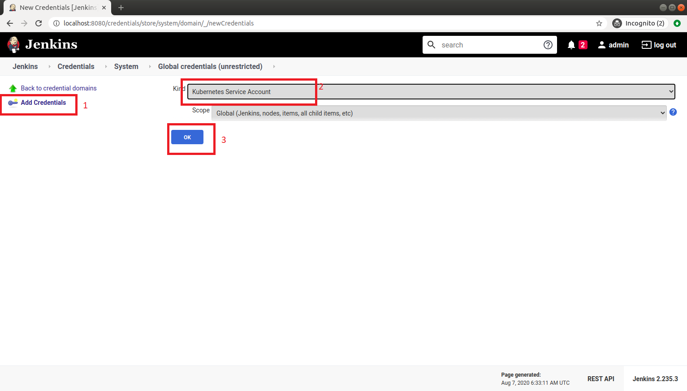
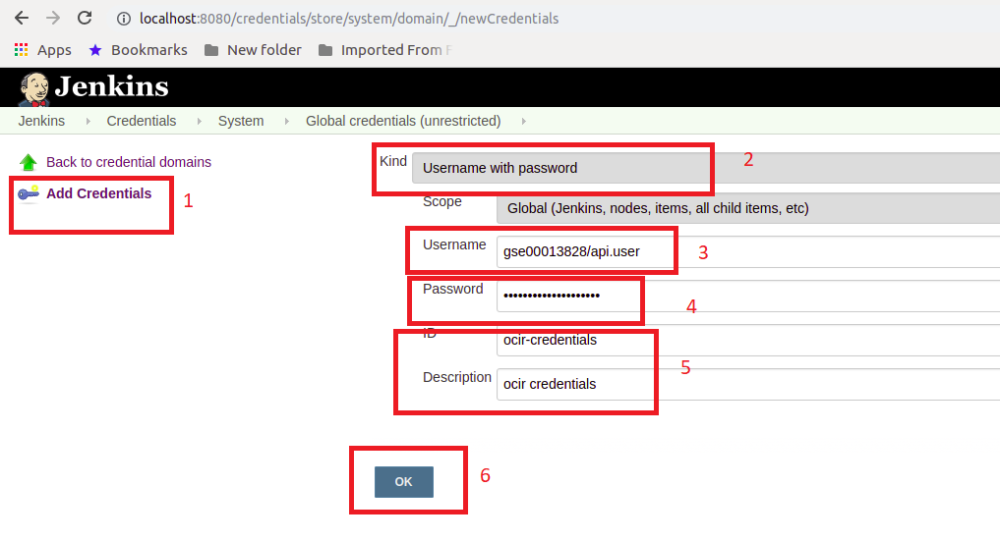
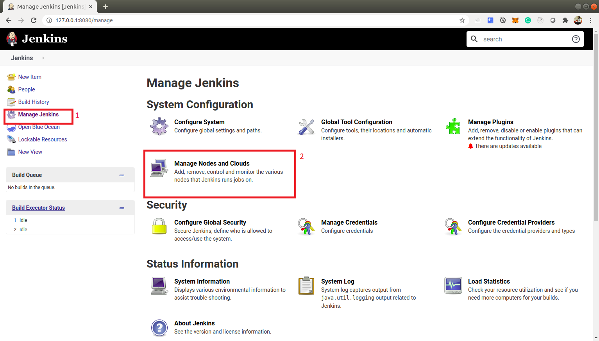
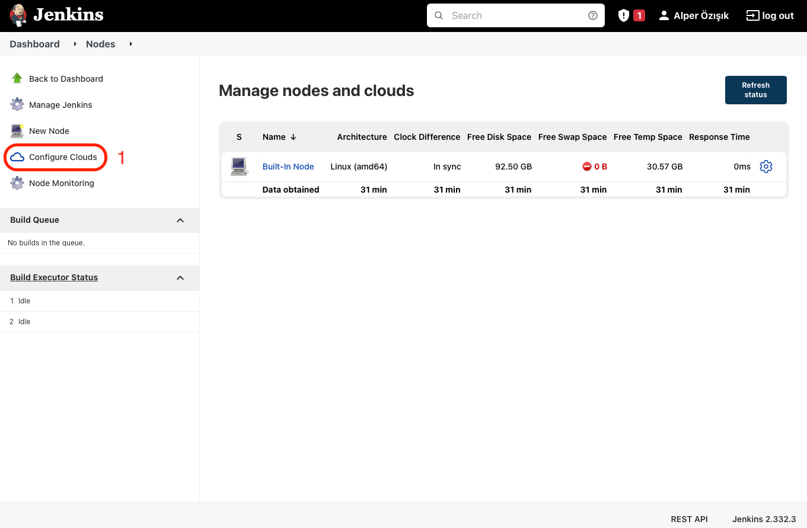
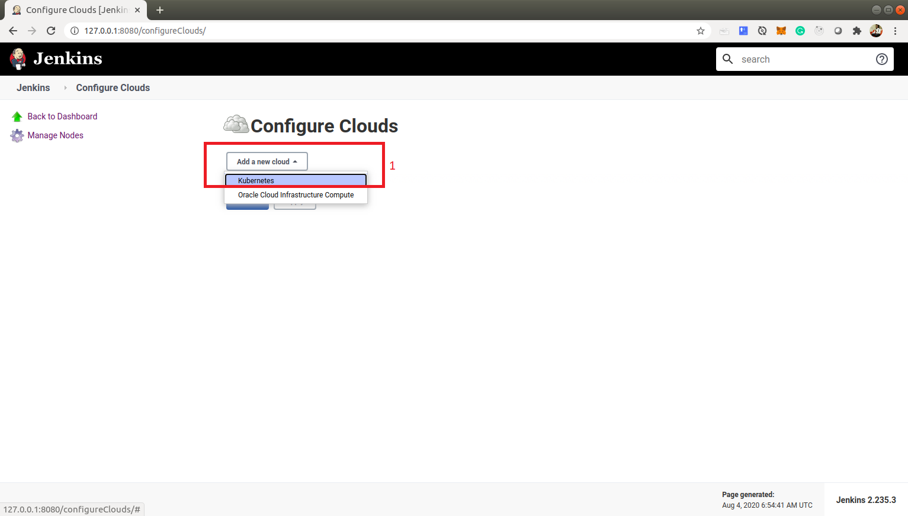
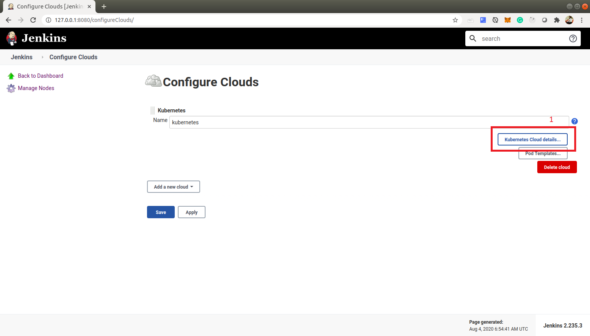
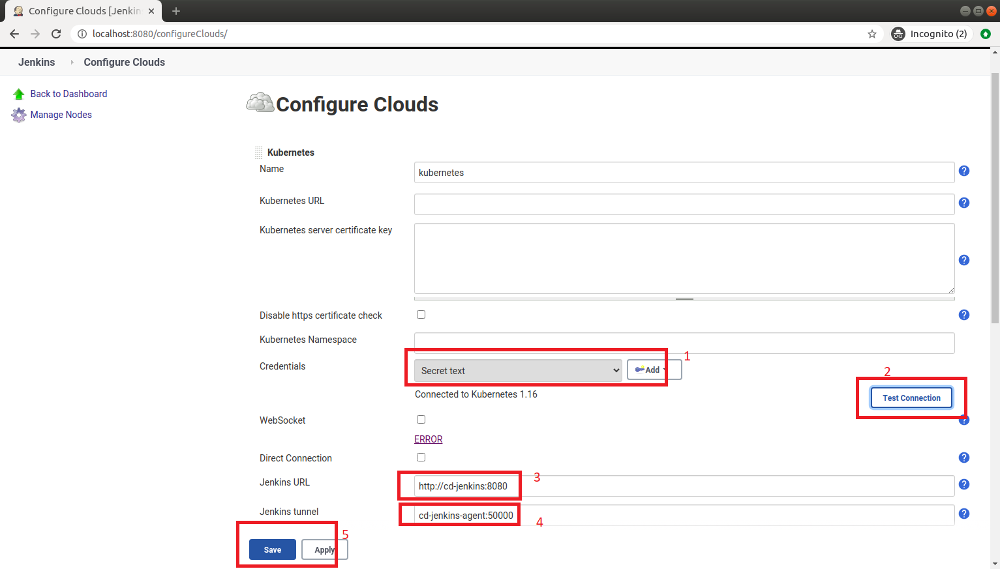

# DevOps: Deploying Microservices to OKE with Jenkins Pipelines (CI/CD) #

**Step 3** - *Assumption* [Create Jenkins Instance in your kubernetes cluster](./jenkins.pipelines.OKE3.md) is complete.

# Prerequisites
Make sure you are logged in to your jenkins instance on your kubernetes cluster. If you are having trouble, please refer to [Step 3](./jenkins.pipelines.OKE3.md).

# Step 4 - Configure the Jenkins instance #
In this lab, you are going to configure the jenkins instance. At the end of the lab you should have setup:

+ Created credentials for Kubernetes
+ Created credentials for OCIR (Oracle Cloud Infrastructure Registry) - *This is where will store and pull our docker images from.*
+ Add the kubernetes credentials to the kubernetes plugin in our jenkins instances

1. On the main dashboard, please click on *Manage Jenkins > Manage Credentials * as shown on the screenshot below:

2. Under the *Credentials*, click on Jenkins as shown in the screenshot below.

3. Then unders *System* Click on the Global Credentials as shown in the screenshot below.

4. On the next screen click on *Add Credentials*. The first credentials we are going to add is the Kubernetes Service Account. Please input as shown in the screenshot below then click **OK**:

5. Next, click on *Add Credentials* again. This time we are going to add **OCIR** credentials. Please input as shown below replace username and password with your own values:

+ Kind - **Username with password**
+ Username - **{tenancy/username}**. *For me it's gse00013828 from my tenancy and api.user for my user. Therefore username should be gse00013828/api.user.*
+ password - **Auth Token** *This was generated during the initial setup*
ID - **ocir-credentials** *This ID is very important. You will need it in the of the Jenkinfile in later steps*
+ Description - **ocir credentials** *You can write your own description*

6.Now that we have a credentials setup, we can now add our kubernetes credentials to our kubernetes plugin in our jenkins instance. To do this, Click on *Manage Jenkins > Manage Nodes and Clouds* as shown in the screenshot below:

7. Then choose *Configure Clouds* as shown in the screenshot below:

8. Next, under configure Clouds, click on *Add a new cloud* and select *kubernetes* as shown in the screenshot below:

9. On the next page, click on *Kubernetes Cloud details...* as shown in the screenshot below:

10. On the configure page, scroll down to the *Kubernetes* plugin. Under credentials, select your *Secret Text* then click *Test Connection*. Once it succesfull, update the Jenkins URL and the Jenkins tunnel as show in the screenshot. Then, scroll to the bottom of the page and click *Save > Apply*

**Now your jenkins instance is ready to execute pipelines on to your kubernetes clusters**

---
[Go back to Jenkins Pipelines Workshop Home page](README.md)

[Previous](jenkins.pipelines.OKE3.md)

[Next](jenkins.pipelines.OKE5.md)

    
