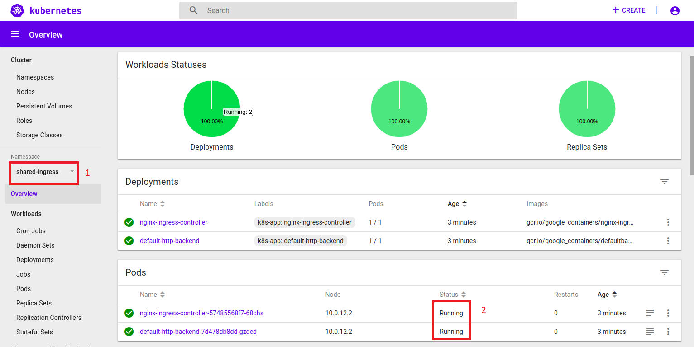

# DevOps: Deploying Microservices to OKE with Jenkins Pipelines (CI/CD) #

# Prerequisites
Make sure you have completed the Initail Setup  [Step 2](jenkins.pipelines.OKE2.md).

# Step 6 - Create a Shared Ingress for the kubernetes cluster #
In this lab, you are going to set up an Ingress for the applications. Ingress allows external access to services within the Kubernetes cluster. In our case, our ingress will be a Load Balance that will be shared by the FrontEnd application and by the Backend application.

+ Create the Load Balancer
+ Verify the Load Balancer was created

1. The first thing you need to do is create a cluster role binding using the user used to create the cluster. Use the command below. **Do not forget to replace the --user= with your OCID**

```
kubectl create clusterrolebinding my-cluster-admin-binding --clusterrole=cluster-admin --user=ocid1.user.oc1..xxxxx
```
Output:
```
clusterrolebinding.rbac.authorization.k8s.io/my-cluster-admin-binding created
```

2. For you to create the Load Balancer, I have provided a shell script that you can execute on you command like. The script is part of the kubernetes project you clone earlier. https://github.com/allenkubai/kubernetes/blob/master/oracle/oke/shared-ingress/create-ingress.sh

To execute the script:

```
cd oracle_projects/kubernetes

./oracle/oke/shared-ingress/create-ingress.sh

```

```
#!/bin/sh
export NAMESPACE=shared-ingress

kubectl delete namespace $NAMESPACE --ignore-not-found=true --now=true

# wait to delete resources
sleep 60

kubectl create namespace $NAMESPACE

#wait to avoid issues with uncreated namespace
sleep 10

kubectl create sa oraclebmc-provisioner -n=$NAMESPACE
  
kubectl create -f https://raw.githubusercontent.com/nagypeter/kubernetes/master/ingress/rbac.yaml -n=$NAMESPACE
  
kubectl create -f https://raw.githubusercontent.com/nagypeter/kubernetes/master/ingress/nginx-default-backend-deployment.yaml -n=$NAMESPACE
  
kubectl create -f https://raw.githubusercontent.com/nagypeter/kubernetes/master/ingress/nginx-default-backend-service.yaml -n=$NAMESPACE
  
kubectl create -f https://raw.githubusercontent.com/nagypeter/kubernetes/master/ingress/nginx-config.yaml -n=$NAMESPACE
  
kubectl create -f https://raw.githubusercontent.com/nagypeter/kubernetes/master/ingress/nginx-ingress-controller-deployment.yaml -n=$NAMESPACE
  
kubectl create -f https://raw.githubusercontent.com/nagypeter/kubernetes/master/ingress/nginx-ingress-controller-service.yaml -n=$NAMESPACE
```

**Please note you can execute the commands each at a time if you want.**


Output:

```
namespace/shared-ingress created
serviceaccount/oraclebmc-provisioner created
clusterrole.rbac.authorization.k8s.io/nginx-ingress-clusterrole created
role.rbac.authorization.k8s.io/nginx-ingress-role created
rolebinding.rbac.authorization.k8s.io/nginx-ingress-role-nisa-binding created
clusterrolebinding.rbac.authorization.k8s.io/nginx-ingress-clusterrole-nisa-binding created
deployment.extensions/default-http-backend created
service/default-http-backend created
configmap/nginx-config created
deployment.extensions/nginx-ingress-controller created
service/nginx-ingress-controller created

```
For more information on how to create loadbalance on OKE go [here](https://github.com/nagypeter/kubernetes/tree/master/ingress) or [here](https://github.com/CloudTestDrive/EventLabs/blob/master/AppDev/K8S/loadbalance.md)

2. Check if the your Load balancer is up, login to your kubernetes console to see if the pods are up.



3. Now check if you can see you load balancer on your OCI console.


---
[Go back to Jenkins Pipelines Workshop Home page](README.md)

[Previous](jenkins.pipelines.OKE5.md)

[Next](jenkins.pipelines.OKE7.md)
