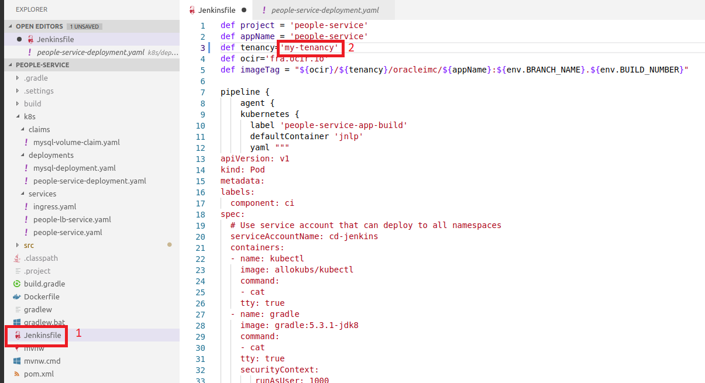
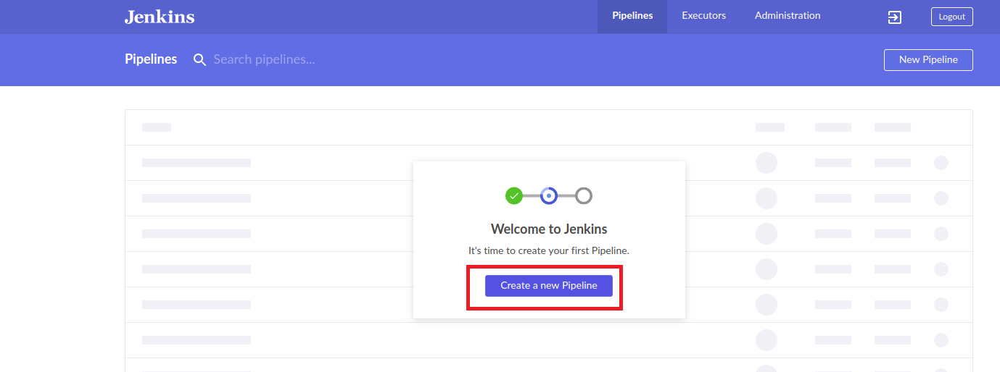
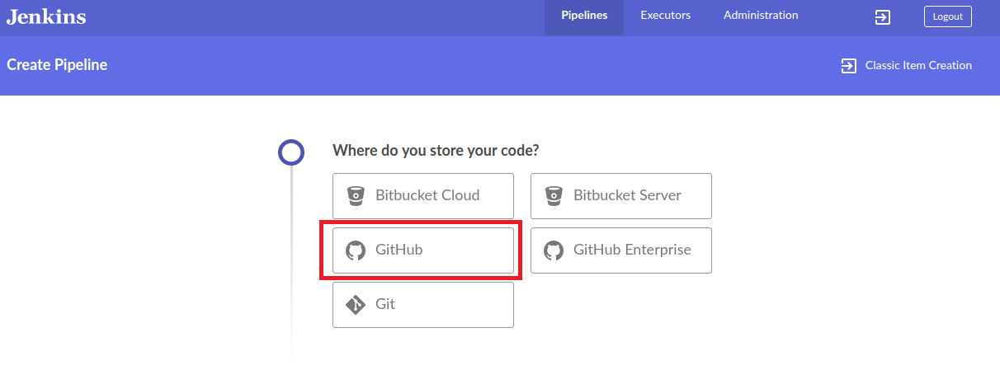
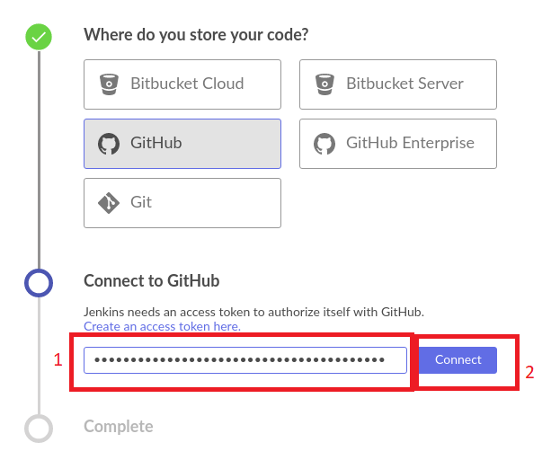
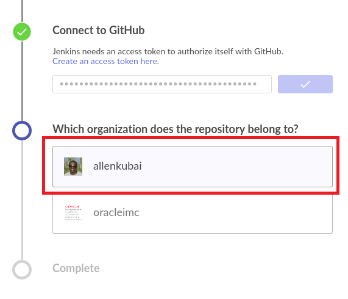
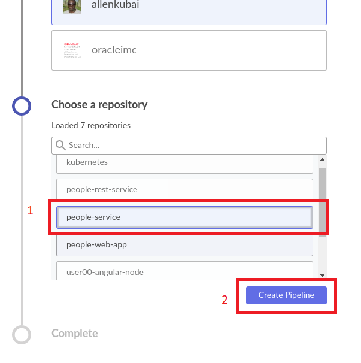
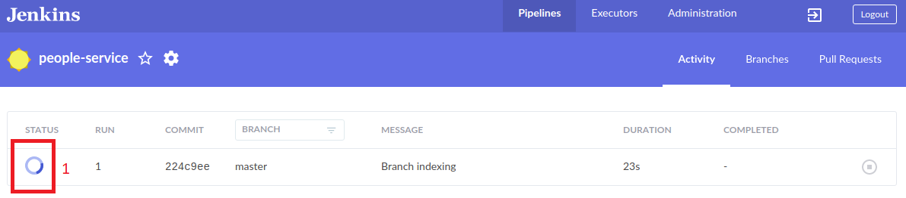
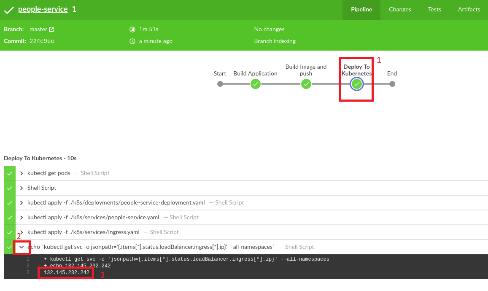
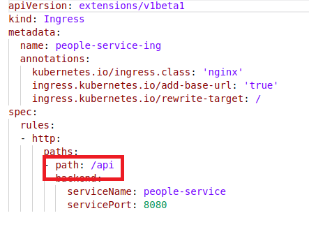
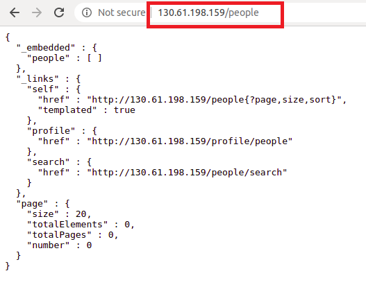

# DevOps: Deploying Microservices to OKE with Jenkins Pipelines (CI/CD) #

# Prerequisites
+ Make sure you have completed the Initail Setup  [Step 3](jenkins.pipelines.OKE2.md).
+ Make sure Jenkins is running.

# Step 7 - Deploy the people-service backend API using Jenkins Pipelines #
In this lab, we are going to deploy our backend API microservice. This is a SpringBoot Application exposing a rest endpoint.

+ Create Docker Registry Secret
+ Add cluster-admin role to the Jenkins service account
+ Update the tenancy and OCIR url in the JenkinsFile
+ Create Jenkins Pipeline using JenkinsFile
+ Verify the endpoint


## Create Docker Registry Secret in the Cluster ##

For the jenkins pipeline to be able to pull images from OCIR, we have to added our Auth Token to our cluster as a secret. 

+ Replace {tenancy}/{username} and {Auth Token}

**Please note if you are in another region apart from eu-frankfurt please also change the --docker-server**

```sh
kubectl create secret docker-registry ocirsecret --docker-username='{tenancy}/{username}' --docker-password='{Auth Token}' --docker-server=fra.ocir.io --docker-email='api.user@acme.com'
```

Output:

```sh
secret/ocirsecret created
```

## Add cluster-admin role to the Jenkins service account ##

```sh
kubectl create clusterrolebinding jenkins-deploy --clusterrole=cluster-admin --serviceaccount=default:cd-jenkins
```

Output: 

```sh
clusterrolebinding.rbac.authorization.k8s.io/jenkins-deploy created
```

## Update the tenancy and OCIR url in the JenkinsFile ##

Before you can create your pipelines, you need to update the tenancy and ocir url on the JenkinFile and commit to your git repository: `people-service`.

1. Open the JenkinFile. The file is located in the root directory of your project. 



**PLEASE NOTE:** 
- That if the cluster in a different region other than eu-frankfurt then you will need to change the ocir url on line 4.
- If you are using the shared tenancy for Workshop, change line 2, add your name
 

2. Commit and push this file to your git repository **before next step.** 

## Create Jenkins Pipeline using JenkinsFile ##

1. Login to the Jenkins Instances.
2. On the jenkins dashboard click on *Open Blue Ocean*. 


3. On the Blue Ocean screen click on *Create a new Pipeline*.



4. Select Github



5. For Jenkins to connet to your github account, you will need to provided you Github access token. Click *Connect*



6. Select the the organization which your repository belongs to



7. Now choose your repository. In this case ***people-service***. Click *Create Pipeline*



You pipeline will started executing as shown below. Click on *STATUS* to see the execution progress.



Wait for the execution to complete. 


Once complete, you will see that the pipeline went through four steps

+ Start
+ Build Application
+ Build Image and Push image
+ Deploy to Kubernetes


To confirm that people-service is up, you get check the pods:

```sh
kubectl get pods
```
Output:
```sh
NAME                              READY     STATUS    RESTARTS   AGE
cd-jenkins-7cdb6d66b4-l9z9d       1/1       Running   0          5h5m
mysql-69cfc89647-fjk7c            1/1       Running   0          4h42m
people-service-57f5f77574-wjdhg   1/1       Running   0          5m8s
```

Also check the service was created

```sh
kubectl get svc
```
Output:
```sh
NAME               TYPE        CLUSTER-IP      EXTERNAL-IP   PORT(S)     AGE
cd-jenkins         ClusterIP   10.96.187.120   <none>        8080/TCP    6h18m
cd-jenkins-agent   ClusterIP   10.96.136.94    <none>        50000/TCP   6h18m
kubernetes         ClusterIP   10.96.0.1       <none>        443/TCP     6h37m
mysql              ClusterIP   10.96.217.28    <none>        3306/TCP    5h54m
people-service     ClusterIP   10.96.65.158    <none>        8080/TCP    6m
```
## Verify the endpoint ##

Let's get the public ip of our deploy service. Go to you pipeline execution and select *Deploy To Kubernetes*, then select the last output and expand it to get the public ip.



The Backend API is using a shared load balance, you need to check the ingress.yml file to confirm it's url path. The ingress file is located under k8s/services/ingress.yaml under the people-service. In my case it's *'/people'*. As shown in the image below.



Therefore my url will be ***http://< ip  >/< restendpoint >***. Input this a browser of you choice. 



As you can see you backend api is now up and running!!

Up next, deploying your frontend

---
[Go back to Jenkins Pipelines Workshop Home page](README.md)

[Previous](jenkins.pipelines.OKE6.md)

[Next](jenkins.pipelines.OKE8.md)
