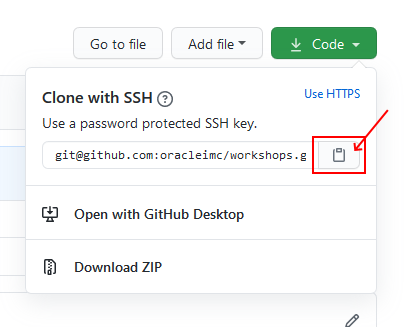
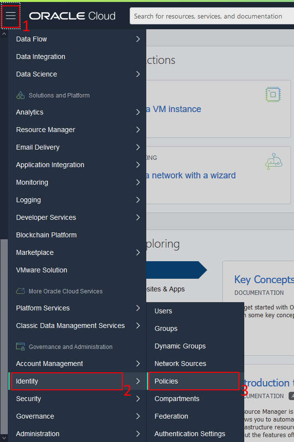

# Prerequisites

1. Create [GitHub](https://github.com/) account, if you do not have one
2. Install required programs
    1. A code editor / IDE. (Such as Sublime, Notepad++ or VS Code). We recommend using [VS Code](https://code.visualstudio.com/download)
    2. Git Client, download if from [git-SCM](https://git-scm.com/download/)
    3. [Oracle Cloud CLI](https://docs.cloud.oracle.com/en-us/iaas/Content/API/SDKDocs/cliinstall.htm) (oci). For Windows, please note that, you need PowerShell (as admin) in order to install (for the rest, we will be using bash terminal). Just install the CLI, do not configure it yet.
    4.  Several programs can be installed easly via third party package manager. On Linux/Mac you can use brew, on Windows you can use Chocolatery
        * [Chocolatery](https://chocolatey.org/) (Windows)
            * Kubernetes cli (kubectl). If you have Docker (desktop) installed this is bundled, no need to install.
                ```sh
                choco install kubernetes-cli
                ```
            * Helm (v3)
                ```sh
                choco install kubernetes-helm
                ```
        * [Homebrew](https://brew.sh/) (Mac/Linux)
            * Kubernetes cli (kubectl). This might be installed as part of the Docker Desktop app on Mac, please check before proceeding.
                ```sh
                brew install kubectl
                ```
            * Helm (v3)
                ```sh
                brew install helm
                ```
3. If you have not set up [Git ssh](https://docs.github.com/en/github/authenticating-to-github/generating-a-new-ssh-key-and-adding-it-to-the-ssh-agent), please do so. This gives you the option to clone and push without password.
4. If you are going to use your own tenancy, you need to make sure that correct permissions are in place, check [Own Tenancy](#own-tenancy) section. If you are to use the **emeaccoe** enviornment, please follow instructions of your trainer. Also check information about using [emeaccoe](./emeaccoe.md).
5. Configure your Oracle CLI based on the information on the previous step.
    ```sh
    oci setup config
    ```

## Using Git & GitHub
After completing the step 3 (Git ssh), you can clone and push repositories via SSH.
On the root of the repository, when you press to the top-right green button, it will display the address. This address might be displayed in HTTPS format. In that case, press to the **Use SSH** button to convert it to SSH format


After you have changed it to SSH, you can copy its address and use during clone commands



Git commands, best works on bash terminals. If you are using Windows, make sure that you are using `Git Bash` only! 

### Popular git commands
Below, popular commands for git are listed for who is not familiar with git. All commands are case sensitive
* clone/download. If you are working with private repositries (examples in this workshop are all public), you will be asked for credentials if you are cloning via HTTPS
    ```sh
    git clone <address>
    ```
    Creates a copy/clone of a remote repository, provided by the address within  the same folder which this command is executed. A new folder is created with the name of the repository. In order to work within that repository, execute `cd <folder>`. That folder is bound with remote repository.
* If you have performed changes on files local folder and you want to send those changes to remote server, perform the following:
    1. Make sure that you have your files saved
    2. This will select all changes to be included with the commit
        ```sh
        git add -A
        ```
    3. This will create a local commit. Every commit has a simple explanatory message, change `<message>` section accordingly
        ```sh
        git commit -m "<message>"
        ```
    4. Now we need to send the local commits to the remote server. If you have cloned via HTTPS, you will be asked for credentials
        ```sh
        git push
        ```
* If there has been changes on the server, which you do not have, you can retrieve them with the following command. If you are working with private repositries (examples in this workshop are all public), you will be asked for credentials if you have cloned via HTTPS
    ```sh
    git pull
    ```

## Own Tenancy
You need to provide necessary permissions for OKE and OCIR to work. A user with necessary privididges (such as admin of the tenancy) can create the policies at the root level. You should **not** be doing this on the shared environment.



On the left side **List Scope** section, make sure that you are in the root compartment.This policy will add necessary permissions to the service
1. Press `Create policy`
2. Give it a name and description, such as `Container Services`
3. Add Statement: `allow service OKE to manage all-resources in tenancy`
4. Press `Create`

If you want to resrict the access of the OKE with desired `<compartment>`, you can replace the last one to the `allow service OKE to manage all-resources in compartment <compartment>`

The following policies will grant permissions to specific "group" to work. Replace `<group>` with corresponding group name and `<compartment>` with corresponding compartment
1. On `root` level compartment
2. Add policy named `<group>Access`
3. Add Statement: `allow group <group> to manage repos in tenancy`
4. Press `+ Another Statement`, please repeat for each statement
4. Add Statement: `allow group <group> to manage all-resources in compartment <compartment>`
