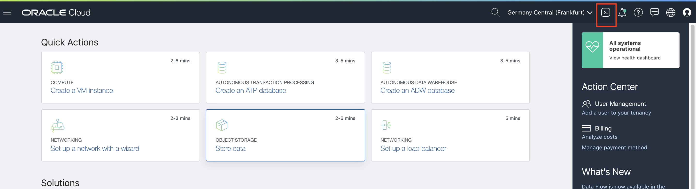
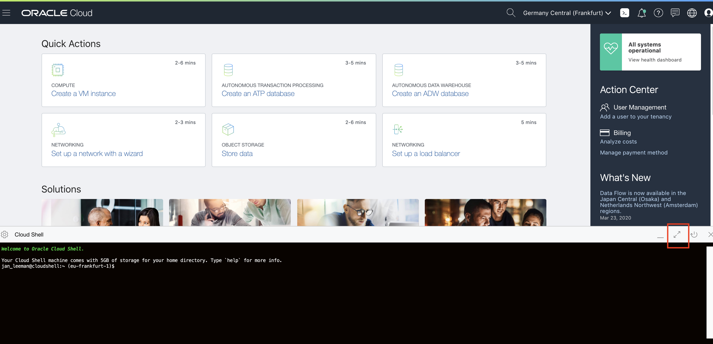

# OCI Cloud Shell

The **OCI Cloud Shell** is accessible through the Oracle Cloud GUI, and has a number of elements set up out of the box, like the Oracle Cloud Command Line Interface, and it also has quite some useful command-line tools pre-installed, like git, docker, kubectl, helm and more.

To access the OCI Cloud Shell, you can use the native browser on your laptop (you don't need to use the Linux desktop VM anymore).

1. Login to your Oracle Cloud Console
2. Click the icon on the top right of your screen: **>_**

3. This will result in the OCI Cloud Shell to be displayed at the bottom 
of your window.

To maximise the size of the OCI Cloud Shell window, click the "Arrows" button on the right of the console as indicated above:

Note, in some steps you may want to minimize the OCI Cloud Shell so you can get information from the GUI. Click the arrows icon again to minimize the OCI Cloud Shell and see the Oracle Cloud GUI again. Alternatively you can open a second browser window or tab onto the Oracle Cloud GUI.

In some steps you are asked to edit files. The OCI Cloud Shell supports typical Linux editors such at *vi*, *emacs* and *nano* Use the editor you prefer to make changes to files. nano has more simplar use.

[More details about nano](https://staffwww.fullcoll.edu/sedwards/Nano/IntroToNano.html)  
[Not familiar with vi ?](/.vi.md)