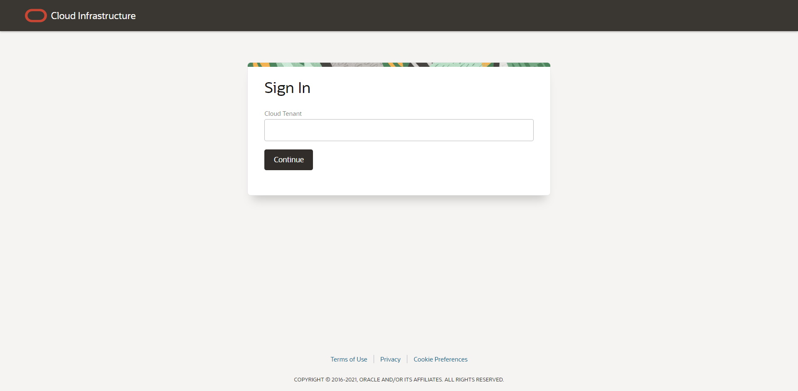
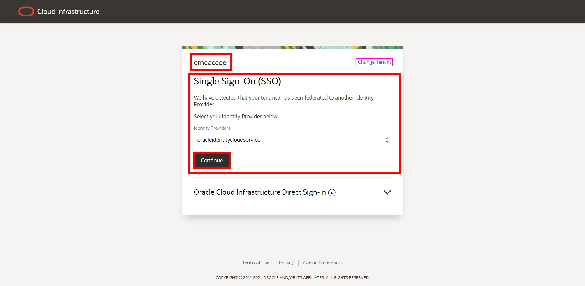
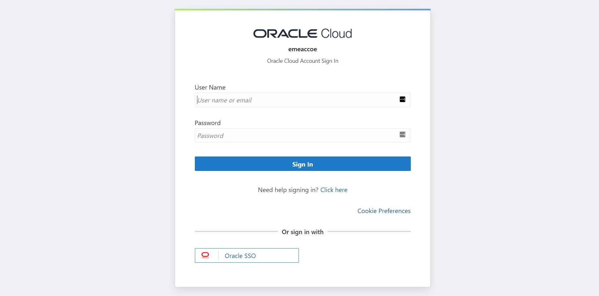
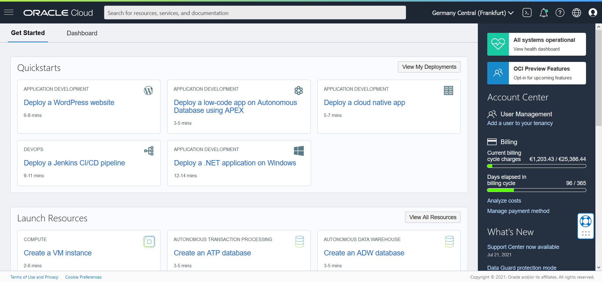

This document explains how to login to the **emeaccoe** tenancy. In order to login, you need to have an account first. If you do not, please read [register](./register.md) document.

# Steps to login
1. Browser: Latest versions Firefox, Google Chrome and Safari browsers are recommended. You can use Microsoft Edge at your discretion. You should be using desktop versions of the browsers; mobile versions can lack some features. If you have logged in to a OCI console to a different tenancy, you either need to log out or use different browser or use private mode.
2. https://console.eu-frankfurt-1.oraclecloud.com is the URL to open OCI (web) Console
3. You might be asked to provide tenancy name. It is **emeaccoe**. If you are not asked for tenancy, proceed with next step

4. In this screen, you are asked to choose your login option.

    1. Verify your tenancy name. If it is different than **emeaccoe**, click to **Change Tenant** to go back and proceed with **step 3**
    2. Single Sign-On (SSO) is the default login option. Do not change anything on this screen and press **Continue**

5. Fill the form with your username (you have defined during [registration](/.register.md)) and password. Press **Sign In** button

6. After successful login, you should be seeing the OCI Console. *similar to the screenshot below*

If you have successfuly logged in, you may continue customise your [OCI Console interface](https://docs.oracle.com/en-us/iaas/Content/GSG/Concepts/console.htm). In most of the workshops, you need to setup a compartment for you. Ask your trainer to proceed with [compartment setup](./compartment.md)!

# Troubleshooting
There are some cases, you might experience difficulties during logging in. Here are most common problems and their solutions are listed

## Firefox Private browser
If you want to use Firefox in private browsing mode, it does not allow using local browser storage/database. OCI web console is depending on that feature. You can either use Firefox as normal mode or different browser as you see fit

## Request header is too large
This is happening due to stored big-large cookie information stored in your browser. There are several ways to handle it:

1. If you are using regular mode, go to private browser mode. Cookies are not carried between regular and private mode. This is not a fix, it is a workaround.
2. Clear your browser cookies. Usually the keyboard shortcut is CTRL + Shift + Delete. Delete the cookies and try again. This will delete all cookies in the selected time span. Not just the cookies that are being used by Oracle. Try logging in again
3. Open the developer console of your browser. Usually the shorcut is F12. Go to Application (Chromium based) or Storage tab. Select cookies (one by one) and delete all of them (by pressing delete button on your keyboard). You can close the developer console. Try logging in again

## IDCS error or HTTP 400 Bad Request
Sometimes IDcs will not throw error while logging in, due to existing login/cookie. Most common action is to trying to logging in again. If this is not working, try the steps mentioned in **Request header is too large** above