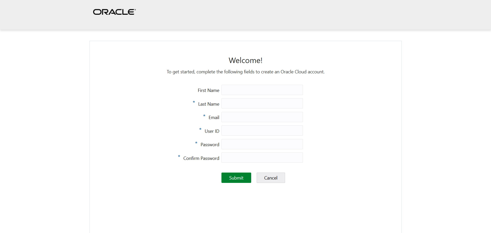
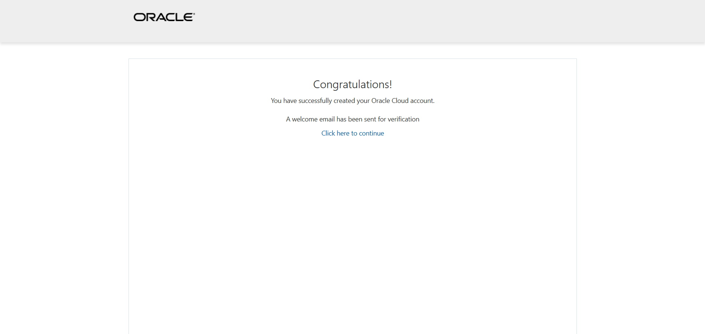

# EMEA CCoE
EMEA = Europe, the Middle East and Africa  
CCoE = Cloud Center of Excellence  
IMC = Innovation and Modernization Center

If this workshop is being delivered to you by CCoE or IMC, you might be provided an Oracle Cloud tenancy (emeaccoe).

# Which Tenancy to use
For some workshops you will be using a tenancy provided by your trainers. The name of this tenancy is **emeaccoe**. For the rest, you will be using a tenancy that your company provides or your own (trial) or a trial that has been whitelisted for you.

The details are mentioned within the invitation of the workshop.

# emeaccoe Tenancy
This tenancy is a shared and preconfigured tenancy with purpose of delivering trainings. If you are to use this tenancy keep in mind that:

1. This is a shared tenancy. Some of the resource names are to be unique
2. You have access for a limited amount of time. Such as entrire duration of workshop
3. Policies are preconfigured. Remember to skip tenancy-wide policy configurations
4. Your access permissions are not administrator level

# Register for OCI Account on emeaccoe Teancy
If you are to use emeacccoe tenancy, your trainer will share a link for you to register.

Fill necessary fields. You need to remember your username in future. You define your username! Your username can be same as your email address.

After submission, you will be:
1. Receiving an email. That verifys your mail adress. Doing this optional and recommended.
2. You will be redirected to a "Congratulations" page. **DO NOT** click to `Click here to continue`. You can close the page.

Continue with [login](./login.md) to access to the tenancy.